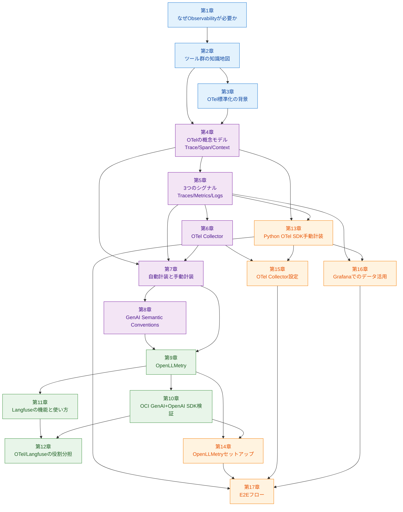
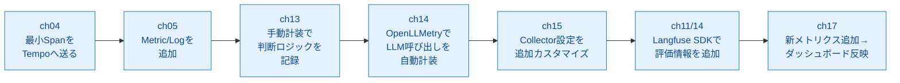

# 書籍構成・章間依存関係 (Book Architecture)

本書の章構成と章間の依存関係を定義する。執筆時・レビュー時に「前提として何が読み終わっているか」「この章以降で拡張される内容は何か」を確認するための地図。

## 4部構成の意図

| 部 | ねらい | 読者が得る状態 |
|----|--------|---------------|
| 第I部 全体像と知識地図 | なぜObservabilityが必要か、どんなツール群で構成されるか | 3層モデル（計装／収集／保存・可視化）で全体を俯瞰できる |
| 第II部 OTelの概念と仕組み | OTelを構成する概念の内部モデル | Trace／Span／3シグナル／Collector／計装方式／GenAI規約を自分の言葉で説明できる |
| 第III部 AIエージェント固有のObservability | LLM特有の関心事と、それに対応するツール | OpenLLMetryの限界とLangfuseの役割を理解し、併用戦略を描ける |
| 第IV部 実践 ― 収集と可視化 | 実コードとGrafana活用、E2Eフロー | 自分で計装を追加しダッシュボードに反映させるループを回せる |
| 付録 | 逆引きリファレンス | 実務中に引ける早見表を持つ |

## 章間依存関係図

*図A.1: 章間の前提知識依存関係。矢印 A → B は「章Aを読んでから章Bを読むことを前提とする」を意味する*

## 各章の前提と提供

| 章 | 前提となる章 | この章で新たに提供する概念・スキル |
|----|-------------|---------------------------------|
| 第1章 | なし | Observabilityの必要性、AIエージェント固有の関心事（システム挙動／判断品質） |
| 第2章 | 1 | 3層モデル（計装／収集／保存・可視化）、各ツールの役割 |
| 第3章 | 2 | OTelが生まれた歴史的経緯、標準化の動機 |
| 第4章 | 2, 3 | Trace／Span／Attribute／SpanContext／Context Propagation／Event |
| 第5章 | 4 | Traces／Metrics／Logsの3シグナル、用途と保存先 |
| 第6章 | 5 | Collectorのパイプライン3段構成、設定ファイルの読み方 |
| 第7章 | 4, 5, 6 | 自動計装（モンキーパッチ）と手動計装の仕組み・使い分け |
| 第8章 | 7 | GenAI Semantic Conventions、OpenLLMetryのOTel合流動向 |
| 第9章 | 7, 8 | OpenLLMetryの仕組み、自動記録されるデータ、限界 |
| 第10章 | 9 | OCI GenAI + OpenAI SDKでのOpenLLMetry動作検証、Responses API対応の判断 |
| 第11章 | 9 | Langfuseの3機能（トレーシング／評価／プロンプト管理） |
| 第12章 | 10, 11 | OTel vs Langfuseの役割分担、データ送信経路の選択（OTLP／SDK／併用） |
| 第13章 | 4, 5 | Python OTel SDKでのSpan/Metric/Log記録の実装パターン |
| 第14章 | 9, 10 | OpenLLMetryの実セットアップとTempo確認 |
| 第15章 | 6, 13 | Collectorの設定追加（Exporter追加等） |
| 第16章 | 5, 13 | Grafanaのデータソース、ダッシュボード／パネル、PromQL/TraceQL/LogQLの使いどころ |
| 第17章 | 13, 14, 15, 16 | メトリクス追加からダッシュボード反映までのE2Eフロー |

## 実装レイヤと概念レイヤの接続

第II部（概念）と第IV部（実装）は対応関係にある:

| 概念章（第II部） | 対応する実装章（第IV部） |
|-----------------|------------------------|
| 第4章 OTel概念モデル | 第13章 Python OTel SDK手動計装 |
| 第5章 3つのシグナル | 第13章（記録側）、第16章（活用側） |
| 第6章 OTel Collector | 第15章 Collector設定 |
| 第7章 自動／手動計装 | 第13章（手動）、第14章（OpenLLMetry自動） |

執筆時はこの対応関係を意識し、概念章で定義した用語を実装章で再定義しないこと。

## サンプルコード構築のタイムライン

章の進行に沿って、同一の「サンプルエージェントアプリ」にObservabilityを積み増していく構成を取る:

*図A.2: 章をまたいで同じサンプルアプリを段階的に計装していく流れ*

## リソース管理とクリーンアップ

- **専用namespace**: 本書サンプルの全リソースは `aio11y-book` namespaceに配置する（既存の `observability` `langfuse` は汚さない）
- **一括削除**: リポジトリルートの `make clean` ですべてを削除できる
- **章単位削除**: `make clean-chNN` で章ごとに戻せる
- **読者引き継ぎ**: サンプルアプリは章をまたいで発展するため、各章の最終状態を `sample-app/chNN/` にタグ付けして保存する

## スコープと外側

第I部〜第IV部のあいだで明示的に扱わない項目:

- Prometheus／Loki／Tempoの内部構造（第2章・第5章で「ストアである」とだけ述べる）
- KubernetesやHelmによるスタックのセットアップ手順（既存前提）
- LangChain／LlamaIndex固有の計装詳細（第9章で「対応SDKが多い」とだけ述べる）
- OpenAI・OCI以外のLLMプロバイダ固有の計装

これらは「なぜ扱わないか」を第1章・第2章で簡潔に宣言し、読者の期待値を揃える。
