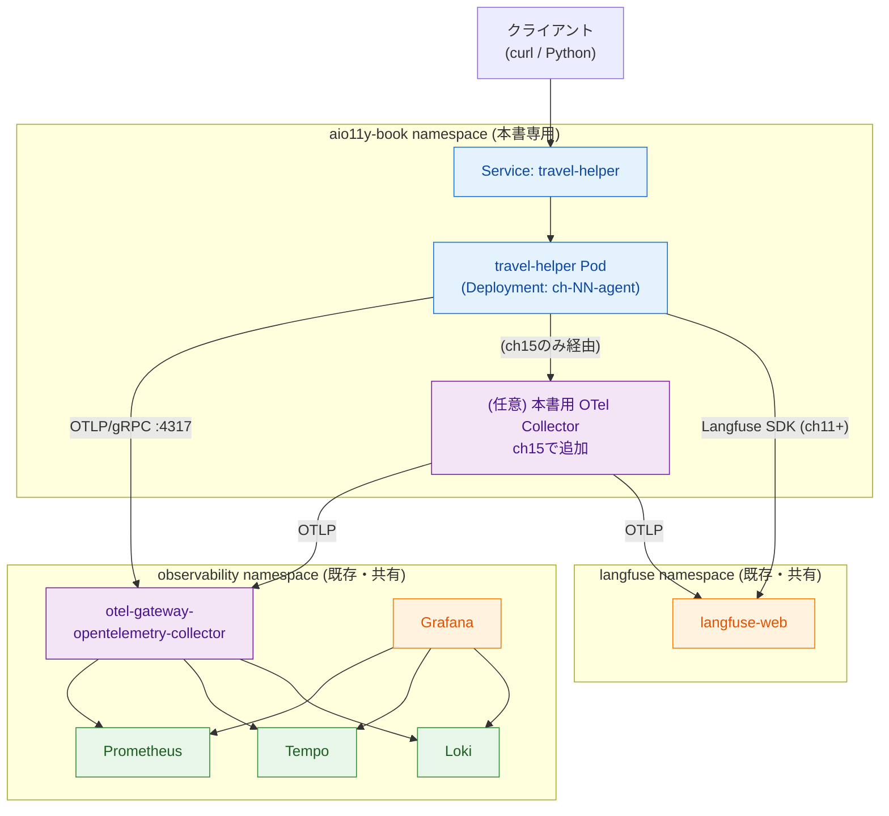
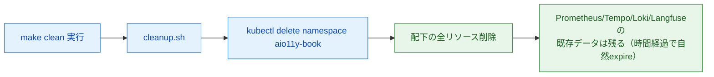

# サンプルアプリ アーキテクチャ設計 (Architecture)

`travel-helper` のデプロイ構成と、周辺コンポーネント（OTel Collector／バックエンドストア／Langfuse）との結線を定義する。

## デプロイ構成の全体像



*図: サンプルアプリとObservabilityスタックの結線。本書用リソースは `aio11y-book` namespaceに隔離し、既存の共有スタックは変更しない*

## データフロー

### 基本経路（ch04〜ch14、ch17）
1. `travel-helper` がOTel SDKでSpan／Metric／Logを生成
2. OTLP/gRPC（ポート4317）で `otel-gateway-opentelemetry-collector.observability` に直接送信
3. GatewayがPipelineで処理し、Tempo／Prometheus／Loki にExport
4. Grafanaがそれぞれのデータソースを参照

### ch15の経路（本書用Collector経由）
1. `travel-helper` がOTLPを `aio11y-book` namespace内の本書用Collectorに送信
2. 本書用CollectorがAttribute追加・フィルタ等の処理を行い、Gatewayにフォワード
3. 以降は基本経路と同じ

### ch11以降のLangfuse経路
1. `travel-helper` がLangfuse SDKで評価スコア・プロンプトを記録
2. Langfuse SDKはHTTPで `langfuse-web.langfuse:3000` に直接送信
3. OTLPトレースとはtrace_idで紐付け

## Kubernetesリソース構成

### namespace と RBAC

```
aio11y-book namespace
├── ServiceAccount: travel-helper
├── Role: travel-helper-reader（ConfigMap参照権限のみ）
├── RoleBinding
├── Secret: travel-helper-secret（OCI GenAI/Langfuse認証情報）
├── ConfigMap: travel-helper-config（非機密設定）
├── Deployment: chNN-agent
├── Service: travel-helper (ClusterIP)
└── (ch15のみ) Deployment: chNN-collector, ConfigMap: collector-config, Service: collector
```

全リソースに以下のラベルを付与する:
- `book.aio11y/owned-by=book`
- `book.aio11y/chapter=NN`
- `app.kubernetes.io/name=travel-helper`
- `app.kubernetes.io/part-of=aio11y-book`

### Deployment仕様

| 項目 | 値 |
|------|-----|
| replicas | 1 |
| image | `ghcr.io/{org}/travel-helper:chNN-v1`（固定タグ） |
| resources.requests | cpu: 100m, memory: 256Mi |
| resources.limits | cpu: 500m, memory: 512Mi |
| readinessProbe | `GET /healthz` on 8080 |
| livenessProbe | `GET /healthz` on 8080 |
| env | `OTEL_EXPORTER_OTLP_ENDPOINT` 等を ConfigMap/Secret から注入 |

### OTLP接続先

| 章 | エンドポイント |
|----|--------------|
| ch04-ch14, ch17 | `http://otel-gateway-opentelemetry-collector.observability:4317` |
| ch15 | `http://chNN-collector.aio11y-book:4317` |

## コンテナイメージ

- ベースイメージ: `python:3.11-slim`
- マルチステージビルド（依存インストール層／実行層）
- 非rootユーザー（uid 1000）で実行
- イメージサイズ目標: 200MB以内

ビルド例:
```dockerfile
FROM python:3.11-slim AS builder
WORKDIR /app
COPY requirements.txt .
RUN pip install --prefix=/install -r requirements.txt

FROM python:3.11-slim
WORKDIR /app
COPY --from=builder /install /usr/local
COPY src/ ./src/
USER 1000
EXPOSE 8080
CMD ["python", "-m", "src.agent"]
```

## Context伝播設計

本書のサンプルは単一Pod内で完結するため、サービス間のContext伝播は不要。ただし「もしエージェント間通信を追加したら」の拡張余地として、W3C Trace Contextを使う前提で設計する（ヘッダ名を `traceparent` `tracestate` で固定）。

## Langfuse連携の設計

### ch11での連携方法
- Langfuse Python SDKを直接使用
- `Langfuse(host=..., public_key=..., secret_key=...)` でクライアント初期化
- `with langfuse.start_as_current_span()` でLangfuse側のSpanを作成
- OTelのtrace_idをmetadataとして渡す（OTel SpanContextから取得）

### ch12で扱うOTLP経由の選択肢
- Langfuseが提供するOTLPエンドポイントに直接送る構成もある
- この構成はch15の「本書用Collector」のExporterとして追加する形で試す
- どちらが適切かは章内の本文で判断基準を示す

## セキュリティ・シークレット管理

- OCI GenAI API Key、Langfuse Secret KeyはKubernetes Secretで管理
- `sample-app/chNN/k8s/secret.example.yaml` をテンプレートとして配布し、実値版 `secret.yaml` は `.gitignore` 対象
- Podは最小権限のServiceAccountで動作
- 外部エンドポイント（OCI GenAI）への通信はHTTPS
- 本書用Collector（ch15）は `aio11y-book` 内のPodからのみアクセス可能（NetworkPolicyは例として1章のみ提示）

## リソース分離とクリーンアップ

### 分離の原則
1. **namespace分離**: 全リソースが `aio11y-book` に閉じ込められる
2. **ラベル分離**: 共有Collectorに情報を流す際も、Resource Attribute `service.namespace=aio11y-book` を付与して既存メトリクスと区別可能にする
3. **設定非破壊**: 共有Collectorの設定を変更しない。必要に応じて本書用Collectorを `aio11y-book` に新設する

### クリーンアップフロー



*図: クリーンアップの流れ。namespace削除1回で配下のDeployment／Service／ConfigMap／Secret／Podが全て消える*

既存スタック側に残る本書由来データ（Prometheus時系列、Tempoトレース、Lokiログ、Langfuseトレース）は各ストアの保持期間に従って自然消滅する。必要ならラベル `book.aio11y/owned-by=book` で絞り込んで即時削除することも可能（付録に手順記載）。

## 拡張余地（スコープ外だが意識する）

- **複数エージェントへの拡張**: `travel-agent` から別の `research-agent` を呼ぶ構成。Context伝播の実例として第4章で概念のみ触れる
- **A2A通信**: 同一Pod内関数呼び出しではなくgRPC経由にする場合の計装。本書スコープ外
- **本番向けセキュリティ**: NetworkPolicy、PodSecurityStandard、Secret暗号化等。本書スコープ外
