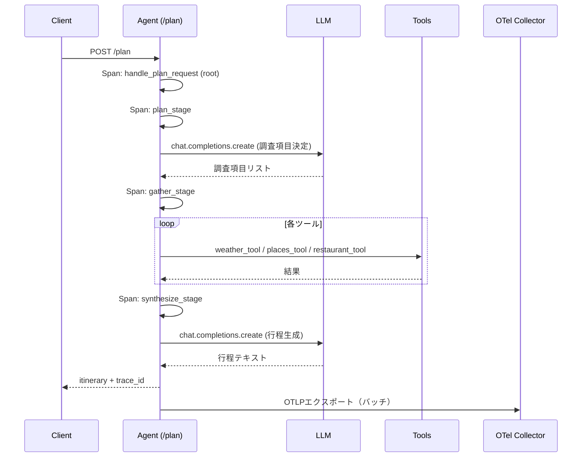

# サンプルアプリ機能設計 (Functional Design)

`travel-helper` の機能単位の設計を定義する。実装時はこの設計に従い、各関数のシグネチャ・Span名・Attribute名を統一する。

## モジュール構成

```
sample-app/chNN/
├── agent.py             # FastAPIエントリ + エージェント本体
├── tools.py             # スタブツール実装
├── llm.py               # LLMクライアント抽象（oci / mock の切替）
├── otel_setup.py        # OTel SDKの初期化
├── langfuse_setup.py    # Langfuse SDKの初期化（ch11以降）
├── config.py            # 環境変数の読み込み
└── k8s/
    ├── deployment.yaml
    ├── service.yaml
    ├── configmap.yaml
    └── secret.example.yaml
```

## APIエンドポイント

### `POST /plan`

**リクエスト**:
```json
{
  "city": "京都",
  "days": 2,
  "keywords": ["寺", "和食"]
}
```

**レスポンス（正常系）**:
```json
{
  "itinerary": "1日目: 清水寺周辺を巡り、...",
  "trace_id": "a1b2c3d4e5f6..."
}
```

**レスポンス（バリデーションエラー）**: HTTP 400
```json
{
  "error": "invalid_request",
  "detail": "days must be 1-7"
}
```

**レスポンス（内部エラー）**: HTTP 500
```json
{
  "error": "internal_error",
  "trace_id": "a1b2c3d4e5f6..."
}
```

### `GET /healthz`
- 200 OK `{"status": "ok"}` を返すのみ。計装は最小限。

## エージェント処理フロー

### シーケンス



### 関数シグネチャ（最終形、ch13以降）

```python
def handle_plan_request(req: PlanRequest) -> PlanResponse: ...
def plan_stage(req: PlanRequest) -> list[InvestigationItem]: ...
def gather_stage(items: list[InvestigationItem], city: str) -> GatheredContext: ...
def synthesize_stage(ctx: GatheredContext, req: PlanRequest) -> str: ...
```

章によっては一部stageを省略する（ch04は `plan_stage` のみ、ch05は `plan + gather` のみ、ch13以降は全stage）。

## Span設計

### 階層構造（ch13以降）

```
handle_plan_request (root span, kind=SERVER)
├── plan_stage (internal)
│   └── llm.chat.completions (client)  ← OpenLLMetry自動計装 or 手動
├── gather_stage (internal)
│   ├── tool.weather (internal)
│   ├── tool.places (internal)
│   ├── tool.places (internal)   ← キーワード毎に繰り返し
│   └── tool.restaurant (internal)
└── synthesize_stage (internal)
    └── llm.chat.completions (client)
```

### Span名と用途

| Span名 | Kind | 記録するAttribute |
|--------|------|-----------------|
| `handle_plan_request` | SERVER | `http.method`、`http.route`、`user.city`、`user.days`、`user.keywords_count` |
| `plan_stage` | INTERNAL | `stage.name`、`stage.investigation_items_count` |
| `gather_stage` | INTERNAL | `stage.name`、`stage.tools_called_count`、`stage.tools_failed_count` |
| `synthesize_stage` | INTERNAL | `stage.name`、`stage.output_chars` |
| `tool.weather` | INTERNAL | `tool.name=weather`、`tool.city`、`tool.days`、`tool.result_count` |
| `tool.places` | INTERNAL | `tool.name=places`、`tool.city`、`tool.keyword`、`tool.result_count` |
| `tool.restaurant` | INTERNAL | `tool.name=restaurant`、`tool.city`、`tool.result_count` |
| `llm.chat.completions` | CLIENT | GenAI Semantic Conventions準拠（`gen_ai.request.model`、`gen_ai.usage.input_tokens`等） |

### エラー時のSpan

- 例外発生時は `span.record_exception(e)` と `span.set_status(Status(StatusCode.ERROR, str(e)))` を呼ぶ
- `tool.*` Spanの5%エラーもこの形で記録される（Observability観測対象として意図的）

## Metric設計

### 記録するMetric（ch05で追加、ch17で拡張）

| Metric名 | 型 | 単位 | 記録タイミング |
|---------|-----|------|---------------|
| `travel_helper.requests` | Counter | `{request}` | `/plan` 完了時（成功／失敗ラベル付き） |
| `travel_helper.request.duration` | Histogram | `s` | `/plan` 完了時 |
| `travel_helper.tool.calls` | Counter | `{call}` | 各ツール呼び出し完了時 |
| `travel_helper.tool.failures` | Counter | `{failure}` | ツール呼び出し失敗時 |
| `travel_helper.llm.tokens` | Histogram | `{token}` | LLM呼び出し完了時（ch17で追加、`direction=input/output` ラベル） |

### 共通ラベル（Attribute）

- `service.name`: `travel-helper-chNN`
- `chapter`: 章番号
- `stage`: `plan`／`gather`／`synthesize`（該当する場合）

## Log設計

- Python標準loggingを使用
- OTel Logs Instrumentationでlogging経由のログをOTel Logとして自動変換
- 各stageの開始・終了でINFOログ1行
- ツールエラーはWARNログ
- 予期しない例外はERRORログ＋`span.record_exception`
- ログには自動的にtrace_id／span_idが付与される

## LLMクライアント抽象

### 共通インターフェース

```python
class LLMClient(Protocol):
    def chat_completion(self, messages: list[Message], **kwargs) -> LLMResponse: ...
```

### 実装

| 実装 | 切り替え条件 | 挙動 |
|------|-------------|-----|
| `OCIOpenAIClient` | `LLM_MODE=oci`（デフォルト） | OpenAI SDKに `base_url=OCI_GENAI_ENDPOINT` を渡して呼び出し |
| `MockLLMClient` | `LLM_MODE=mock` | ハードコードされた疑似レスポンスを返す（50〜200msの遅延付き） |

両実装ともOpenLLMetry計装の対象となる（ch14以降）。MockClientもOpenAI SDK互換のインターフェースで呼び出すため、計装動作の確認に利用できる。

## スタブツール設計

### 共通仕様

```python
class ToolError(Exception):
    """スタブツールが意図的に投げる失敗"""
```

- 各ツールは5%の確率で `ToolError` を投げる
- 固定シードで再現性を持たせることも可能（環境変数 `STUB_SEED`）

### 個別仕様

| ツール | 入力 | 出力 | 遅延 |
|--------|------|------|------|
| `weather_tool(city, days)` | 都市名、日数 | `list[WeatherForecast]`（固定3件） | 100-200ms |
| `places_tool(city, keyword)` | 都市名、キーワード | `list[Place]`（3件） | 150-300ms |
| `restaurant_tool(city)` | 都市名 | `list[Restaurant]`（3件） | 100-200ms |

## 設定の読み込み

`config.py` で環境変数を一元管理する。

```python
@dataclass(frozen=True)
class Config:
    llm_mode: str
    oci_endpoint: str | None
    oci_api_key: str | None
    oci_model: str
    otlp_endpoint: str
    service_name: str
    langfuse_host: str | None
    langfuse_public_key: str | None
    langfuse_secret_key: str | None
    log_level: str
    chapter: str

def load_config() -> Config: ...
```

## 章ごとの差分

| 章 | 追加／変更ファイル | 主な変更点 |
|----|------------------|-----------|
| ch04 | `agent.py`, `otel_setup.py`, `k8s/*` | 最小TracerProvider初期化、`plan_stage` のみSpan化 |
| ch05 | `agent.py`, `otel_setup.py` | MeterProvider追加、Logging計装追加、gather_stage追加 |
| ch13 | 全ファイル完成形 | 全stage実装、Attribute／Event／Status／Exception完全記録 |
| ch14 | `otel_setup.py` | OpenLLMetry `Traceloop.init()` 追加 |
| ch15 | `k8s/configmap.yaml`, `collector-config/ch15-*/` | 専用Collectorを `aio11y-book` にデプロイ、Exporter追加例 |
| ch11 | `agent.py`, `langfuse_setup.py` | Langfuse SDK初期化、評価スコア記録API追加 |
| ch17 | `agent.py`, Grafanaダッシュボード定義 | `travel_helper.llm.tokens` Histogram追加、Dashboard JSON |
