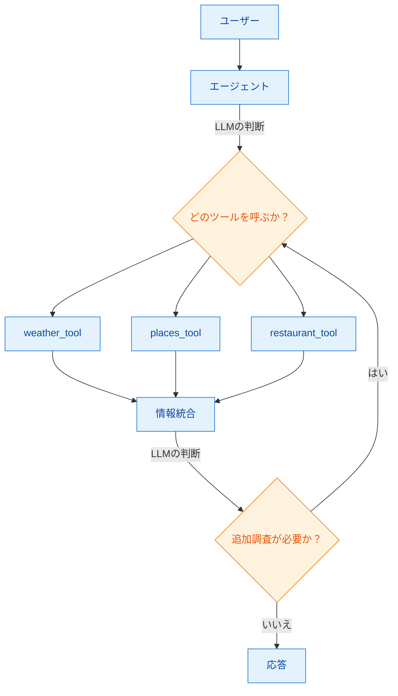
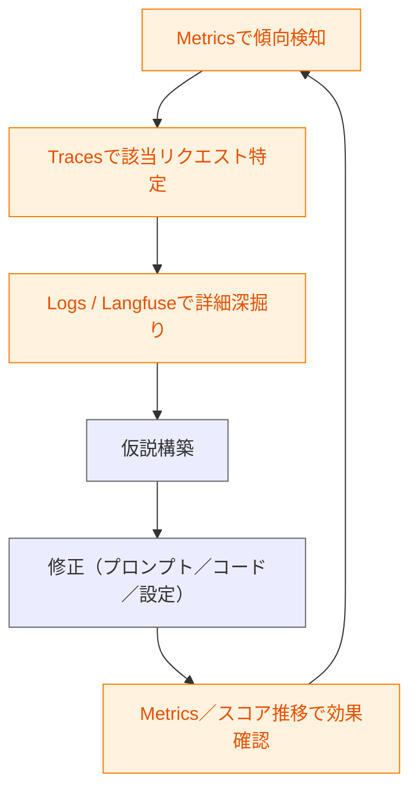
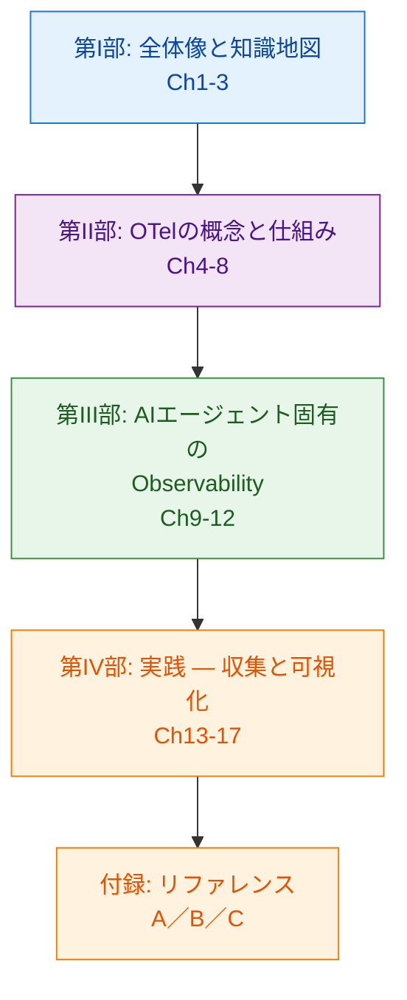

# 第1章 なぜAIエージェントにObservabilityが必要なのか

AIエージェント（AI Agent）の開発と運用は、決定論的に動くマイクロサービスとは異なる観測要件を持つ。本章ではその違いを整理し、本書全体を貫く「システム挙動」と「LLMの判断品質」という2つの関心事を導入する。読了後、読者は本書が取り組むテーマを自分の言葉で説明できる状態になる。

なお本章および本書全体で「決定論的システム」と呼ぶのは、大規模言語モデル（Large Language Model、LLM）を処理の中核に据えていないシステムを指す。対比として「AIエージェントシステム」はLLMの判断を処理経路の決定に用いるシステムを指す。

## 1.1 決定論的システムのObservability

Observability（オブザーバビリティ）という語は、もともと制御理論の概念として導入された[^1]。2010年代以降、クラウド上の分散システムを運用する文脈に転用され、ログ・メトリクス・トレースを組み合わせて「外部から内部状態を推測・診断する」ための実践体系として整理されてきた[^2]。

決定論的システムでは、図1.1のようにリクエストが固定的に流れる。ユーザーがAPIゲートウェイを叩くと、その先のサービスAが呼ばれ、さらにサービスBとデータベースを呼ぶ。この処理経路は事前に設計されており、同じ入力に対して同じ経路をたどる。

*図1.1: 決定論的システムでのリクエスト追跡。処理経路が固定的で、各ホップにログ・メトリクス・トレースを付ければ「どこで何が壊れたか」を追跡できる*

このような系では、各サービスにログ・メトリクス・トレースを仕込めば、障害原因は「どこで何が壊れたか」の粒度で特定できる。リクエストの再現性が高いため、同じ入力での再実行によってデバッグを進めることも可能である。成熟したObservabilityの方法論はこの再現性を前提に組み立てられてきた。

## 1.2 AIエージェントの根本的な違い

AIエージェントシステムではこの前提が揺らぐ。図1.2のように、LLMの判断が処理経路そのものを決める。

*図1.2: AIエージェントのリクエスト処理。菱形はLLMによる判断ポイントを表し、ランタイムで経路が決まる*

この構造には、決定論的システム向けの観測では捕捉しきれない3つの特性がある。

1つ目は**非決定論性**である。同じ入力に対するLLMの出力は常に一致するとは限らない。OpenAIはseedとsystem_fingerprintによる再現性サポートを提供しているが、それらを揃えても出力が完全一致する保証はないと明記している[^3]。再現性を前提にしたデバッグ手法は通用しにくくなる。

2つ目は**判断の内在化**である。どのツールを呼ぶか、どのサブエージェントにルーティングするか、いつ処理を打ち切るか――これらの判断がLLMの内部で行われている。システム側の静的な設計図にもコードにも判断ロジックが書かれていないため、「なぜそう動いたか」はログやトレースだけでは説明できない。

3つ目は**エージェント間協調**である。複雑なタスクでは複数のエージェントが連鎖し、1つのユーザーリクエストが複数回から多数回のLLM呼び出しを伴うことがある。全体像を把握するには、個別の呼び出しを俯瞰する視点が欠かせない。

これらの特性を踏まえると、ログ・メトリクス・トレースだけでは足りない。「何が起きたか」に加え、「なぜそう判断したか」「その判断は適切だったか」まで追う必要がある。

## 1.3 追うべき2つの関心事

本書ではAIエージェントのObservabilityを2つの関心事に分けて整理する（表1.1）。

*表1.1: AIエージェントのObservabilityが扱う2つの関心事。本書の表では、計装・収集・可視化の標準としてOpenTelemetry（OpenTelemetry、以下OTel）を用い、LLM品質の評価にはLangfuseを用いる*

| 観点 | 関心事A: システムとして何が起きたか | 関心事B: LLMの出力品質はどうだったか |
|------|-----------------------------------|---------------------------------------|
| 典型的な問い | どこが遅い／失敗したか。どのサービスが律速か。 | LLMの応答は適切か。どのプロンプトが効くか。 |
| 扱うデータ | リクエストのレイテンシ、エラー率、Spanの親子関係 | プロンプト、レスポンス、評価スコア、トークン使用量 |
| 本書で扱うツール群 | OTel＋Grafana＋Prometheus／Tempo／Loki | Langfuse（LLM特化トレース・評価・プロンプト管理） |
| 既存技術との関係 | 分散トレーシングの延長 | LLM登場以前のObservabilityにはなかった関心事 |

関心事Aは分散トレーシングの延長線上にある。OTelを中心としたエコシステムが成熟しており、Grafanaのような可視化UIで複数ストアを横断的に扱える[^4]。

関心事Bは新しい領域である。LLMが返したテキストの品質をどう評価するか、プロンプトを変えると結果がどう変わるか、トークンコストはどう変動するか――これらは従前のメトリクスでは表現しきれない。Langfuseのような専用ツールが、プロンプトとレスポンスをトレースに紐付けて記録し、評価スコアを付ける仕組みを提供する[^5]。

重要なのは、どちらか片方では改善ループが回らないという点である。「遅い」と感じたときにシステム側の原因のみを見ると、LLMのプロンプトや推論時間の増加を見逃す。逆に「LLMの答えがおかしい」ときに関心事Bだけを見ると、裏でリトライやタイムアウトが起きていることに気付けない。両方を並行して観測できる体制を組むことが、AIエージェント開発の出発点になる。

## 1.4 改善ループの具体像

2つの関心事を使った改善ループは実際どう動くか。3つの典型シナリオで示す（図1.3）。

*図1.3: 改善ループの模式図。観測・可視化の行為（橙系）と仮説構築・修正の行為（中立色）を交互に回す*

シナリオA（システム寄り）では、「リクエスト全体が遅い」という問題にまずGrafanaでp95レイテンシの推移を確認し、悪化した時刻を特定する。次にTempoで該当時刻のトレースをサンプルし、Spanのウォーターフォールで律速箇所を探す。LLM呼び出しのSpanが伸びていれば、その時点のプロンプトや入出力トークン数を確認する。ここまでが関心事Aの範疇である。

シナリオB（LLM寄り）では、「LLMが変な判断をした」という報告を受け、Langfuseで該当リクエストのトレースを開き、プロンプトとレスポンスを並べて見る。期待と異なる出力の原因を、プロンプト文面・Few-shotの欠落・モデルの変更点などの観点で仮説化する。必要ならLLM-as-judgeで同種の入力を一括評価し、失敗パターンを抽出する。

シナリオC（効果確認）では、修正投入後に本当に良くなったかを確認する。Langfuseで評価スコアの時系列推移を見ながら、同時にGrafanaでレイテンシやエラー率の変化も追う。片方だけを見ると、品質は上がったがコストが倍になっていたといった副作用を見落としうる。

このループを回せるようになることが本書の目指すゴールである。

## 1.5 本書の読み方

本書は4部構成である（図1.4）。

*図1.4: 本書の章構成マップ。第I部で全体像、第II部でOTelの概念、第III部でLLM固有のツール、第IV部で実装を扱う*

第I部は本章を含む3章で全体像を描く。第2章でツール群を3層モデルに整理し、第3章でOTelが標準化された歴史的背景を扱う。

第II部ではOTelの概念モデルを順に深掘りする。取り上げる項目は次のとおり。

- Trace／Span／Attribute／SpanContext（第4章）
- 3つのシグナル: Traces／Metrics／Logs（第5章）
- OTel Collector（第6章）
- 自動計装と手動計装（第7章）
- GenAI Semantic Conventions（第8章）

第III部ではAIエージェント固有のトピックを扱う。

- OpenLLMetry（第9章）
- OCI Generative AI Service＋OpenAI SDK環境での検証（第10章）
- Langfuseの機能（第11章）
- OTelとLangfuseの役割分担（第12章）

第IV部ではPythonでの実装、Collector設定、Grafana活用、End-to-Endの拡張フローを実機で体験する。

本書のサンプルアプリは `travel-helper` という旅行プラン作成エージェントである。第4章以降、章が進むごとにこのアプリに計装を積み増していく。各章の `sample-app/chNN/` は独立に動作するため、任意の章から追試できる。全サンプルは読者のKubernetesクラスタ上の `aio11y-book` 名前空間に配置され、章ごとの `make clean-chNN` またはリポジトリルートの `make clean` で一括削除できる。

読者は第1章から直線的に読む必要はない。特定のトピックだけを知りたい場合は、`docs/book-architecture.md` の章間依存関係図を参照し、前提となる章を遡ればよい。

## まとめ

- 決定論的システムのObservabilityは再現性を前提に組み立てられており、この方法論はAIエージェントには部分的にしか通用しない
- AIエージェントは非決定論性・判断の内在化・エージェント間協調の3点で異なる観測要件を持つ
- 本書ではObservabilityを「システムとして何が起きたか」と「LLMの出力品質はどうだったか」の2つの関心事に分けて扱う
- 両方を並行して観測し、検知→深掘り→仮説→修正→効果確認のループを回すことが品質改善の軸になる
- 本書は4部構成で、概念（第II部）と実装（第IV部）を対応させながら学ぶ

## 理解度チェック

### Q1. 決定論的システムとAIエージェントシステムでObservabilityの要件はどう異なるか

**種類**: 概念の確認 / **関連する節**: 1.1、1.2

決定論的システムとAIエージェントシステムで、Observabilityの要件がどう違うかを非決定論性の観点から説明せよ。

解答と解説

決定論的システムは同じ入力に対し同じ経路をたどるため、再現性に基づくデバッグが可能だった。AIエージェントはLLMの判断によって経路が変わり、同じ入力でも出力が揺れる（seedとsystem_fingerprintを揃えても完全一致は保証されない）。そのためログ・メトリクス・トレースだけでは再現や原因特定が難しく、「なぜそう判断したか」を追う観測データが新たに必要になる。

### Q2. 本書の「2つの関心事」と対応するツール群

**種類**: 概念の確認 / **関連する節**: 1.3

本書で扱う2つの関心事をそれぞれ1行で説明し、対応するツール群を述べよ。

解答と解説

- 関心事A: 「システムとして何が起きたか」。OTel＋Grafana＋Prometheus／Tempo／Lokiで扱う。
- 関心事B: 「LLMの出力品質はどうだったか」。Langfuseで扱う（LLM特化トレース・評価・プロンプト管理）。

両者はtrace_idで紐付けられ、横断デバッグを可能にする。

### Q3. LLMの出力が日によって変わる状況への対応

**種類**: 判断問題 / **関連する節**: 1.3、1.4

「同じ質問に対してLLMが日によって違う答えを返す」という状況に対し、関心事Aと関心事Bのどちらの観点でObservabilityを強化すべきかを選び、理由を述べよ。

解答と解説

主として関心事B。出力の違いは判断品質の揺らぎを反映する可能性が高く、プロンプトとレスポンスを並べて比較できるLangfuseの機能が有効である。ただし、裏側のモデル切替（system_fingerprint変更）やタイムアウト・リトライ等のシステム要因も疑うべきなので、関心事Aの観測（該当時刻のトレース・メトリクス）も合わせて確認する。

## 参考文献

- Kálmán, Rudolf E. "On the general theory of control systems." *Proceedings of the First International Conference on Automatic Control, Moscow*, 1960.
- Majors, Charity, Liz Fong-Jones, and George Miranda. *Observability Engineering: Achieving Production Excellence*. O'Reilly Media, 2022. https://www.oreilly.com/library/view/observability-engineering/9781492076438/
- OpenAI. "Reproducible outputs with the seed parameter." *OpenAI Cookbook*. https://cookbook.openai.com/examples/reproducible_outputs_with_the_seed_parameter （閲覧日: 2026-04-14）
- Grafana Labs. "OpenTelemetry at Grafana Labs." https://grafana.com/docs/opentelemetry/ （閲覧日: 2026-04-14）
- Langfuse. "LLM Observability & Application Tracing." https://langfuse.com/docs/observability/overview （閲覧日: 2026-04-14）

[^1]: Kálmán, Rudolf E. "On the general theory of control systems." *Proceedings of the First International Conference on Automatic Control, Moscow*, 1960. 「Observability」は元来、制御対象の状態を出力信号のみから推定できるかを問う概念として導入された。
[^2]: Majors, Charity, et al. *Observability Engineering*. O'Reilly, 2022. ソフトウェア運用文脈でのObservabilityの現代的な定義と実践をまとめた標準的な参考書。
[^3]: OpenAI. "Reproducible outputs with the seed parameter." *OpenAI Cookbook*. https://cookbook.openai.com/examples/reproducible_outputs_with_the_seed_parameter
[^4]: Grafana Labs. "OpenTelemetry at Grafana Labs." https://grafana.com/docs/opentelemetry/
[^5]: Langfuse. "LLM Observability & Application Tracing." https://langfuse.com/docs/observability/overview

## 次章への接続

本章で描いた2つの関心事と改善ループを実現するには、具体的にどのツールをどう組み合わせればよいか。第2章では、本書で扱うツール群を3層モデル（計装層／収集・転送層／保存・可視化層）として整理し、知識地図を完成させる。
