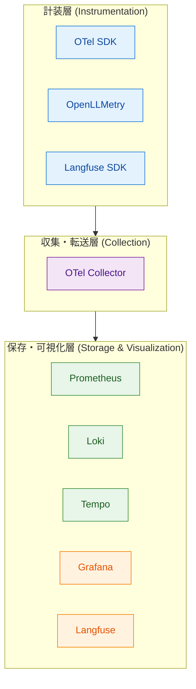
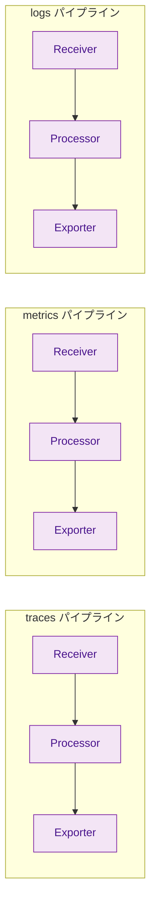
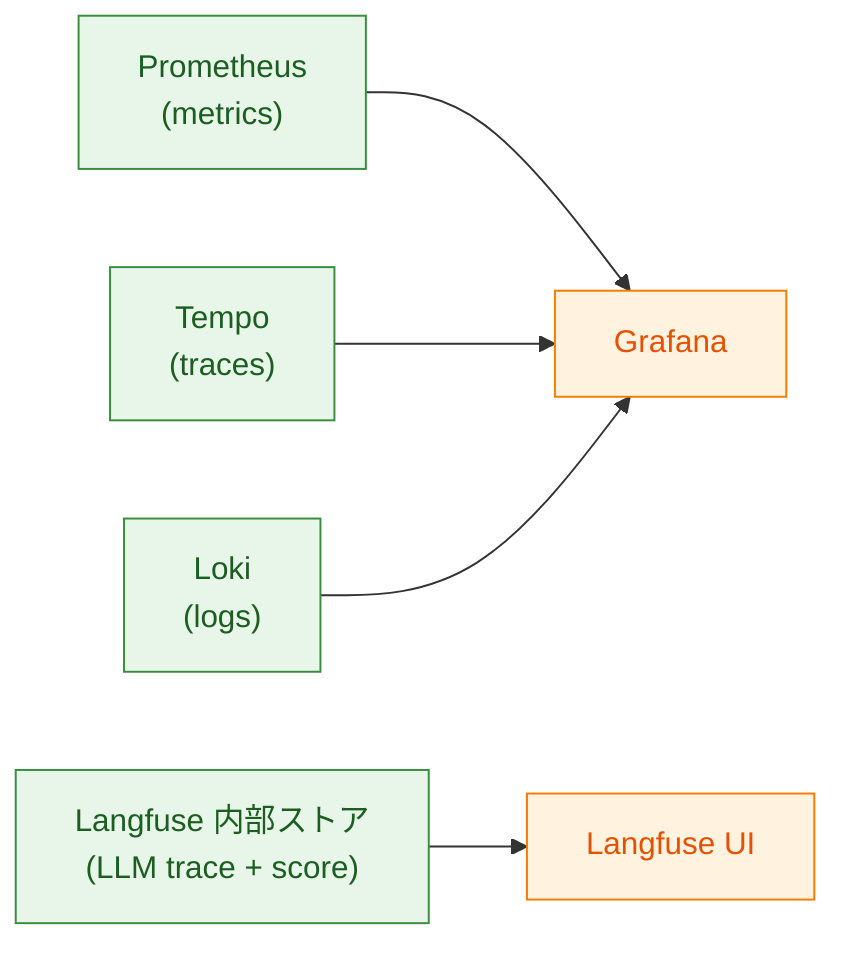
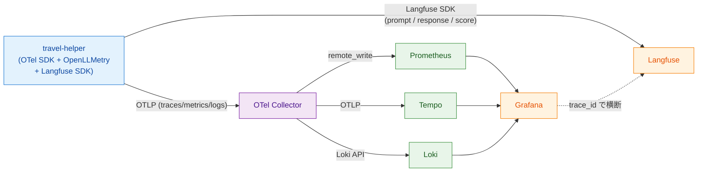

# 第2章 ツール群の知識地図

第1章では、AIエージェントのObservabilityには「システムとして何が起きたか」と「LLMの出力品質はどうだったか」という2つの関心事があり、両者を並行して観測する必要があると述べた。本章では、その2つの関心事に応えるツール群を1枚の地図として整理する。読了後、読者は本書で扱う各ツールが「どの層の・どの役割を担うか」を即座に答えられる状態になる。

## 2.1 3層モデルで整理する理由

ツール名を列挙しただけでは、なぜそのツールが必要か、他のツールとどう協調するかは見えてこない。本書ではObservability関連ツールを「観測データの生成（計装、Instrumentation）」「観測データの転送」「観測データの保存と活用」という3つの役割に分け、それぞれを層として扱う（図2.1）。

*図2.1: 3層モデルの全体像。計装層（青）でデータが生まれ、収集・転送層（紫）が中継し、保存・可視化層（緑＋橙）に蓄積されて利用される*

3層に分ける意義は2つある。1つ目は、各層が独立した関心事を扱うため、層内のツールを別物に差し替えても他の層への影響が局所化される点である。例えば保存層のTempoを別のトレースストアに置き換えたとしても、計装層のコードに修正は入らない。2つ目は、本書の章構成がこの3層に沿っているため、地図上の現在位置を読者が把握しやすくなる点である。

層を越えて責務を持たせる設計、例えばアプリケーションから直接ベンダー固有のバックエンドAPIを叩く構成は、変更の波及が広く、長期運用での保守性を損なう。この問題意識は第3章でOpenTelemetry（以下OTel）誕生の背景として再度取り上げる。

本書で扱う章と3層の対応は次のとおりである。第II部（第4〜8章）と第III部の一部（第9・11章）が計装層の概念を扱い、第6章と第15章が収集・転送層を扱う。保存・可視化層は第16章で集中的に取り上げる。

## 2.2 計装層のツール

計装層には3つのツールが存在する。OTel SDK、OpenLLMetry、Langfuse SDKである。それぞれの位置付けを表2.1に示す。

*表2.1: 計装層のツール比較。自動化度はアプリ側コード改変の少なさ、対応範囲は何を観測対象にできるか、送信先は出力プロトコルを示す*

| ツール | 生成データ | 自動化度 | 対応範囲 | 送信先 |
|--------|-----------|----------|----------|--------|
| OTel SDK | Traces、Metrics、Logs | 手動（明示的にコード記述） | 任意のコード区間（汎用） | OTLP（gRPC／HTTP） |
| OpenLLMetry | Traces、Metrics（OTel準拠） | 自動（モンキーパッチ） | LLM／VectorDB／フレームワークSDK | OTLP（gRPC／HTTP） |
| Langfuse SDK | LLMトレース、評価スコア、プロンプト履歴 | 半自動（デコレータ／明示記録） | LLM呼び出しと評価 | Langfuse OTLPエンドポイント（旧版は独自Ingestion API） |

OTel SDKは汎用の計装ライブラリである。Spanの開始と終了、Metricの記録、Logの出力をアプリケーション側のコードに明示的に記述する。手動計装の柔軟性が高い反面、対応するライブラリ呼び出しを自分で囲う必要がある。

OpenLLMetryはTraceloop社が開発するOSSであり、多数のLLM SDKやベクトル検索ライブラリ・フレームワークの呼び出しを自動的にOTel Spanに変換する[^1]。生成されるデータはOTel準拠であるため、送信先はOTel SDKと同じくOTLPに対応した受け口（典型的にはOTel Collector）である。第9章で詳しく扱う。

Langfuse SDKはLangfuseプラットフォーム専用のクライアントであり、LLMの入出力プロンプト、評価スコア、プロンプトのバージョンといったLLM Observability固有のデータを記録する[^2]。Python SDKはv3（2025年5月リリース）以降OpenTelemetry上に構築されており、データはOTLP/HTTPでLangfuseの専用エンドポイント（`/api/public/otel`）に送信される[^3]。OTel Collectorを必ずしも経由せずLangfuseバックエンドに直接送る構成が標準である点が、他の2つと運用面で異なる。

3者の使い分けは「何を記録したいか」で決まる。汎用Spanや自前メトリクスはOTel SDK、LLM呼び出しの自動可視化はOpenLLMetry、評価スコアやプロンプト管理はLangfuse SDKが担う。第9章と第11章でそれぞれ実機検証する。

## 2.3 収集・転送層のツール

収集・転送層には1つのツール、OTel Collectorしか存在しない。Collectorはアプリケーションとバックエンドの間に立ち、データの受信・加工・送信を担う中継点である。アプリは送信先の詳細を知らずにOTLPを話すだけでよく、Collectorが宛先ごとの形式変換を引き受ける。

Collectorの内部はReceivers、Processors、Exportersの3段パイプラインとして構成される（図2.2）[^4]。Receiversがデータを受信し、Processorsがバッチ化や属性追加といった加工を行い、Exportersが各バックエンドに転送する。

*図2.2: OTel Collectorのパイプライン概念図。3シグナル（traces／metrics／logs）はそれぞれ独立したパイプラインを持ち、Receivers→Processors→Exportersの3段構成で動作する*

3シグナルごとにパイプラインを独立して構成できる点が重要である。例えばトレースだけサンプリングを強めたい、メトリクスだけ別のバックエンドに送りたい、といった要件に対し、他のシグナルに影響を与えず独立に変更できる。

Collectorを挟むことで得られる恩恵は単なる中継にとどまらない。送信先の追加・削除はCollector設定の変更だけで完結し、アプリ側の再ビルドや再デプロイは不要になる。本書では第15章でLangfuseへのExporter追加を実機で行い、この恩恵を確認する。Collectorの構成要素やパイプライン設定の詳細は第6章で扱う。

## 2.4 保存・可視化層のツール

保存・可視化層は性質の異なる2種のツールが混在する。データを蓄積する「ストア」と、ストアに問い合わせて表示する「UI」である（表2.2）。

*表2.2: 保存・可視化層のツール比較。Langfuseは独自にストアを内包するため、保存とUIが分離していない*

| ツール | 役割 | 対象データ | クエリ言語 | 主な用途 |
|--------|------|-----------|-----------|----------|
| Prometheus | ストア | Metrics | PromQL | レイテンシ、エラー率、トークン消費の集計 |
| Tempo | ストア | Traces | TraceQL | リクエスト経路、Span詳細の検索 |
| Loki | ストア | Logs | LogQL | ログのラベル絞り込みとパターン検索 |
| Grafana | UI | 上記3ストアを横断 | データソースごと | ダッシュボード、トレース閲覧、ログ検索 |
| Langfuse | ストア＋UI | LLMトレース、評価スコア、プロンプト履歴 | UI上の絞り込み／API | プロンプト管理、評価、品質改善ループ |

Prometheus、Tempo、Lokiはそれぞれ単機能のデータストアであり、本書では「メトリクス／トレース／ログを蓄積するバックエンド」として扱う。それぞれの内部アーキテクチャやスケーリング戦略は本書のスコープ外である。

Grafanaはこれらのストアにデータソースとしてつなぎ、横断的に可視化するUIを提供する[^5]。Grafana自体はデータを保持せず、クエリを各ストアに発行して結果を表示する。

Langfuseはストアとしての側面とUIとしての側面を両方備えている。LLMトレースと評価スコアを内部のデータベースに保存し、専用のWeb UIで閲覧と分析を行う[^2]。GrafanaがOTel Collector経由でPrometheus／Tempo／Lokiに集約されたデータを引き受けるのに対し、LangfuseはLangfuse SDKから直接送られたデータを自身のストアで引き受ける、と整理できる（図2.3）。

*図2.3: データストアと可視化UIの接続関係。Grafanaは3ストアを横断し、LangfuseはストアとUIを内包する*

GrafanaとLangfuseは競合しない。前者はシステム挙動の地図であり、後者はLLM判断の顕微鏡である。両者の役割分担は第12章で詳述する。

## 2.5 データフロー全体図

3層を縦に並べただけでは、計装層から保存・可視化層までデータがどう流れるかは見えにくい。本節では本書の「北極星マップ」となるデータフロー全体図を提示する（図2.4）。以降の各章は、この地図のどこを詳しく見ているかを冒頭で示す。

*図2.4: データフロー全体図（本書の北極星マップ）。OTel経由の経路（実線）とLangfuse SDK経由の経路（実線下段）が並存し、trace_id（破線）で横断デバッグできる*

サンプルアプリ `travel-helper` は3つの計装ライブラリを同時に使う。OTel SDKとOpenLLMetryが生成するOTLPデータはCollectorに集約され、CollectorがPrometheus／Tempo／Lokiにそれぞれ振り分ける。Grafanaはこの3ストアを横断するUIである。

一方、Langfuse SDKが生成するデータは、本書の構成ではCollectorを経由せずLangfuseのOTLPエンドポイントへ直接送られる。Langfuseは独自のデータモデル（プロンプトのバージョン管理、評価スコア、ユーザーフィードバック等）を持ち、OTel Collectorを挟む構成と挟まない構成のいずれも採れるが、運用上の役割分担を明確にするため本書は直接送信を採用する。経路選択の詳細は第12章で扱う。

2つの経路は独立に動作するが、trace_idによって紐付けられる。GrafanaのTempoでトレースを開いたとき、その `trace_id` を使ってLangfuse上の同一リクエストの判断履歴に飛べる。逆方向も成立する。この紐付け方法と運用は第12章で扱う。

この図は本書の「北極星」である。後続の章で個別のツールに踏み込む際にも、必ずこの図のどこを今扱っているかを冒頭で示す。読者は地図上の現在地を見失わずに学習を進められる。

## 2.6 「どっちを見ればいい？」の判断基準

地図ができても、トラブル発生時に最初にどちらのUIを開くかという判断は別問題である。本書ではツール名で覚えるのではなく、第1章で導入した「2つの関心事」から選ぶことを推奨する。表2.3は典型的な問いごとの第一選択をまとめたものである。

*表2.3: 問いとツールの対応表。第一選択はあくまで起点であり、横断デバッグでは両方を併用する*

| 症状・問い | 第一選択 | 関心事 | 理由 |
|-----------|---------|--------|------|
| エンドポイント全体のp95レイテンシが悪化した | Grafana | A | 時系列メトリクスの俯瞰 |
| 特定のユーザーリクエストが遅い | Grafana → Tempo | A | レイテンシ→該当トレース特定 |
| エラー率が急増した | Grafana | A | エラーカウンタの推移 |
| LLMが期待と違う回答をした | Langfuse | B | プロンプトとレスポンスを並べて検証 |
| プロンプト変更後に品質が落ちた | Langfuse | B | プロンプトバージョン間の出力比較 |
| LLMが想定外のツールを選んだ | Langfuse → Grafana | B→A | 判断履歴を見た後、関連Spanを確認 |
| LLM呼び出しのコストが急増した | Grafana（メトリクス）→ Langfuse | A→B | トークン消費の傾向→該当判断の妥当性 |
| 特定ユーザーで継続的に評価スコアが低い | Langfuse | B | スコア時系列とトレース詳細 |

表2.3の右端「理由」が示すように、選択基準は固有名詞ではなく関心事である。「システムが正常に動いているか」を疑う問いはGrafanaから、「LLMが賢く動いているか」を疑う問いはLangfuseから入る。

慣れてきたら、両方を横断的に見るのが標準になる。例えば「コストが急増」は関心事Aから入ってメトリクスで全体傾向を捉え、関心事Bに移って具体的な判断を検証する、といった流れである。第12章で扱うtrace_id紐付けは、この横断を支える基盤である。

## まとめ

- 本書のツール群は計装層／収集・転送層／保存・可視化層の3層モデルで整理できる
- 計装層にはOTel SDK（手動・汎用）、OpenLLMetry（自動・LLM特化）、Langfuse SDK（評価・プロンプト管理）の3種がある
- 収集・転送層はOTel Collector1つで、3シグナル独立のパイプラインを構成する
- 保存・可視化層はストア（Prometheus／Tempo／Loki）とUI（Grafana）の組と、ストア兼UI（Langfuse）から成る
- データフロー全体図はOTel経路とLangfuse SDK経路の2系統が並存し、trace_idで横断する
- トラブル時は固有名詞ではなく関心事（A／B）から第一選択を決め、必要に応じて両UIを行き来する

## 理解度チェック

### Q1. 3層モデルの各層の役割

**種類**: 概念の確認 / **関連する節**: 2.1

3層モデル（計装層／収集・転送層／保存・可視化層）のそれぞれの役割を、1行ずつで説明せよ。

解答と解説

- 計装層: アプリケーションコードから観測データ（Span、Metric、Log、LLMトレース等）を生成する層。
- 収集・転送層: 計装層からデータを受け取り、加工して各バックエンドに振り分けて転送する層（OTel Collector）。
- 保存・可視化層: 受信したデータを蓄積するストア（Prometheus／Tempo／Loki／Langfuse内部ストア）と、それを問い合わせて表示するUI（Grafana／Langfuse UI）から成る層。

### Q2. OpenLLMetryとLangfuse SDKの違い

**種類**: 概念の確認 / **関連する節**: 2.2

OpenLLMetryとLangfuse SDKの違いを、計装対象と送信先の観点から述べよ。

解答と解説

OpenLLMetryはLLM SDKやベクトル検索ライブラリの呼び出しをモンキーパッチで自動的にOTel Spanに変換する自動計装で、送信先はOTLPに対応した受け口（典型的にはOTel Collector）である。Langfuse SDKはLLM呼び出しの入出力プロンプト・評価スコア・プロンプトバージョン等のLLM Observability固有データを記録するクライアントで、現行のPython v3以降はOTel上に構築されOTLP/HTTPでLangfuseの専用エンドポイントに直接送る構成が標準である。本書ではCollectorを経由しない構成を採る。

### Q3. コスト過剰使用への第一選択

**種類**: 判断問題 / **関連する節**: 2.5、2.6

「LLMがコストを過剰に使っている」という問題に最初に向き合うとき、Grafana／Langfuseのどちらを開くべきか、理由とともに答えよ。

解答と解説

まずGrafana。コストの急増を捉えるにはトークン消費の時系列推移（メトリクス）を俯瞰する必要があり、これは関心事A（システムとして何が起きたか）の問いだからである。悪化した時間帯と該当エンドポイントを特定したら、次にLangfuseに移り、その時間帯の具体的なリクエストでLLMがなぜ多くのトークンを使う判断をしたか（不要なツール呼び出しの連鎖、過剰なFew-shot等）を検証する。trace_idで両UIを横断するのが定石である。

## 参考文献

- Traceloop. "OpenLLMetry — Integrations." https://www.traceloop.com/docs/openllmetry/integrations/introduction （閲覧日: 2026-04-14）
- Langfuse. "LLM Observability & Application Tracing." https://langfuse.com/docs/observability/overview （閲覧日: 2026-04-14）
- Langfuse. "OpenTelemetry Integration." https://langfuse.com/integrations/native/opentelemetry （閲覧日: 2026-04-14）
- OpenTelemetry Project. "Collector — Architecture." https://opentelemetry.io/docs/collector/architecture/ （閲覧日: 2026-04-14）
- Grafana Labs. "Grafana documentation — Data sources." https://grafana.com/docs/grafana/latest/datasources/ （閲覧日: 2026-04-14）

[^1]: Traceloop. "OpenLLMetry — Integrations." https://www.traceloop.com/docs/openllmetry/integrations/introduction
[^2]: Langfuse. "LLM Observability & Application Tracing." https://langfuse.com/docs/observability/overview
[^3]: Langfuse. "OpenTelemetry Integration." https://langfuse.com/integrations/native/opentelemetry
[^4]: OpenTelemetry Project. "Collector — Architecture." https://opentelemetry.io/docs/collector/architecture/
[^5]: Grafana Labs. "Grafana documentation — Data sources." https://grafana.com/docs/grafana/latest/datasources/

## 次章への接続

本章では本書のツール群を3層モデルとして地図化し、データフロー全体図を北極星として提示した。地図上で中心的な位置を占めるのはOTelである。なぜOTelが標準として存在し、計装層と収集層の双方をカバーしているのか。第3章ではその歴史的経緯を辿り、「計装をバックエンドから切り離す」という設計判断の根拠を確認する。
