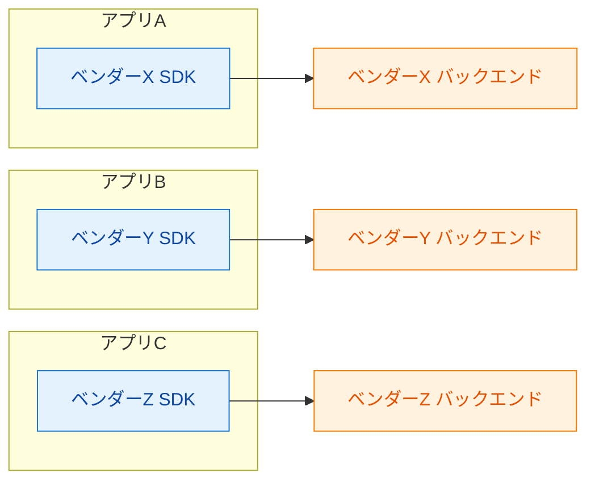
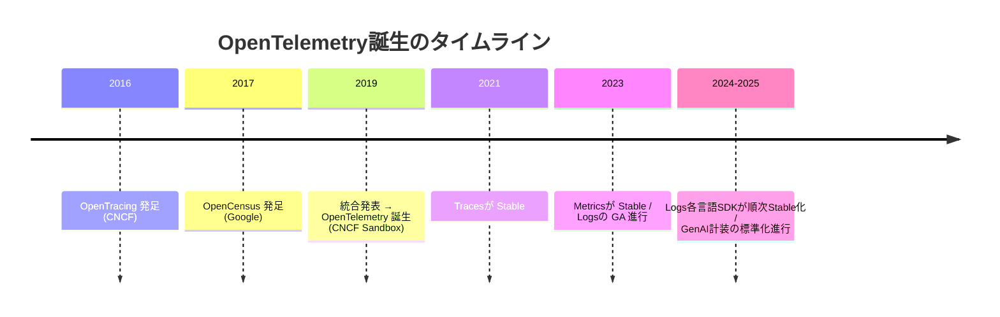
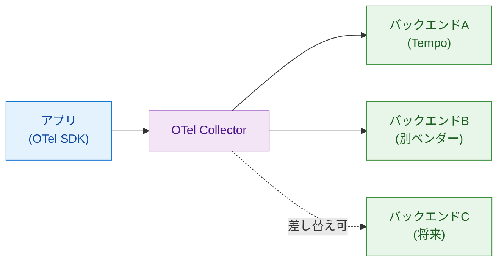

# 第3章 OTelはなぜ生まれたか ― 標準化の背景

第2章ではOpenTelemetry（以下OTel）が3層モデル上で計装層と収集・転送層の双方を担っていると述べた。なぜOTelは標準として広く存在し、計装からCollectorまでを包括するのか。本章ではその歴史的経緯を辿り、「計装をバックエンドから切り離す」という設計判断がどのような問題意識から生まれたかを確認する。読了後、読者はOTelに準拠する判断の根拠を自分の言葉で語れる状態になる。

## 3.1 ベンダーロックイン問題

分散トレーシングが運用現場に広まり始めた2010年代前半、各監視ベンダーはそれぞれ独自のSDKと独自のデータフォーマットを提供していた。アプリケーション開発者は「どのベンダーのバックエンドにデータを送るか」を選ぶと同時に、そのベンダー固有のSDK呼び出しをアプリケーションコードに埋め込むことを強いられた（図3.1）。

*図3.1: ベンダーロックイン下での計装依存。アプリ側のコードがベンダー固有SDKに直結し、バックエンド変更時には計装の書き直しが発生する*

この構造には2つの痛みがあった。1つ目は、バックエンドを別ベンダーに切り替えるたびにアプリケーションのコード変更が必要となる点である。観測対象が増えるほどこの変更コストは線形に増えていく。2つ目は、組織内で複数の監視ベンダーが混在した場合、アプリごとに異なるSDKを学ばなければならず、計装のノウハウが集約しにくい点である。

「計装」と「バックエンド」を分離したい――この動機が、後述するOpenTracingやOpenCensusといった標準化プロジェクトを生んだ[^1]。

## 3.2 OpenTracingとOpenCensus

ベンダーロックインへの対抗として、2つの標準化プロジェクトがほぼ同時期に立ち上がった。OpenTracingとOpenCensusである。両者はクラウドネイティブ技術の標準化を担うCNCF（Cloud Native Computing Foundation）と関係を持ちつつ進展した。表3.1にその比較を示す。

*表3.1: OpenTracingとOpenCensusの比較。両者は目的が重なる部分を持ちながらも、対象範囲と成果物の形が異なっていた*

| 項目 | OpenTracing | OpenCensus |
|------|-------------|------------|
| 発足 | 2016年（CNCFプロジェクト） | 2017年（Google主導、後にOpenTelemetryへ統合） |
| 主な対象 | 分散トレーシング | トレーシング＋メトリクス |
| 提供物 | 標準API（仕様）と各言語のラッパ | SDK、エージェント、フォーマット |
| 設計思想 | API中心。実装はベンダーが提供 | フルスタックの計装ライブラリ |
| 問題点 | 実装ごとの差異が残り、相互運用性が限定的 | OpenTracingとAPIが非互換、エコシステムの分断 |

OpenTracingは「計装APIだけを標準化し、実装はベンダーが用意する」という方針を採った[^2]。これによりアプリのコードはベンダー非依存になる一方、実装間の挙動差や仕様外の振る舞いに悩まされることがあった。

OpenCensusはGoogleの内部標準（Census）を起点にOSS化されたプロジェクトであり、トレースとメトリクスを統合的に扱うSDKやエージェント（Collectorの先祖）を提供した[^3]。仕様だけでなく実装まで提供するアプローチは導入の手間を減らしたが、OpenTracingとAPIが互換でなかったため、両者を跨ぐ場合はアダプタやブリッジが必要だった。

結果として「ベンダーニュートラルに計装したい」というユーザーの願いに対し、選択肢が2つの標準として並立する状況が生まれた。標準が複数あること自体がエコシステムの分断であり、ユーザー体験を損ねていた。

## 3.3 OpenTelemetryの誕生

2019年、KubeCon EU 2019において、OpenTracingとOpenCensusの両プロジェクトはOpenTelemetryへの統合を発表した[^4]。標準が1つに収斂したことで、計装API・SDK・データフォーマット（OTLP）を1つのプロジェクト内で扱えるようになった。

*図3.2: OpenTelemetryに至るまでの主要マイルストーン。2標準の並立から統合、3シグナルの段階的安定化までの流れ*

OTelは3シグナル（Traces／Metrics／Logs）を1つのプロジェクト内で扱う方針を採り、Tracesは2021年2月のSpecification v1.0.0で安定版となった[^5]。MetricsはやがてStable APIに到達し、Logsも順次安定化が進んだ。CNCFプロジェクトとしての成熟度も高く、2万人を超えるコントリビュータを擁する大規模コミュニティへと成長している[^6]。

主要な観測ベンダー（DataDog、New Relic、Honeycomb、Grafana Labs等）はOTelの取り込み口を提供しており、計装側がOTLPを話せばバックエンドはほぼ自由に選べる状況が形成されている[^7]。

## 3.4 なぜこの背景が本書に関係するか

OTelの設計思想は本書のサンプル構成の出発点でもある。アプリケーションがOTel SDKでデータを生成し、OTel CollectorがそれをPrometheus／Tempo／Lokiに振り分ける構成は、3.1節で示したベンダーロックイン問題への直接の回答である（図3.3）。

*図3.3: 「計装・収集・保存」の分離が生む柔軟性。CollectorのExporter設定を変更するだけで送信先を差し替えでき、アプリ側のコードに変更は波及しない*

この構造により、運用組織はバックエンドを選び直す自由度を保ちながら、アプリ側の計装コードの再利用性を最大化できる。観測ベンダーを今後変える可能性がある場合でも、計装層への投資が無駄にならない。

OpenLLMetryがOTelの上に構築されているのも、この同じ論理の延長である。LLM呼び出しの自動計装をOTel Spanとして表現すれば、Tempoでも他のベンダーでも、OTLP受信に対応するバックエンドであればそのまま受け取れる。LLM計装をOpenLLMetryではなくベンダー固有SDKで行えば、再びベンダーロックインへの逆戻りとなる。

LLM計装の標準化はOTelプロジェクト本体でも進行中である。GenAI Semantic Conventionsとして、`gen_ai.request.model` 等の標準Attribute名が定義されつつあり、Traceloop（OpenLLMetry開発元）はこれらの計装コードのOTel本体への寄贈を進めている[^8]。詳細は第8章で扱う。

## まとめ

- 分散トレーシング黎明期にはベンダー固有SDKがアプリに直結し、バックエンド切替コストが計装の書き直しという形で発生していた
- OpenTracing（API標準、CNCF）とOpenCensus（SDK＋エージェント、Google主導）が並立し、エコシステムの分断を生んでいた
- 2019年に両者がOpenTelemetryに統合され、3シグナル（Traces／Metrics／Logs）を1つのプロジェクトで扱う標準として整った
- OTelの「計装をバックエンドから切り離す」設計は、OTel Collectorによる中継として本書の構成にそのまま現れている
- OpenLLMetryのOTel準拠もこの設計思想の延長にあり、LLM計装でもベンダーロックインを避けられる

## 理解度チェック

### Q1. OpenTracingとOpenCensusの違いと統合理由

**種類**: 概念の確認 / **関連する節**: 3.2、3.3

OpenTracingとOpenCensusの違いを述べたうえで、両者が統合される必要があった理由を述べよ。

解答と解説

OpenTracingはCNCF発足（2016年）の標準で、計装APIだけを定義し実装はベンダーに委ねるアプローチを採った。OpenCensusはGoogle発足（2017年）でトレースとメトリクスを統合的に扱うSDK＋エージェントを提供した。両者は目的が重なるにもかかわらずAPIが非互換であったため、ユーザーは2標準のどちらを採用するか決めねばならず、両者を跨ぐ場合はアダプタを書く必要があった。標準が複数あること自体がエコシステムの分断を生んでいたため、2019年にOpenTelemetryに統合された。

### Q2. 「計装とバックエンドを分離する」の意味

**種類**: 概念の確認 / **関連する節**: 3.1、3.4

OTel Collectorが「計装とバックエンドを分離する」とはどういうことか、ベンダーロックイン問題に照らして説明せよ。

解答と解説

ベンダー固有SDKを用いる場合、アプリのコードがバックエンドに直結し、バックエンドを変更するたびに計装の書き直しが発生する。OTel Collectorを挟むと、アプリはOTLPを話すだけでよく、送信先（Tempo、Prometheus、別ベンダーのバックエンド等）はCollectorのExporter設定で切り替えられる。これによりアプリ側コードに変更を波及させずバックエンドを差し替えられ、ベンダーロックイン問題が解消される。

### Q3. 新規プロジェクトでの計装SDK選択

**種類**: 判断問題 / **関連する節**: 3.3、3.4

新規プロジェクトでLLMアプリを計装する際、ベンダー独自SDKとOTel準拠SDK（OTel SDKやOpenLLMetry）のどちらを選ぶべきか、本章の歴史的背景をふまえて判断理由を述べよ。

解答と解説

OTel準拠SDKを選ぶべきである。本章で示したとおり、独自SDKは過去のベンダーロックイン問題と同じ構造をアプリに持ち込み、将来のバックエンド変更コストを高める。OTel準拠SDKを使えば、Tempoから別ベンダーへの切り替えもCollectorのExporter設定で完結し、アプリ側の計装は再利用できる。LLM計装も標準化が進行中であり（GenAI Semantic Conventions）、独自命名のAttributeに依存する計装は将来の標準準拠データソースで活用しにくくなるリスクがある。

## 参考文献

- CNCF. "OpenTracing Project." https://opentracing.io/ （閲覧日: 2026-04-14）
- OpenCensus Project. "OpenCensus." https://opencensus.io/ （閲覧日: 2026-04-14）
- CNCF Blog. "OpenTracing and OpenCensus merge to form OpenTelemetry." https://www.cncf.io/blog/2019/05/21/a-brief-history-of-opentelemetry-so-far/ （閲覧日: 2026-04-14）
- OpenTelemetry Specification. "Project Timeline." https://github.com/open-telemetry/opentelemetry-specification/#project-timeline （閲覧日: 2026-04-14）
- CNCF. "Projects — OpenTelemetry." https://www.cncf.io/projects/opentelemetry/ （閲覧日: 2026-04-14）
- OpenTelemetry Project. "Vendors that support OpenTelemetry." https://opentelemetry.io/ecosystem/vendors/ （閲覧日: 2026-04-14）
- OpenTelemetry Project. "Semantic Conventions for Generative AI." https://opentelemetry.io/docs/specs/semconv/gen-ai/ （閲覧日: 2026-04-14）

[^1]: CNCF Blog. "A brief history of OpenTelemetry (so far)." https://www.cncf.io/blog/2019/05/21/a-brief-history-of-opentelemetry-so-far/
[^2]: CNCF. "OpenTracing Project." https://opentracing.io/
[^3]: OpenCensus Project. "OpenCensus." https://opencensus.io/
[^4]: CNCF Blog. "A brief history of OpenTelemetry (so far)." https://www.cncf.io/blog/2019/05/21/a-brief-history-of-opentelemetry-so-far/
[^5]: OpenTelemetry Specification. "Project Timeline." https://github.com/open-telemetry/opentelemetry-specification/#project-timeline
[^6]: CNCF. "Projects — OpenTelemetry." https://www.cncf.io/projects/opentelemetry/ （コントリビュータ統計を参照）
[^7]: OpenTelemetry Project. "Vendors that support OpenTelemetry." https://opentelemetry.io/ecosystem/vendors/
[^8]: OpenTelemetry Project. "Semantic Conventions for Generative AI." https://opentelemetry.io/docs/specs/semconv/gen-ai/

## 次章への接続

本章でOTelの設計思想を歴史的経緯から確認した。第II部からは、その設計思想が具体的にどのようなデータモデルとして実装されているかを掘り下げる。第4章では、OTelの最も基本的な構成要素であるAttribute、Span、Trace、SpanContext、Context Propagation、Eventの6概念を順に学び、最小のハンズオンでSpanをTempoに届けるところまで実機で確認する。
