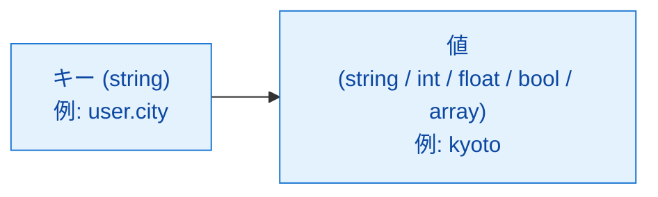
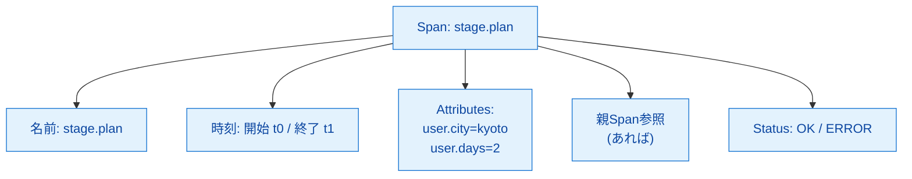
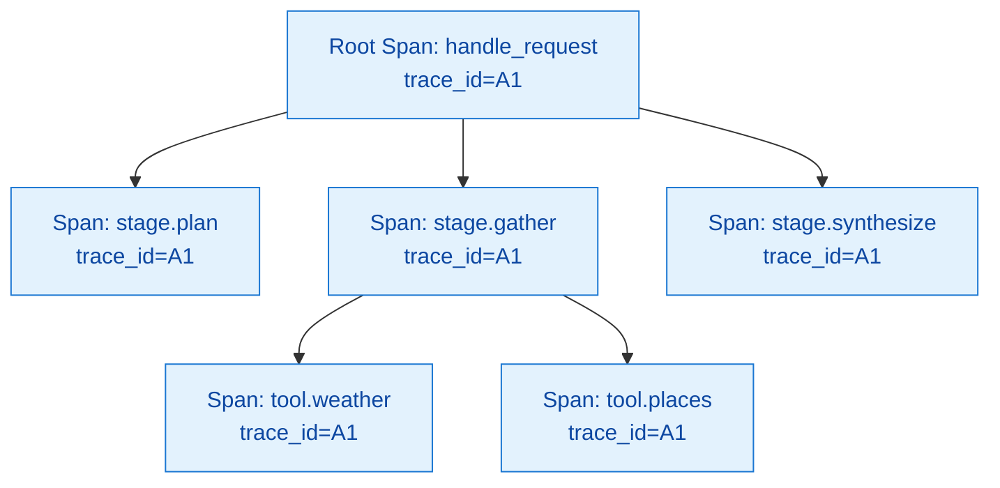
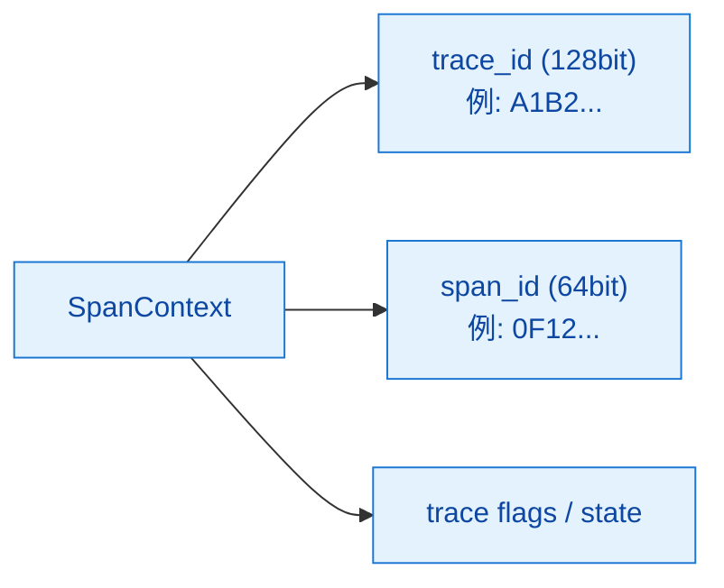
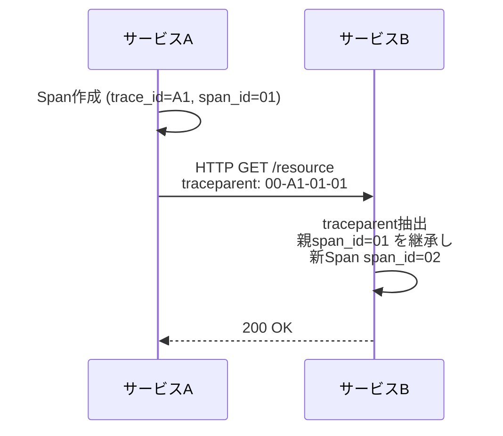
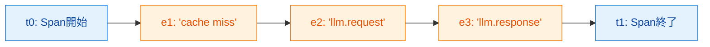
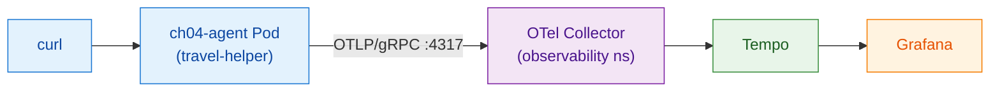

# 第4章 OTelの概念モデル

第II部からはOpenTelemetry（以下OTel）の中身に踏み込む。本章ではOTelが提供するSDK（Software Development Kit）と、それが扱うデータモデルの詳細に入る。前章までは「OTelが何を解決するか」「ツール群の地図上での位置」を扱ったが、本章ではOTelが扱うデータモデルを最小単位から組み立てる。Attribute、Span、Trace、SpanContext、Context Propagation、Eventの6概念を順に定義し、最後に最小のハンズオンとして1つのSpanをTempoに届けるところまでを実機で確認する。読了後、読者はOTelのデータモデルを自分の言葉で説明でき、簡単な計装コードを書ける状態になる。

本章で扱う範囲は、第2章の図2.4（北極星マップ）の左端「アプリケーション → OTel SDK」と、その先の「OTel Collector → Tempo」までである。

## 4.1 Attribute ― 最小単位のメタデータ

Attribute（属性）はOTelデータモデルの最小単位であり、観測データの「メタデータ」を表現する。構造としてはキーと値のペアであり、これ以上分解できない（図4.1）。



*図4.1: Attributeの構造。キーは文字列、値はプリミティブ型または同一型の配列に限定される*

Attributeのキーは文字列であり、値は文字列、整数、浮動小数点数、真偽値、またはそれらの同一型配列のいずれかに限定される[^1]。キーの命名にはドット階層が慣例として用いられる。例えば `user.city`、`http.request.method`、`gen_ai.request.model` のように、名前空間を `.` で区切って表現する。

OTelではAttributeはあらゆる場所に現れる。次節以降で扱うSpan、Metric、Log、Eventの全てがAttributeを保持する。共通の規約として「Semantic Conventions」（意味論の規約）が定義されており、例えばHTTPリクエストには `http.request.method`、`url.full` といった標準キーが推奨される[^2]。LLM向けの規約はGenAI Semantic Conventionsとして第8章で扱う。

本書のサンプルでは独自Attributeに `travel_helper.` プレフィックスを付け、標準キーとの衝突を避ける（development-guidelinesに基づく）。

## 4.2 Span ― 処理区間の単位

Span（スパン）は「ある処理の開始から終了までの区間」を表す単位である。Spanは開始時刻、終了時刻、名前、Attribute集合、親Spanへの参照、ステータスを持つ（図4.2）。



*図4.2: Spanの構造。1つの処理区間が時刻・名前・Attribute・親参照・ステータスをまとめて保持する*

Pythonでの最も基本的なSpan生成は次の形である。

```python
with tracer.start_as_current_span("stage.plan") as span:
    span.set_attribute("user.city", "kyoto")
    # ここで処理を実行
```

`start_as_current_span` はSpanの開始と終了をwith構文で囲み、ブロックを抜けるときに自動的にSpanを終了させる。同時にこのSpanを「現在のSpan」として登録する点が重要であり、これが次節以降のTraceとSpanContextの自動接続を支える。

Spanは入れ子（ネスト）にできる。withをネストすると、内側のSpanは自動的に外側のSpanを親として認識する。これにより呼び出し階層がそのまま親子関係としてTraceに反映される。

## 4.3 Trace ― Spanの集合

Trace（トレース）は「同じTrace IDを共有するSpanの集合」である。1つのリクエスト処理に紐付くSpan群を1つのTraceとして俯瞰できる。木構造として描かれることが多い（図4.3）。



*図4.3: 1つのTraceは木構造として現れる。全てのSpanが同じTrace IDを共有し、親子参照で木が形作られる*

注意すべき点として、OTelの実装には「Traceクラス」は存在しない。Trace IDというフィールドがSpanに付くだけであり、Trace単体のオブジェクトを生成する操作はない。Traceは「同じTrace IDを持つSpanの集合」という抽象として、TempoのようなトレースストアやGrafanaのUIで再構成される。

Trace IDは128bitの値で、最上位のSpan（Root Span）の生成時にOTel SDKによって自動採番される[^3]。子Spanは親のTrace IDをそのまま継承する。「リクエストの同一性」はこのTrace IDによって表現される。

## 4.4 SpanContext ― 現在位置の表現

SpanContextは「今どのTraceのどのSpanの中にいるか」を表す不変オブジェクトである。Trace ID（128bit）とSpan ID（64bit）に加え、サンプリング情報やtrace flagsを含む（図4.4）。



*図4.4: SpanContextの構成要素。Trace IDとSpan IDがコアで、サンプリング判断などのフラグが付帯する*

SpanContextはPythonでは `contextvars` モジュールを介してスレッド／タスクごとに保持される。`with tracer.start_as_current_span(...)` のwithブロック内では、その新しいSpanのSpanContextが「現在のコンテキスト」になる。ブロックを抜けると元のコンテキストに戻る。

この自動伝播のおかげで、開発者は「親Spanは何か」を明示的に書かずに済む。withをネストすれば自動的に親子関係が成立する。一方で、非同期処理（asyncioのTask、ThreadPoolExecutor等）でコンテキストが渡らない場合は、`Context.attach` などで明示的に伝播する必要がある。本書のサンプルは単一スレッドのFastAPIハンドラに閉じているため、この問題には踏み込まない。

## 4.5 Context Propagation ― プロセス境界を越える伝播

SpanContextの自動伝播はプロセス内に限られる。マイクロサービス間でTraceを連結するには、HTTP呼び出しの際にTrace IDとSpan IDを相手に伝える必要がある。これを担うのがContext Propagation（コンテキスト伝播）である（図4.5）。



*図4.5: W3C Trace Contextに基づくHTTP越えのContext伝播。`traceparent`ヘッダーで親Span情報を引き継ぎ、サービス境界を越えてTraceが連結される*

OTelはW3C Trace Context仕様に準拠する[^4]。`traceparent` ヘッダーは「version-trace_id-parent_span_id-flags」形式の文字列で、相手サービスはこれを読み取って自身のSpanの親として設定する。`tracestate` ヘッダーはベンダー固有のメタデータを乗せる二次的な仕組みである。

OTelのHTTPクライアント自動計装（例: `opentelemetry-instrumentation-requests`）はこのヘッダー付与を自動で行う。FastAPI側の自動計装は逆にヘッダーを読み取って親Spanを設定する。本書のサンプルは単一Pod内で完結するためサービス間伝播は登場しないが、概念として押さえておく。

## 4.6 Event ― Span内の瞬間

Event（イベント）はSpan内の特定時点を記録する仕組みである。「ある瞬間に何が起きた」を時系列に並べる、Span内のミニログのようなものと考えてよい（図4.6）。



*図4.6: 1つのSpanのタイムライン上に並ぶEvent。各Eventは時刻・名前・任意のAttributeを持つ*

EventはSpan APIの `add_event(name, attributes, timestamp)` で追加する。1つのEventは時刻、名前、Attribute集合を持つ。Eventは独立したSpanではないため、親子関係や独自のSpan IDは持たず、所属するSpanのコンテキスト内に閉じている。

LLMのプロンプトとレスポンスをEventとして記録するアプローチは、GenAI Semantic Conventionsで議論されているが、執筆時点ではexperimentalである[^5]。本書の本筋ではログやSpan Attributeでの記録を採用し、Eventは概念紹介に留める。

## 4.7 ハンズオン ― 最小Spanを送る

6つの概念を理解したところで、最小のSpanを実機で生成し、Tempoまで届くことを確認する。本書のサンプルアプリ `travel-helper` の第4章版（`sample-app/ch04/`）は、`POST /plan` で1つのSpan（`stage.plan`）を作って終わるだけの最小構成である（図4.7）。



*図4.7: 第4章ハンズオンの構成。`travel-helper` がOTLP/gRPCで既存のCollectorに送り、Tempoまで届く*

Spanを生成しているコードはリスト4.1である。

**リスト4.1: `sample-app/ch04/agent.py`（抜粋）**

```python
@app.post("/plan", response_model=PlanResponse)
def plan(req: PlanRequest) -> PlanResponse:
    with tracer.start_as_current_span("stage.plan") as span:
        span.set_attribute("user.city", req.city)
        span.set_attribute("user.days", req.days)
        span.set_attribute("user.keywords_count", len(req.keywords))
        ctx = span.get_span_context()
        trace_id_hex = format(ctx.trace_id, "032x")
        items = [f"{kw}関連スポット" for kw in req.keywords] or ["市内中心部の主要観光"]
        itinerary = (
            f"{req.city} {req.days}日間プラン: " + " / ".join(items)
        )
        span.set_attribute("travel_helper.investigation_items_count", len(items))
        return PlanResponse(itinerary=itinerary, trace_id=trace_id_hex)
```

`tracer` は `otel_setup.py` で初期化されたグローバルなTracerである（同ディレクトリ参照）。`with tracer.start_as_current_span("stage.plan")` で1つのSpanを生成し、`set_attribute` でユーザー入力をAttributeとして記録する。`span.get_span_context().trace_id` を16進文字列に変換してレスポンスに含めることで、後でTempo上の同じTraceに辿り着けるようにしている。

KubernetesへのデプロイマニフェストはConfigMap経由でコードを配布する形を採っている（リスト4.2）。読者が独自にイメージビルドする手間を省くため、`python:3.11-slim` をベースに起動時 `pip install` する構成である。

**リスト4.2: `sample-app/ch04/k8s/deployment.yaml`（抜粋）**

```yaml
spec:
  containers:
    - name: agent
      image: python:3.11-slim
      workingDir: /app
      command: ["/bin/sh", "-c"]
      args:
        - |
          set -e
          cp /code/* /app/
          pip install --no-cache-dir -r /app/requirements.txt
          exec uvicorn agent:app --host 0.0.0.0 --port 8000
      envFrom:
        - configMapRef:
            name: travel-helper-ch04-config
      volumeMounts:
        - name: code
          mountPath: /code
  volumes:
    - name: code
      configMap:
        name: travel-helper-ch04-code
```

OTLP（OpenTelemetry Protocol）送信先は環境変数 `OTEL_EXPORTER_OTLP_ENDPOINT` で `http://otel-gateway-opentelemetry-collector.observability:4317` を指定する。これは既存スタックの中継Collectorで、ここから先は読者が手を入れる必要はない。

デプロイと検証は次のコマンドで行う。

```bash
cd sample-app/ch04
make deploy
make verify
```

`make verify` は `/plan` にPOSTを送り、`service.name=travel-helper-ch04` のTraceがTempoに登場することを確認する。Grafanaの「Explore → Tempoデータソース → Search」で `service.name=travel-helper-ch04` を検索すると、生成された `stage.plan` Spanが、Attributeとして `user.city` `user.days` `user.keywords_count` `travel_helper.investigation_items_count` を持つことが確認できる。

実機検証時には1リクエストにつき1つのSpanが生成され、Tempoに正しく届くことが確認できた。本書ではSDK標準の `BatchSpanProcessor`（生成されたSpanを一定間隔・一定件数でバッファリングしてエクスポートする送信機構）を用いている。このためSpan生成からTempoでの検索ヒットまで数秒のラグがある点に注意する。

確認が終わったら次のコマンドで本章のリソースをクリーンアップする。

```bash
make clean
# またはリポジトリルートから
make clean-ch04
```

このコマンドは `aio11y-book` namespace内の `book.aio11y/chapter=04` ラベルを持つリソースのみを削除する。共有スタック（observability、langfuse）には触れない。

## まとめ

- AttributeはOTelの最小単位で、キーと値のペアとして全ての観測データに付与される
- Spanは処理区間を表し、開始終了時刻・名前・Attribute・親参照・ステータスを持つ
- Traceは「同じTrace IDを共有するSpanの集合」であり、Traceクラスは存在しない
- SpanContextはTrace ID＋Span IDで「現在位置」を表し、withネストで自動伝播する
- W3C Trace Contextの `traceparent` ヘッダーがプロセス境界を越える伝播を担う
- EventはSpan内の特定時点を記録する仕組み（プロンプト記録への応用はexperimental）
- 最小ハンズオンで1つのSpanがOTLP→Collector→TempoまでE2Eで届くことを確認した

## 理解度チェック

### Q1. Trace・Span・Attribute・SpanContextの関係

**種類**: 概念の確認 / **関連する節**: 4.1〜4.4

Trace、Span、Attribute、SpanContextの4概念の関係を、データの包含関係と参照関係で説明せよ。

<details>
<summary>解答と解説</summary>

Spanは1つの処理区間を表す中核要素で、複数のAttributeを内包する。Spanは親Spanへの参照を持ち、同じTrace IDを共有するSpanの集合がTraceとなる。SpanContextはTrace IDとSpan IDのペアで、「現在どのTraceのどのSpanの中にいるか」を示す不変オブジェクトである。Attributeはあらゆる場所（Span、Metric、Log、Event）に付くキーバリュー型のメタデータ。OTelに「Traceクラス」は存在せず、Traceは同じTrace IDを共有するSpanの集合という抽象として再構成される。

</details>

### Q2. ネストしたstart_as_current_spanの親子関係

**種類**: 概念の確認 / **関連する節**: 4.2、4.4

`with tracer.start_as_current_span()` をネストしたとき、内側Spanの親はどう決まるかを述べよ。

<details>
<summary>解答と解説</summary>

外側のwithブロック内では外側Spanが「現在のSpan」としてSpanContextに登録されている。内側で `start_as_current_span` を呼ぶと、SDKは現在のSpanContextを参照して外側Spanを親として記録し、内側Spanを新たな「現在のSpan」に切り替える。内側のwithブロックを抜けると元（外側）のSpanContextに戻る。開発者は親Spanを明示しなくてよい。

</details>

### Q3. Context Propagationがない場合の影響

**種類**: 概念の確認 / **関連する節**: 4.5

Context Propagationがないとき、サービスを跨いだ分散トレーシングで何が起きるかを説明せよ。

<details>
<summary>解答と解説</summary>

サービスAで作られたSpanのTrace IDがサービスBに伝わらないため、サービスBは自分独自の新しいTrace IDを採番する。結果としてサービスAとBで処理した同じリクエストが2つの別Traceとして記録され、Tempo等のUI上で1リクエストの全体像（ウォーターフォール）を再構成できなくなる。W3C Trace Contextの `traceparent` ヘッダーがこの分断を防ぐ。

</details>

### Q4. plan_stageとsynthesize_stageのSpan設計

**種類**: 設計問題 / **関連する節**: 4.2、4.3

plan_stageとsynthesize_stageの2段階処理を持つ関数に対して、Spanをどう配置するか設計せよ（何をRoot Spanにするか、stageごとにSpanを分けるか、Attributeに何を入れるか）。

<details>
<summary>解答と解説</summary>

設計案: HTTPリクエストハンドラ全体を包むRoot Span（例: `handle_plan_request`）を1つ作り、その内側で `stage.plan`、`stage.synthesize` の子Spanをそれぞれwithでネストする。これにより1リクエスト＝1Trace、Trace内に3つのSpan（親1＋子2）という構造になる。

Attributeは次のように分配する。Root Spanにはユーザー入力（`user.city`、`user.days`、`user.keywords_count`）を置き、リクエスト全体の特性を示す。`stage.plan` には判断結果（`travel_helper.investigation_items_count` 等）、`stage.synthesize` には生成結果の特性（`travel_helper.itinerary_length` 等）を置く。stageを分けることでウォーターフォールでどちらが律速かが判別でき、Attributeを階層的に分配することで集計と詳細の両用途に対応できる。

</details>

## 参考文献

- OpenTelemetry Project. "Common — Attribute." https://opentelemetry.io/docs/specs/otel/common/#attribute （閲覧日: 2026-04-14）
- OpenTelemetry Project. "Semantic Conventions — HTTP Spans." https://opentelemetry.io/docs/specs/semconv/http/http-spans/ （閲覧日: 2026-04-14）
- OpenTelemetry Project. "Trace API and SDK Specification." https://opentelemetry.io/docs/specs/otel/trace/api/ （閲覧日: 2026-04-14）
- W3C. "Trace Context." https://www.w3.org/TR/trace-context/ （閲覧日: 2026-04-14）
- OpenTelemetry Project. "Semantic Conventions for Generative AI events." https://opentelemetry.io/docs/specs/semconv/gen-ai/ （閲覧日: 2026-04-14）

[^1]: OpenTelemetry Project. "Common — Attribute." https://opentelemetry.io/docs/specs/otel/common/#attribute
[^2]: OpenTelemetry Project. "Semantic Conventions — HTTP Spans." https://opentelemetry.io/docs/specs/semconv/http/http-spans/
[^3]: OpenTelemetry Project. "Trace API and SDK Specification." https://opentelemetry.io/docs/specs/otel/trace/api/
[^4]: W3C. "Trace Context." https://www.w3.org/TR/trace-context/
[^5]: OpenTelemetry Project. "Semantic Conventions for Generative AI events." https://opentelemetry.io/docs/specs/semconv/gen-ai/

## 次章への接続

本章ではSpanとTraceを軸にOTelのデータモデルを学び、最小ハンズオンで1Span→TempoのE2Eが成立することを確認した。OTelが扱うシグナルはTracesだけではない。第5章ではMetricsとLogsの2つを加えた「3つのシグナル」を扱い、それぞれが何を表現するか、どのように使い分けるかを整理する。
