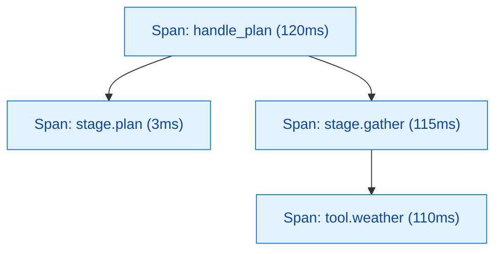
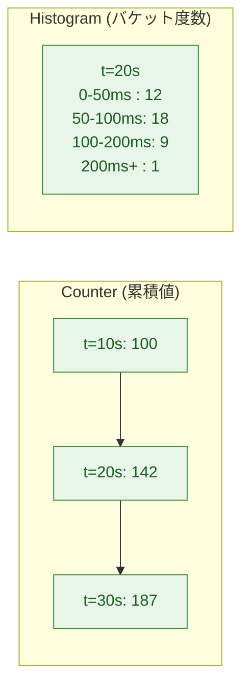
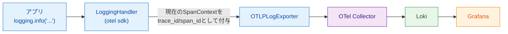
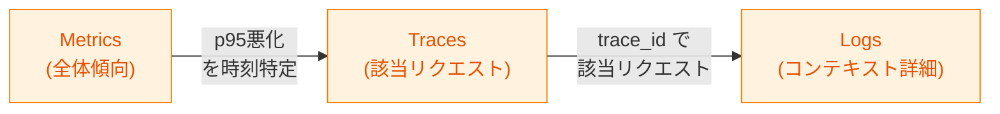
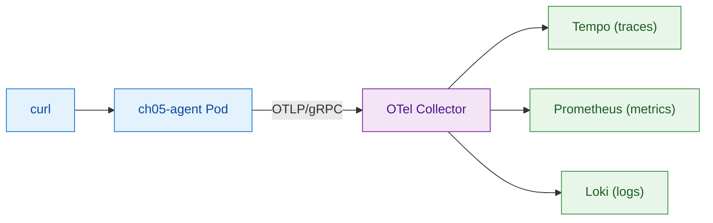

# 第5章 3つのシグナル ― Traces、Metrics、Logs

第4章ではOpenTelemetry（以下OTel）のデータモデルをSpanとTraceを中心に学び、最小ハンズオンで1つのSpanがTempoまで届くことを確認した。OTelが扱うシグナルはTracesだけではない。本章ではMetricsとLogsを加えた3シグナル（Three Signals）の全体像を整理し、それぞれの用途・保存先・使い分けを示す。最後にサンプルアプリを拡張して3シグナル全てが同時に流れる状態を実機で作る。

3シグナルの位置付けは第2章の図2.4「データフロー全体図」の左半分に対応する。アプリケーションがOTel SDKでTraces／Metrics／Logsを生成し、OTel CollectorがそれぞれをTempo／Prometheus／Lokiに振り分ける、という流れである。

## 5.1 Tracesの深掘り

Traces（トレース）は前章で扱ったSpanの集合であり、用途は「個別リクエストの詳細追跡」である。1つのリクエストがどのサービス・どの関数を、どの順序・どの所要時間で経由したかを、ウォーターフォール表示で俯瞰できる（図5.1）。



*図5.1: Tracesの典型的な活用シナリオ。1リクエストのSpanウォーターフォールから「どこで時間を使ったか」が読み取れる*

エージェント開発において、Tracesは最頻用のシグナルになる。LLMの判断ポイントごとにSpanを切り、ツール呼び出しも独立Spanとして記録すれば、「なぜこの応答が遅かったか」「どの判断で時間を使ったか」がTrace1本で把握できる。保存先はTempoであり、第4章のハンズオンで既に流せるようになっている。

Tracesは1リクエスト単位の解像度を持つため、原則として全件を保存することは難しい。本番ではサンプリング（Sampling）で取捨選択するが、本書のサンプル規模では全件保存で十分である。サンプリング戦略は第6章のCollector章で再度触れる。

## 5.2 Metrics ― 集計データ

Metric（メトリクス）は時系列の集計データである。Tracesが1リクエスト1本の解像度を持つのに対し、Metricsは時間バケットごとの集約値を持つ。OTelは3つの基本型を定める（表5.1）。

*表5.1: Metric3型の比較。記録パターンと典型的用途で使い分ける*

| 型 | 記録される値 | 典型的用途 | 例 |
|----|------------|-----------|-----|
| Counter（カウンタ） | 単調増加する累積値 | リクエスト数、エラー数、トークン消費合計 | `travel_helper.requests` |
| Histogram（ヒストグラム） | 値の分布（複数バケットへの度数分配） | レイテンシ、レスポンスサイズ、トークン数 | `travel_helper.request.duration` |
| Gauge（ゲージ） | 現在の瞬間値 | キュー長、接続数、利用メモリ | `task_queue_length` |

CounterとHistogramのデータ構造の違いを図5.2に示す。



*図5.2: CounterとHistogramのデータ構造。Counterは時刻ごとの累積値を1点ずつ保存し、Histogramは1時刻に複数バケットの度数を保存する*

Counterは「いくつ起きたか」の累積を記録する。グラフ化するときはレート（1秒あたりの増分など）として表示することが多い。Histogramは値の分布を保持するため、p50／p95／p99といったパーセンタイルを後から計算できる。Gaugeは時系列の各時点で「今いくつ」を保存するシンプルな型であり、本書のサンプルでは登場しない。

Metricsの保存先はPrometheusである。OTel CollectorはOTLPで受けたMetricをPrometheus Remote Write形式に変換してPrometheusに書き込む構成が一般的である[^1]。

## 5.3 Logs ― イベント単位のデータ

OTel LogsはOTel Spec内で安定化したシグナルであり、従来のログ基盤（FluentdやFluent Bit経由のLoki／Elasticsearch投入）の置き換えではなく「上に乗る抽象」として位置付けられる[^2]。本書での主眼はOTel Logsの最大の特徴である「SpanContextとの自動紐付け」にある（図5.3）。



*図5.3: ログとSpanContextの紐付け。OTelのLoggingHandlerが現在のSpanContextを読み取り、`trace_id` `span_id` をログレコードに自動付与する*

Python標準の `logging` モジュールに `opentelemetry.sdk._logs.LoggingHandler` を追加すると、`logging.info(...)` といった通常のログ呼び出しが自動的にOTLP Logsとして送信される。送信されるレコードには、その時点の現在のSpanContextから得られる `trace_id` と `span_id` が付与される。これによりLokiでログを検索したとき、同じ `trace_id` のTraceに直接ジャンプできる。

従来基盤との比較で重要な差分は3つある。まず、`trace_id` 紐付けが標準で行われる。次に、ログのSeverity・Resource・Attributeが構造化された型として定義されている。最後に、転送経路がOTLPで統一されるため、TracesやMetricsと同じCollectorパイプラインで扱える。詳細は第6章で扱う。

## 5.4 3シグナルの使い分け

3シグナルは独立したデータ種別だが、同じTrace IDで連結することで横断的に使える。Metrics→Traces→Logsという順に解像度を上げていく流れが、本書が推奨する標準ワークフローである（図5.4）。



*図5.4: 3シグナルの協調フロー。集計データで異常を検知し、トレースで該当リクエストを特定し、ログで詳細コンテキストを確認する*

Metricsは「何かが異常に動いている」を最初に教えるシグナルである。秒〜分単位の時系列で全体傾向を俯瞰し、p95レイテンシの悪化やエラー率の急上昇を検知する。次にTracesに移り、悪化した時間帯のリクエストを1本ずつ開いてSpanウォーターフォールを見ることで、律速箇所を特定する。最後にLogsで、そのTraceに紐付くログを `trace_id` で絞り込み、詳細なコンテキスト（入力値、エラーメッセージ、判断結果）を確認する。

逆方向のシナリオもある。「ユーザーから特定の問題が報告された」場合は、ユーザーIDなどでLogsを絞り、見つかったログの `trace_id` から該当Traceに飛び、必要ならMetricsで同種の問題が他にもあるかを確認する。3シグナルが `trace_id` で連結している前提が、こうした往復を支える。

## 5.5 ハンズオン ― 3シグナルを流す

サンプルアプリ `travel-helper` の第5章版（`sample-app/ch05/`）は、第4章版に `gather_stage`（簡易版：weather_toolのみ呼ぶ）を追加し、Counter／Histogram／OTel Logsを記録するように拡張した（図5.5）。



*図5.5: 第5章ハンズオン構成。1つのアプリが3シグナルを生成し、Collector経由で3つのストアに振り分けられる*

3シグナル分のProvider（TracerProvider／MeterProvider／LoggerProvider）を初期化するコードがリスト5.1である。

**リスト5.1: `sample-app/ch05/otel_setup.py`（抜粋）**

```python
def init_otel(service_name: str) -> Tuple[trace.Tracer, metrics.Meter]:
    resource = Resource.create({"service.name": service_name})

    tp = TracerProvider(resource=resource)
    tp.add_span_processor(BatchSpanProcessor(
        OTLPSpanExporter(endpoint=_endpoint(), insecure=True)))
    trace.set_tracer_provider(tp)

    reader = PeriodicExportingMetricReader(
        OTLPMetricExporter(endpoint=_endpoint(), insecure=True),
        export_interval_millis=10_000)
    mp = MeterProvider(resource=resource, metric_readers=[reader])
    metrics.set_meter_provider(mp)

    lp = LoggerProvider(resource=resource)
    lp.add_log_record_processor(BatchLogRecordProcessor(
        OTLPLogExporter(endpoint=_endpoint(), insecure=True)))
    set_logger_provider(lp)
    handler = LoggingHandler(level=logging.NOTSET, logger_provider=lp)
    logging.getLogger().addHandler(handler)

    return trace.get_tracer(service_name), metrics.get_meter(service_name)
```

3つのProviderはいずれも共通の `Resource`（`service.name` 付き）を共有する。Resourceは「どのプロセスから出たデータか」を全シグナルに刻印する役割を持つ。これによりLokiのログでも、Prometheusのメトリクスでも、Tempoのトレースでも、同じ `service.name=travel-helper-ch05` で絞り込める。

Metricsは `MeterProvider` が `PeriodicExportingMetricReader` で10秒ごとにエクスポートする設定とした。Logsは `LoggerProvider` を作り、Pythonの `logging` モジュールに `LoggingHandler` を登録する。これだけで、後段のアプリコード内で `logging.info(...)` と書くだけでOTLP Logsとして送信される。

リクエストハンドラ側でCounterとHistogramを記録するコードがリスト5.2である。

**リスト5.2: `sample-app/ch05/agent.py`（抜粋）**

```python
requests_counter = meter.create_counter(
    "travel_helper.requests",
    description="Total number of /plan requests")
duration_hist = meter.create_histogram(
    "travel_helper.request.duration",
    unit="ms",
    description="End-to-end /plan request duration")

@app.post("/plan", response_model=PlanResponse)
def plan(req: PlanRequest) -> PlanResponse:
    start = time.perf_counter()
    with tracer.start_as_current_span("handle_plan") as root:
        # ... stage.plan / stage.gather のSpanをネスト
        ...
    elapsed_ms = (time.perf_counter() - start) * 1000
    requests_counter.add(1, {"endpoint": "/plan"})
    duration_hist.record(elapsed_ms, {"endpoint": "/plan"})
```

Counterは `add(値, 属性)`、Histogramは `record(値, 属性)` というAPIである。属性を付けることで、後でPrometheusでクエリするとき `endpoint` などの軸で集計を分割できる。

デプロイと検証は次のコマンドで行う。

```bash
cd sample-app/ch05
make deploy
make verify
```

`make verify` は `/plan` を3回叩き、Tempoでトレースが、Prometheusで `travel_helper_requests_total` が、Lokiで `service_name=travel-helper-ch05` のログが見えることを順に確認する。実機検証ではTempoに `handle_plan` をRootとする3階層のTrace、PrometheusにCounter値（`travel_helper_requests_total{endpoint="/plan"} = 8`）、Lokiに `trace_id` 付きの構造化ログがそれぞれ届くことを確認した。

クリーンアップは次のコマンドで行う。

```bash
make clean
# またはリポジトリルートから
make clean-ch05
```

## まとめ

- TracesはSpan集合として個別リクエストの詳細追跡を担い、保存先はTempo
- MetricsはCounter／Histogram／Gaugeの3型で時系列集計を担い、保存先はPrometheus
- OTel LogsはSpanContextを自動付与する点が従来基盤との最大の差分で、保存先はLoki
- 3シグナルはMetricsで検知→Tracesで特定→Logsで深掘りという協調ワークフローで使い分ける
- ハンズオンで3シグナル全てを `service.name=travel-helper-ch05` で横断的に確認できる状態を作った

## 理解度チェック

### Q1. 3シグナルそれぞれの用途

**種類**: 概念の確認 / **関連する節**: 5.1〜5.3

Traces、Metrics、Logsの3シグナルそれぞれの用途を1文で説明せよ。

<details>
<summary>解答と解説</summary>

- Traces: 1リクエストが通った経路と各区間の所要時間を、Spanの集合として詳細追跡する。
- Metrics: 単位時間あたりのリクエスト数・レイテンシ分布・エラー率といった集計値を時系列で保持し、全体傾向の俯瞰と異常検知に用いる。
- Logs: 個々のイベントを文字列＋属性で記録し、SpanContextを自動付与することでTraceに紐付けて詳細コンテキストを保持する。

</details>

### Q2. OTel Logsと従来ログ基盤の違い

**種類**: 概念の確認 / **関連する節**: 5.3

OTel Logsが従来のログ基盤と異なる点を述べよ。

<details>
<summary>解答と解説</summary>

主な差分は3点である。第1に、現在のSpanContextから `trace_id` と `span_id` がログレコードに自動付与され、TraceとLogの相互ジャンプが標準で可能になる。第2に、Severity、Resource、Attribute等が構造化された型として仕様化されており、テキスト中心の従来ログより検索・集計が安定する。第3に、転送プロトコルがOTLPに統一され、TracesやMetricsと同じCollectorパイプラインで処理できる。

</details>

### Q3. 「平均より遅い」傾向への次の一手

**種類**: 判断問題 / **関連する節**: 5.4

「ある時間帯のリクエストが平均より遅い」という傾向を発見した。次にどのシグナルを見るべきか、理由と共に答えよ。

<details>
<summary>解答と解説</summary>

次にTracesを見る。「平均より遅い」はMetricsで時間軸の傾向として見えており、次に必要なのは「具体的にどのリクエストの、どのSpanで時間を使ったか」の特定である。Tempoで該当時間帯・該当サービスのトレースを抽出し、Spanウォーターフォールで律速箇所を見る。律速SpanのAttributeで原因仮説が立たない場合は、その `trace_id` でLogsに進み、コンテキスト詳細（入力値、外部呼び出しのエラー等）を確認する。

</details>

### Q4. トークン使用量の可視化設計

**種類**: 設計問題 / **関連する節**: 5.2、5.5

LLM呼び出しのトークン使用量を可視化するため、MetricsとTracesのどちらでどう記録するかを設計せよ。

<details>
<summary>解答と解説</summary>

両方を併用する。

- Metrics（全体把握用）: Histogramで `gen_ai.usage.input_tokens` `gen_ai.usage.output_tokens` を `model` `endpoint` を属性として記録する。Histogramを選ぶ理由は、合計だけでなくp50／p95の分布が見えるため、コスト最適化対象を特定しやすいから。Counterで `gen_ai.usage.total_tokens` の累積も並行記録すると総コスト推定に使える。
- Traces（個別リクエスト深掘り用）: LLM呼び出しのSpanのAttributeとして `gen_ai.usage.input_tokens` `gen_ai.usage.output_tokens` を付ける。これにより「どの判断で多くトークンを使ったか」が個別リクエストで追える。

両者は同じAttribute命名（GenAI Semantic Conventions準拠）で揃えるのが望ましい。Metricsで異常検知→Tracesで該当リクエストの該当Spanで詳細確認、という第5.4節のフローがそのまま回る。

</details>

## 参考文献

- OpenTelemetry Project. "Metrics Data Model." https://opentelemetry.io/docs/specs/otel/metrics/data-model/ （閲覧日: 2026-04-14）
- OpenTelemetry Project. "Logs Data Model." https://opentelemetry.io/docs/specs/otel/logs/data-model/ （閲覧日: 2026-04-14）
- OpenTelemetry Project. "Prometheus Compatibility — OpenMetrics." https://opentelemetry.io/docs/specs/otel/compatibility/prometheus_and_openmetrics/ （閲覧日: 2026-04-14）
- OpenTelemetry Python. "Logs API and SDK." https://opentelemetry-python.readthedocs.io/en/latest/sdk/_logs/index.html （閲覧日: 2026-04-14）

[^1]: OpenTelemetry Project. "Prometheus Compatibility — OpenMetrics." https://opentelemetry.io/docs/specs/otel/compatibility/prometheus_and_openmetrics/
[^2]: OpenTelemetry Project. "Logs Data Model." https://opentelemetry.io/docs/specs/otel/logs/data-model/

## 次章への接続

本章で3シグナルを生成・送信できるようになった。次に明らかにすべきは、これらのデータがアプリから保存先まで「どう中継されるか」である。第6章ではOTel Collectorの内部構造（Receivers／Processors／Exporters）に踏み込み、3シグナル独立のパイプラインがどう構成されるかを実際の設定ファイルと共に読み解く。
