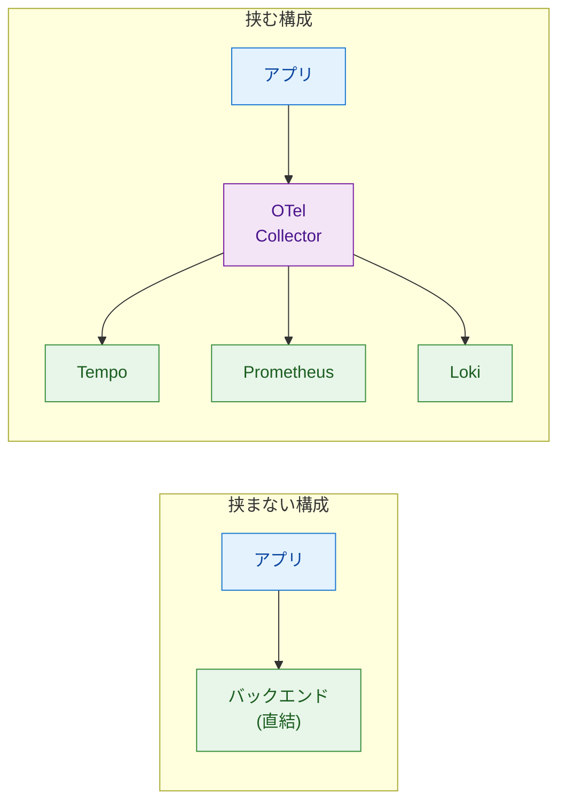
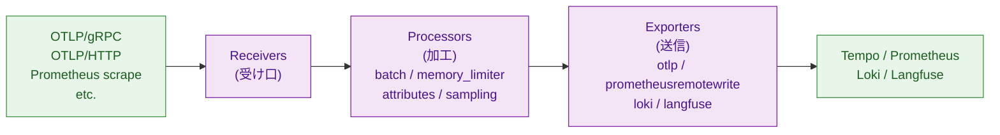
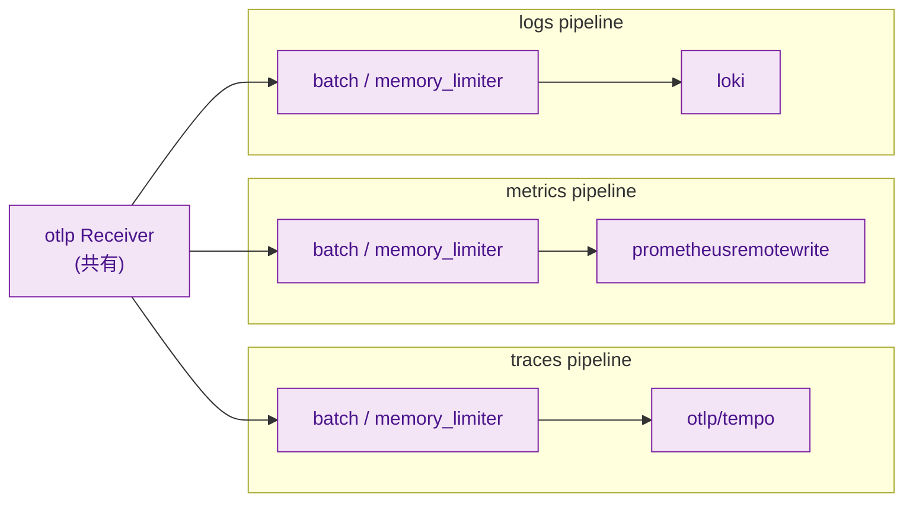
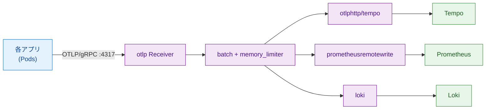
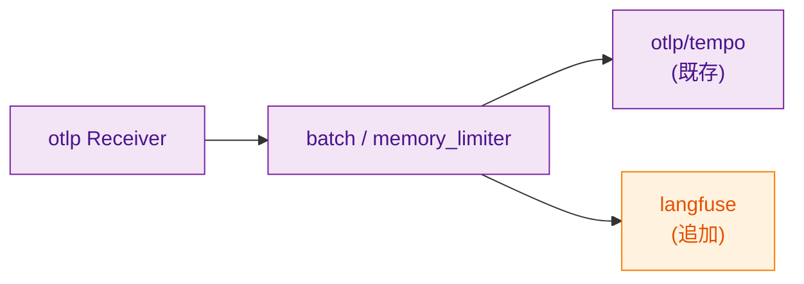

# 第6章 OTel Collector ― データの中継と変換

第5章までで、アプリケーションから3シグナル（Traces／Metrics／Logs）を生成し、OpenTelemetry（以下OTel）の標準プロトコルOTLPで送信できるようになった。本章ではその送信先となるOTel Collector（以下Collector）の役割と内部構造を扱う。第15章で本書専用のCollectorを構築する際の土台として、本章でCollectorの設定ファイルを読み解く力を身に付ける。

本章は第2章の図2.4の中央部、すなわちアプリとバックエンド（Tempo／Prometheus／Loki／Langfuse）の間に位置する「OTel Collector」の内部を顕微鏡で見る章である。

## 6.1 Collectorの役割

Collectorはアプリとバックエンドの間に立つベンダーニュートラルな中継点である。Collectorを挟む構成と挟まない構成の差を図6.1に示す。



*図6.1: Collectorあり／なしの比較。Collectorを挟むことで、複数バックエンドへの分配・バッチ化・属性変換などの共通処理をアプリから切り離せる*

挟まない構成では、アプリが各バックエンドの送信プロトコルや認証、リトライ等を直接扱う。バックエンドが増えるたびにアプリ側のコードと依存ライブラリが増え、バックエンド変更がアプリの再ビルドを伴う。

挟む構成では、アプリはOTLPだけを話せばよい。バックエンドの追加・削除・差し替えはCollector設定の変更で完結する。第3章で扱った「計装をバックエンドから切り離す」設計判断の具体的な実装が、まさにこのCollectorである。

Collectorに集約されることでもう1つの利点が生まれる。バッチ化、サンプリング、Attribute変換、機密情報のマスキングといった共通処理を、複数アプリにまたがって1か所で実施できる。アプリ側コードはこれらに関与しなくてよい。

## 6.2 パイプラインの3段構成

Collectorの内部はReceivers、Processors、Exportersの3段パイプラインとして動作する（図6.2）。



*図6.2: 3段パイプラインの詳細。Receiverが入力、Processorが加工、Exporterが出力を担う*

Receiverはデータの受け口である。OTLP/gRPC（4317）とOTLP/HTTP（4318）の両プロトコルが基本だが、Prometheusのscrapeフォーマットや、syslog、Filelog（Kubernetesのコンテナログファイル）など多数のReceiverがある[^1]。

Processorは中間加工を担う。代表例として `batch`（一定件数または一定時間でまとめて送信）、`memory_limiter`（メモリ上限を超えそうなときにドロップ／バックプレッシャ）、`attributes`（Attributeの追加・削除・改変）、`tail_sampling`（Trace単位のサンプリング判断）、`resource`（Resource属性の付与）などがある。

Exporterは送信先ごとに別物である。Tempoには `otlp` Exporter、Prometheusには `prometheusremotewrite` Exporter、Lokiには `loki` Exporter、Langfuseには独自のExporterまたはOTLP HTTPへの送信、といった具合である。

## 6.3 3シグナルそれぞれの独立パイプライン

Collectorは「パイプライン」を1つだけ持つわけではない。Traces／Metrics／Logsの3シグナルそれぞれに独立したパイプラインを構成できる（図6.3）。



*図6.3: 3パイプラインの並列動作。同じReceiverを共有しつつ、Processor／Exporterはシグナル種別ごとに独立に構成する*

ReceiverはOTLPのように複数シグナルを受け取れるものなら、3つのパイプラインで同じインスタンスを共有できる。一方、Exporterはシグナル種別固有である。`otlp` ExporterはTraces／Metrics／Logsいずれにも対応するが、`prometheusremotewrite` はMetrics専用、`loki` はLogs専用といった制約がある。

Processorは多くがシグナル横断で使えるが、振る舞いはシグナルごとに変わる。例えば `tail_sampling` はTraces専用、`groupbyattrs` は使い方がシグナルで異なる。各Processorのシグナル対応はOTel Collector公式ドキュメントに明記されている[^2]。

シグナルごとに独立構成にできる利点は、要件の差を分離できる点にある。例えば「Tracesはサンプリングを強める」「Metricsだけ別のバックエンドに送る」「Logsだけ機密情報をマスキングする」といった要求を、互いに干渉せずに実装できる。

## 6.4 設定ファイルの読み方

Collectorの設定ファイルは `receivers`、`processors`、`exporters`、`service` の4セクション構成である。本書のベースライン設定としてリスト6.1を示す。

**リスト6.1: `collector-config/ch06-baseline/config.yaml`**

```yaml
receivers:
  otlp:
    protocols:
      grpc:
        endpoint: 0.0.0.0:4317
      http:
        endpoint: 0.0.0.0:4318

processors:
  memory_limiter:
    check_interval: 1s
    limit_mib: 512
    spike_limit_mib: 128
  batch:
    send_batch_size: 1024
    timeout: 5s
  resource:
    attributes:
      - key: collector.instance
        value: ch06-baseline
        action: insert

exporters:
  otlp/tempo:
    endpoint: tempo.observability:4317
    tls:
      insecure: true
  prometheusremotewrite:
    endpoint: http://prometheus-kube-prometheus-prometheus.observability:9090/api/v1/write
  loki:
    endpoint: http://loki.observability:3100/loki/api/v1/push

service:
  pipelines:
    traces:
      receivers: [otlp]
      processors: [memory_limiter, resource, batch]
      exporters: [otlp/tempo]
    metrics:
      receivers: [otlp]
      processors: [memory_limiter, resource, batch]
      exporters: [prometheusremotewrite]
    logs:
      receivers: [otlp]
      processors: [memory_limiter, resource, batch]
      exporters: [loki]
```

ポイントは4つある。第1に、`receivers`／`processors`／`exporters` の3セクションでコンポーネントを「定義」し、`service.pipelines` でその組み合わせを「宣言」する。定義しただけで `service` に書かれていないコンポーネントは無効で、起動時にエラーになるか単に動作しない。

第2に、コンポーネント名は「タイプ」と「インスタンス名」の2つで識別する。`otlp` のようにインスタンス名を省略すると暗黙の単一インスタンスになる。`otlp/tempo` のように `/` でインスタンス名を付けると、同じタイプを複数インスタンス使い分けられる。例えば `otlp/tempo` と `otlp/another-backend` を別々の宛先に向けることが可能である。

第3に、`memory_limiter` はパイプラインの先頭に置くのが推奨である[^3]。バッチ化前の段階でメモリ圧を判定し、必要ならバックプレッシャを返してアプリ側に送信を控えさせる。

第4に、`batch` は性能のために実質必須である。1件ずつ送るとgRPC接続のオーバーヘッドが累積するため、`send_batch_size` または `timeout` のいずれかが満ちた時点でまとめて送る。

主要なコンポーネントを表6.1にまとめる。

*表6.1: 主要なReceiver／Processor／Exporter。Collector配布は core と contrib があり、 contrib に多くの選択肢が含まれる*

| カテゴリ | コンポーネント | 用途 |
|---------|--------------|------|
| Receiver | `otlp` | OTLP/gRPC, OTLP/HTTPの受信。最も基本 |
| Receiver | `prometheus` | Prometheus形式のscrape |
| Receiver | `filelog` | ファイルからのログ収集（DaemonSetでKubernetesログ取り込み） |
| Processor | `batch` | バッチ化（実質必須） |
| Processor | `memory_limiter` | メモリ上限管理 |
| Processor | `resource` | Resource属性の追加 |
| Processor | `attributes` | Attributeの追加・削除・変更 |
| Processor | `tail_sampling` | Trace単位のサンプリング |
| Exporter | `otlp` | OTLP/gRPCで他のCollectorやTempoへ送信 |
| Exporter | `otlphttp` | OTLP/HTTPで送信 |
| Exporter | `prometheusremotewrite` | Prometheus Remote Writeで送信 |
| Exporter | `loki` | LokiのPush APIで送信（近年は `otlphttp` + Loki OTLPエンドポイントも一般的） |
| Exporter | `debug` | 標準出力に出力（デバッグ用） |

`batch` と `memory_limiter` を除けば、必要に応じて取捨選択する形になる。

## 6.5 既存の共有Collectorを読む

本書のサンプルアプリは、共有スタック内の `otel-gateway-opentelemetry-collector`（namespace: `observability`）にOTLPで送信している。この共有Collectorは複数のチームから観測データを受ける役割を持ち、本書では設定の変更は行わない（共有資産のため）。

論理的なパイプライン構成は図6.4のとおりである。



*図6.4: 既存共有Collectorのパイプライン概略。3シグナルのいずれもotlpで受け、それぞれの保存先にExporterで送る*

第4章・第5章のハンズオンで実際にデータが届いていたのは、このパイプラインを通っていたためである。`OTEL_EXPORTER_OTLP_ENDPOINT=http://otel-gateway-opentelemetry-collector.observability:4317` という環境変数1つで、アプリがこのCollectorを呼ぶように接続できていた。

第15章では、本書専用のCollectorを `aio11y-book` namespaceに新規デプロイし、Langfuse向けExporterを追加する。共有Collectorに変更を入れず、専用Collectorを並走させる方針である。

## 6.6 Exporter追加の考え方（実装は第15章）

新しいバックエンド（Langfuse、追加のTempo、別ベンダー等）にデータを送りたい場合、Collector設定の変更だけで実現できる。アプリ側のコードは変えなくてよい。図6.5に変更イメージを示す。



*図6.5: Exporter追加時のパイプライン変化。既存Exporterはそのまま残し、新しいExporterを追加して `service.pipelines.traces.exporters` に列挙する*

設定変更の流れは次のとおりである。第1に、`exporters` セクションに新Exporterのインスタンス（接続先・認証情報等）を追加する。第2に、`service.pipelines` の該当シグナルの `exporters` リストに追加する。既存のExporterは残したまま要素を1つ増やすだけで、既存の流れを壊さずに分配を加えられる。

設定の反映方法はCollectorのデプロイ形態に依存する。Kubernetes上ではConfigMap更新後にCollector Podを再起動（rolling restart）するのが基本である。本書ではこのPod再起動による反映のみを扱う。

実際の追加作業は第15章で行う。本章では「設定だけで送信先を増やせる」「アプリ側コードは触らずに済む」という構造の理解までが目的である。

## まとめ

- Collectorはアプリとバックエンドの間に立つ中継点で、共通処理を集約してアプリ側コードを単純化する
- 内部はReceivers／Processors／Exportersの3段パイプラインとして動作する
- 3シグナル（Traces／Metrics／Logs）はそれぞれ独立したパイプラインを持ち、Receiverは共有可、Exporterは多くがシグナル固有
- 設定ファイルは `receivers` / `processors` / `exporters` / `service` の4セクションで、`service.pipelines` で組み合わせを宣言する
- 既存共有Collectorはそのまま使い、本書専用Collectorは第15章で新規デプロイする
- バックエンド追加はCollector設定だけで完結し、アプリ側コードは触らない

## 理解度チェック

### Q1. Receivers／Processors／Exportersの役割

**種類**: 概念の確認 / **関連する節**: 6.2

CollectorのReceivers、Processors、Exportersのそれぞれの役割を1文で述べよ。

<details>
<summary>解答と解説</summary>

- Receivers: アプリやスクレイプ対象から観測データを受信するコンポーネント。OTLPやPrometheus scrapeなどの形式を扱う。
- Processors: 受信したデータをエクスポート前に加工する中間段。バッチ化、メモリ上限管理、Attribute操作、Trace単位のサンプリング等を担う。
- Exporters: 加工後のデータを各バックエンドへ送信するコンポーネント。送信先ごとに専用のExporter（otlp、prometheusremotewrite、loki等）を選ぶ。

</details>

### Q2. Collectorを挟まない場合の欠点

**種類**: 概念の確認 / **関連する節**: 6.1

アプリからバックエンドに直接送信する構成（Collectorを挟まない構成）の欠点を2つ挙げよ。

<details>
<summary>解答と解説</summary>

- アプリ側コードがバックエンド固有の送信プロトコル・認証・リトライ等を直接扱う必要があり、バックエンド変更時にアプリの再ビルド・再デプロイが必要になる。
- バッチ化、サンプリング、Attribute変換、機密情報マスキング等の共通処理を各アプリで個別に実装することになり、複数アプリ間で重複と挙動の差が生まれる。

</details>

### Q3. ログ量増大時のCollector側対応

**種類**: 判断問題 / **関連する節**: 6.2、6.4

アプリからのログ送信を増やしたところ、Lokiのストレージが逼迫した。Collector側でどう対応するか、複数案から選び理由を述べよ。

<details>
<summary>解答と解説</summary>

第1選択は `attributes` または `filter` Processorで「不要な低Severityログ（DEBUG等）」をパイプライン途中でドロップする方針である。アプリのログ呼び出し自体は残せるため、必要時に増やせる柔軟性を保ちつつLokiへの流量を即時に減らせる。

第2選択として `batch` の `timeout` を伸ばして送信頻度を下げる、または `memory_limiter` の閾値を下げて過剰流量時にバックプレッシャをかける案もある。ただしこれらはストレージ削減の本質的解にはならず、副作用が大きい。

なお、ログ自体が必要ならLoki側のretention短縮や圧縮率向上といった対策もあるが、本問はCollector側対応に限定しているため上記が主回答となる。

</details>

### Q4. Langfuse Exporter追加の設定

**種類**: 設計問題 / **関連する節**: 6.6

Langfuseへもデータ送信を追加したい。リスト6.1の設定ファイルのどこを編集するか、`exporters` と `service.pipelines.traces` の追加内容を疑似YAMLで示せ。

<details>
<summary>解答と解説</summary>

```yaml
# exporters セクションに追加（既存と並列）
exporters:
  otlp/tempo:
    endpoint: tempo.observability:4317
    tls:
      insecure: true
  # 追加
  otlphttp/langfuse:
    endpoint: http://langfuse-web.langfuse:3000/api/public/otel
    headers:
      Authorization: "Basic ${env:LANGFUSE_BASIC_AUTH}"

# service.pipelines.traces の exporters に追加
service:
  pipelines:
    traces:
      receivers: [otlp]
      processors: [memory_limiter, resource, batch]
      exporters: [otlp/tempo, otlphttp/langfuse]   # 1つ追加
```

ポイントは2点。第1に、既存の `otlp/tempo` を残したまま `otlphttp/langfuse` を追加することで、既存のTempo経路を壊さず分配する。第2に、`service.pipelines` への列挙を忘れると `exporters` セクションに書いただけでは有効化されない。Langfuseの実エンドポイントと認証ヘッダの形式は第12章および第15章で扱う。

</details>

## 参考文献

- OpenTelemetry Project. "Collector — Architecture." https://opentelemetry.io/docs/collector/architecture/ （閲覧日: 2026-04-14）
- OpenTelemetry Project. "Collector — Configuration." https://opentelemetry.io/docs/collector/configuration/ （閲覧日: 2026-04-14）
- OpenTelemetry Project. "memory_limiter Processor." https://github.com/open-telemetry/opentelemetry-collector/tree/main/processor/memorylimiterprocessor （閲覧日: 2026-04-14）
- OpenTelemetry Collector Contrib. "Receivers." https://github.com/open-telemetry/opentelemetry-collector-contrib/tree/main/receiver （閲覧日: 2026-04-14）
- OpenTelemetry Collector Contrib. "Processors." https://github.com/open-telemetry/opentelemetry-collector-contrib/tree/main/processor （閲覧日: 2026-04-14）

[^1]: OpenTelemetry Collector Contrib. "Receivers." https://github.com/open-telemetry/opentelemetry-collector-contrib/tree/main/receiver
[^2]: OpenTelemetry Collector Contrib. "Processors." https://github.com/open-telemetry/opentelemetry-collector-contrib/tree/main/processor
[^3]: OpenTelemetry Project. "memory_limiter Processor README." https://github.com/open-telemetry/opentelemetry-collector/tree/main/processor/memorylimiterprocessor

## 次章への接続

本章でCollectorの設定ファイルを読み解けるようになった。次に焦点を当てるのはアプリ側の計装方式である。第7章では、ライブラリ呼び出しを自動でSpanに変換する「自動計装」と、開発者が明示的にSpan生成コードを書く「手動計装」の使い分けを扱う。AIエージェント開発で何を自動に任せ、何を手動で書くかの判断軸を整理する。
