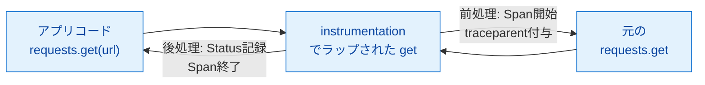
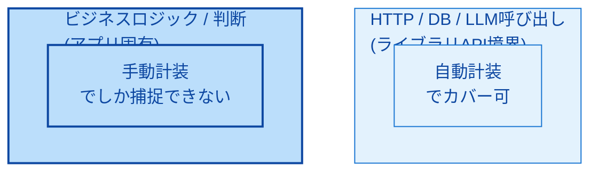
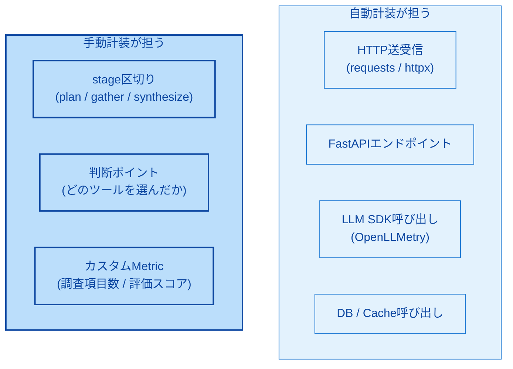
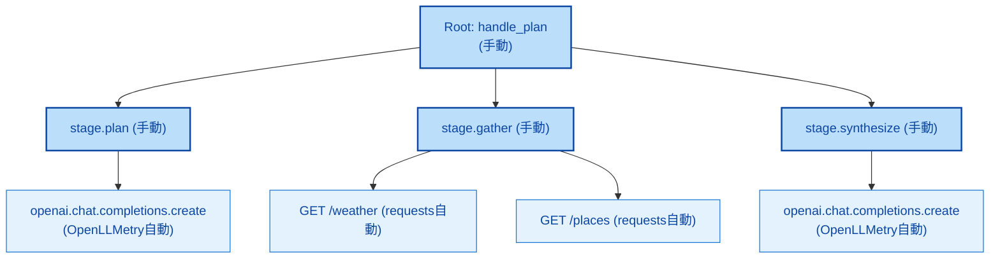

# 第7章 自動計装と手動計装

第6章まででOpenTelemetry（以下OTel）のデータモデルと中継経路を理解した。本章では計装の入口に戻り、Spanを生成する2つの方式――自動計装と手動計装――の仕組みとトレードオフを整理する。AIエージェント開発で「何を自動に任せ、何を手動で書くか」の判断軸を作るのが本章の目的である。

本章で扱うのは第2章図2.4の左端「計装層」の内部である。OpenLLMetryの位置付け（自動計装）、本書サンプルアプリの手動Span（手動計装）の双方が、この使い分けの結果として現れる。

## 7.1 自動計装の仕組み

自動計装は、対応ライブラリの呼び出しを開発者が意識せずにSpanへ変換する仕組みである。実装の中心は「モンキーパッチ（Monkey Patching）」と呼ばれる技法で、実行時にライブラリのメソッドを差し替えて前後処理を挿入する（図7.1）。



*図7.1: モンキーパッチによる計装挿入の概念図。元の関数をラップし、前後処理（Span開始・属性付与・終了）を差し込む*

OTelエコシステムでは `opentelemetry-instrumentation-*` という命名で多数の自動計装パッケージが提供されている[^1]。例えば `opentelemetry-instrumentation-requests`（HTTPクライアント）、`opentelemetry-instrumentation-fastapi`（Webフレームワーク）、`opentelemetry-instrumentation-psycopg`（PostgreSQLクライアント）など、メジャーなライブラリは概ねカバーされている。

導入は次のように `instrument()` を1度呼ぶだけで済む。

```python
# 疑似コード
from opentelemetry.instrumentation.requests import RequestsInstrumentor
RequestsInstrumentor().instrument()

import requests
requests.get("https://example.com")  # 自動でSpanが作られる
```

仕組み上の制約として、対応するinstrumentationパッケージが存在しないライブラリには適用できない。また、ライブラリのバージョンアップで内部APIが変わると追随が必要になるため、`opentelemetry-instrumentation-*` のバージョンも固定が望ましい。

## 7.2 手動計装の仕組み

手動計装は、第4章で扱った `with tracer.start_as_current_span(...)` を開発者がコード中に明示的に書く方式である。本書のサンプルアプリでも `stage.plan` `stage.gather` などのSpanを手動で生成してきた。

手動計装の本質的な意義は、「ビジネスロジック固有の判断ポイント」を計装できる点にある。HTTPやDBアクセスといった汎用ライブラリの呼び出しは自動計装で十分だが、AIエージェントの「どのツールを選んだか」「いくつの調査項目を立てたか」といった判断は、自動計装では捕捉できない（図7.2）。



*図7.2: 手動計装が捕捉する範囲。汎用ライブラリ境界は自動計装で網羅できるが、アプリ固有の判断は手動計装でないと記録できない*

手動計装は3つの自由度を持つ。第1に、Span名を任意に設計できる（`stage.plan` のように業務文脈に沿った命名）。第2に、Attributeに何を載せるかを自分で決められる（`travel_helper.investigation_items_count` のようなドメイン固有値）。第3に、Span間のネスト構造を意図したとおりに作れる（Root Spanの下に複数のstage Spanを並べ、その下にツール呼び出しSpanを置くなど）。

代償として、計装コードがビジネスロジックに混ざり込む。読みやすさを保つには、計装の関心事をdecoratorやcontext managerに切り出す工夫が要る。OpenLLMetryが提供する `@workflow` `@task` `@agent` デコレータはその一例である（第9章で扱う）。

## 7.3 両者の比較

自動計装と手動計装のトレードオフを表7.1に整理する。

*表7.1: 自動計装と手動計装の比較。両者は対立ではなく補完関係にあり、AIエージェント開発では混在運用が標準*

| 観点 | 自動計装 | 手動計装 |
|------|---------|---------|
| 導入コスト | 最小（パッケージ追加と `instrument()` 1行） | 中〜高（Span生成コードを全箇所に書く） |
| 制御の細かさ | 低（Span名・Attributeはinstrumentation実装に依存） | 高（命名・属性・ネストを完全に制御） |
| 対応範囲 | 対応instrumentationがあるライブラリのみ | 任意のコードブロック |
| メンテコスト | ライブラリ／instrumentationの追従が必要 | 自前コードと一体で管理 |
| ビジネスロジック計装 | 不可（汎用境界しか捕捉しない） | 可 |
| 典型的な用途 | HTTP・DB・LLM SDK・キャッシュ等の外部呼び出し | stage区切り、判断ポイント、カスタムMetric記録 |

両者は対立しない。同じプロセス内で自動計装と手動計装を併用すると、自動が捕捉するライブラリ呼び出しと手動が捕捉するビジネスロジックが、同じTraceContextを共有して1本のTrace木に収まる。

## 7.4 エージェント開発での使い分け

AIエージェント開発における典型的な使い分けを図7.3に示す。



*図7.3: AIエージェントでの計装マップ。汎用境界は自動、アプリ固有は手動が担う*

LLM呼び出しはOpenLLMetryによる自動計装が標準である。OpenAI SDK等のメソッドをモンキーパッチし、リクエスト・レスポンス・トークン使用量・モデル名等をAttributeとしてSpanに記録する（第9章で詳述）。

一方、判断ポイントは手動計装でないと記録できない。「3つのツール候補のうち、なぜweather_toolを選んだか」「ループを何回まで回す判断をしたか」「最終応答のFew-shotを何件含めたか」――これらはアプリ固有の論理であり、汎用instrumentationが知る由もない。

カスタムMetricも手動領域である。本書のサンプルでは `travel_helper.requests` Counterと `travel_helper.request.duration` Histogramを第5章で手動記録した。OpenLLMetryやFastAPI instrumentationもMetricを記録するが、業務指標は自分で定義する必要がある。

判断指針をまとめると次のようになる。「外部世界と接する境界」は自動計装を第一選択にし、「アプリ内部の判断・状態」は手動計装で捕捉する。両者を併用することで、汎用部分の網羅性とアプリ固有部分の表現力を同時に得られる。

## 7.5 両者を組み合わせたコード例

自動と手動を併用したときのSpan木の典型を図7.4に示す。



*図7.4: 自動＋手動を組み合わせた典型的なSpan木。手動Spanがstage区切りを担い、自動Spanがその内側のライブラリ呼び出しを記録する*

実装イメージをリスト7.1に疑似コードで示す。本章では動作確認を行わず、実機検証は第13章（手動計装の完成形）と第14章（OpenLLMetry追加）で扱う。

**リスト7.1: 自動計装＋手動計装の疑似コード（動作検証は第13・14章）**

```python
# 疑似コード（動作検証対象外）
from opentelemetry.instrumentation.requests import RequestsInstrumentor
from opentelemetry.instrumentation.fastapi import FastAPIInstrumentor
from traceloop.sdk import Traceloop

# --- 初期化フェーズ：自動計装の有効化 ---
RequestsInstrumentor().instrument()         # HTTPクライアント
FastAPIInstrumentor.instrument_app(app)     # FastAPI
Traceloop.init(app_name="travel-helper")    # OpenLLMetry (LLM SDK)

# --- ハンドラ：手動計装を併用 ---
@app.post("/plan")
def plan(req: PlanRequest):
    with tracer.start_as_current_span("handle_plan") as root:
        root.set_attribute("user.city", req.city)

        with tracer.start_as_current_span("stage.plan"):
            # この内側の openai 呼び出しは OpenLLMetry が自動計装
            items = decide_items_via_llm(req)

        with tracer.start_as_current_span("stage.gather"):
            # 内側の requests.get は RequestsInstrumentor が自動計装
            forecast = requests.get(weather_url(req.city)).json()

        with tracer.start_as_current_span("stage.synthesize"):
            return synthesize_via_llm(items, forecast)
```

ポイントは2つある。第1に、自動計装と手動計装は同じTraceContextを共有するため、手動Spanの内側で発生する自動Spanは自然にその子として記録される。`with tracer.start_as_current_span("stage.gather")` 内部で `requests.get(...)` を呼ぶと、その呼び出しに紐付くHTTP Spanは `stage.gather` の子として木に加わる。

第2に、Span名とAttributeの命名規則を揃えることで、TempoのウォーターフォールやTraceQLのクエリが書きやすくなる。本書では手動Spanは `stage.*` `tool.*` のドット階層、Attributeは `user.*` `travel_helper.*` のプレフィックスで揃えている（development-guidelines準拠）。自動計装が生成するAttributeは標準のSemantic Conventions（例: `http.request.method`、`gen_ai.request.model`）に従うため、混在しても衝突しない。

## まとめ

- 自動計装はモンキーパッチで対応ライブラリのメソッドをラップし、開発者が意識せずSpanを生成する仕組み
- 手動計装は `with tracer.start_as_current_span(...)` を明示的に書き、Span名・Attribute・ネストを完全に制御する方式
- 両者は対立せず、同じTraceContextを共有して1本のTraceに収まる
- 「外部世界との境界」は自動を第一選択、「アプリ固有の判断・状態」は手動で捕捉するのが基本指針
- LLM呼び出しはOpenLLMetry（自動）、stage区切りや判断ポイントは手動、というのが本書サンプルの構成
- 命名規則を揃える（手動は `stage.*`、Attributeは `travel_helper.*`、自動は標準Semantic Conventions）ことで読みやすさを担保

## 理解度チェック

### Q1. モンキーパッチとは

**種類**: 概念の確認 / **関連する節**: 7.1

モンキーパッチとは何か、計装の文脈で説明せよ。

<details>
<summary>解答と解説</summary>

モンキーパッチは実行時にライブラリのメソッドや関数を別の実装で差し替える技法である。OTelの自動計装では、対象ライブラリ（例: `requests.get`）を計装処理付きのラッパー関数に置き換える。ラッパーは元の関数の前後にSpan開始・Attribute付与・Span終了・例外記録などを挿入し、呼び出し側のコードには一切手を加えずSpan生成を実現する。

</details>

### Q2. 手動計装でしか記録できない情報

**種類**: 概念の確認 / **関連する節**: 7.2

手動計装でしか記録できない情報の例を2つ挙げよ。

<details>
<summary>解答と解説</summary>

例1: アプリ固有の判断結果。例えば「LLMが返した3案のうちどれを採用したか」「ツール候補のうちどれを選んだか」といった、ライブラリ境界では現れないアプリ内部の論理。

例2: 業務ドメインの定量値。例えば「立てた調査項目の数」「生成した行程文の長さ」「評価スコア」など、特定の業務上の意味を持つメトリクス。汎用instrumentationはこれらを知らないため、Span Attributeや独自Metricとして手動で記録する必要がある。

</details>

### Q3. PostgreSQLクライアントの計装

**種類**: 判断問題 / **関連する節**: 7.3、7.4

「PostgreSQLクライアントの呼び出しを計装したい」場合、自動と手動どちらを先に検討すべきか、理由と共に答えよ。

<details>
<summary>解答と解説</summary>

自動計装を先に検討する。PostgreSQLクライアントは汎用ライブラリであり、`opentelemetry-instrumentation-psycopg` などの公式instrumentationが提供されている。これを導入すれば、SQL文・接続情報・実行時間・エラー等が標準のSemantic Conventionsに沿ったAttribute付きで自動Span化される。手動で同等を書くと労力に対して得られる情報の差が小さく、他システムとの相互運用性も低下する。アプリ固有の文脈（どのstageでクエリしたか）を加えたい場合は、外側に手動Spanを置いてその内側でDB呼び出しを行う併用パターンを取る。

</details>

### Q4. ツール選択の記録

**種類**: 判断問題 / **関連する節**: 7.4

「エージェントがどのツールを選んだかを記録したい」場合、自動と手動どちらを使うべきか答えよ。

<details>
<summary>解答と解説</summary>

手動計装を使う。「ツール選択」はアプリ内部の判断であり、汎用ライブラリ境界には現れないため自動計装の対象外である。具体的には、判断を行う関数の周りに `with tracer.start_as_current_span("agent.tool_select")` を置き、`travel_helper.tool.candidates`（候補リスト）と `travel_helper.tool.selected`（選ばれたツール名）をAttributeとして付ける。OpenLLMetryのデコレータ（`@agent` 等）でも類似の階層を作れるが、選択結果そのものは手動で属性化する必要がある。

</details>

## 参考文献

- OpenTelemetry Project. "Python — Automatic Instrumentation." https://opentelemetry.io/docs/zero-code/python/ （閲覧日: 2026-04-14）
- OpenTelemetry Project. "Python instrumentation packages." https://github.com/open-telemetry/opentelemetry-python-contrib/tree/main/instrumentation （閲覧日: 2026-04-14）
- OpenTelemetry Project. "Python — Manual Instrumentation." https://opentelemetry.io/docs/languages/python/instrumentation/ （閲覧日: 2026-04-14）
- OpenTelemetry Project. "Semantic Conventions." https://opentelemetry.io/docs/specs/semconv/ （閲覧日: 2026-04-14）

[^1]: OpenTelemetry Project. "Python instrumentation packages." https://github.com/open-telemetry/opentelemetry-python-contrib/tree/main/instrumentation

## 次章への接続

本章で自動計装と手動計装の使い分けを整理した。LLM呼び出しは自動計装に任せたいが、その自動計装が記録する情報が「ベンダーごとにバラバラ」では再びベンダーロックインを招く。第8章ではこの問題に対するOTelの回答であるGenAI Semantic Conventionsを扱い、LLM計装の標準化動向とOpenLLMetryのOTel本体合流の現状を整理する。
