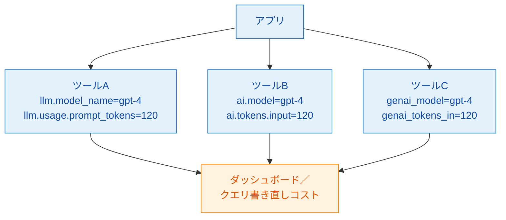
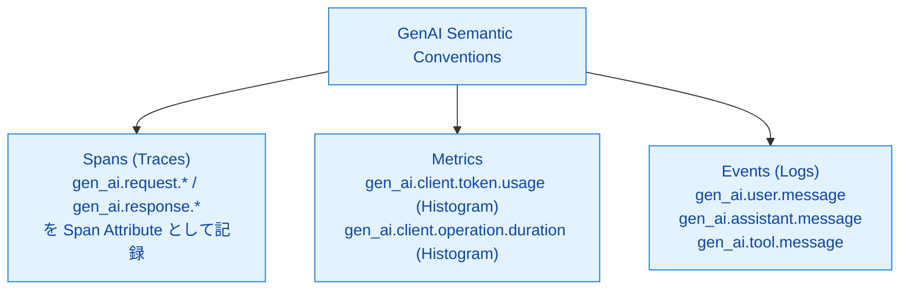
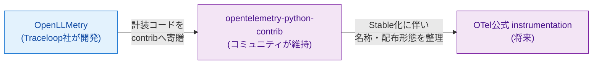

# 第8章 GenAI Semantic Conventions ― LLM計装の標準化

第7章でAIエージェント開発における計装の使い分けを整理した。LLM呼び出しはOpenLLMetryを中心とする自動計装に任せるのが現実的だが、ここで再び第3章の問題意識が現れる。自動計装が記録するAttributeの命名がツールごとにバラバラだと、ツール切替・複数ベンダー対応・データ移行のたびに、アプリ側の計装ロジックや下流のダッシュボード／クエリの書き直しが必要になる。本章では、この問題に対するOpenTelemetry（以下OTel）コミュニティの回答であるGenAI Semantic Conventionsを扱い、現在進行形の標準化動向を整理する。

本章はコンセプト章であり、コードの実装はない。読了後、読者は「いま何が標準化されつつあり、それを採用するとどのようなメリットとリスクがあるか」を自分の言葉で語れる状態になる。

## 8.1 なぜGenAI向けの標準が必要なのか

LLM呼び出しは、従来の汎用ライブラリ呼び出し（HTTP、DB、キャッシュ等）とは質的に異なる情報を伴う。プロンプト文字列、応答テキスト、入力／出力トークン数、モデル名、温度（temperature）、トップP（top_p）等のパラメータ、ツール呼び出し（function calling）の選択結果といった項目である。これらをSpanにどう載せるかは、各計装ツールがそれぞれ独自に決めてきた（図8.1）。

*図8.1: 標準化前の状況。同じ意味の値（モデル名、トークン数）に対して計装ツールごとに異なるAttribute名を使うため、ツール切替時に下流のダッシュボード・クエリの書き直しが発生する*

問題は3つある。第1に、ツール間で同じ値が違う名前で記録されるため、`Tempo` での検索や `PromQL` のクエリも各ツール用に書き分ける必要がある。第2に、ツールを切り替えるとAttribute名が変わるため、既存ダッシュボード・アラート・運用クエリが軒並み壊れる。第3に、複数ツールを並行運用すると同じデータが別名で重複し、集計の正確性が損なわれる。

これは第3章で扱った「ベンダーロックイン」と同じ構造である。SDKレベルではOTelで標準化されたが、Attribute命名というデータ表現レベルで再びベンダー固有の差分が生まれていた。GenAI Semantic Conventionsはこの差分を解消することを目的とする。

## 8.2 GenAI Semantic Conventionsの概要

GenAI Semantic Conventionsは、OTelプロジェクト内のGen AI SIG（Special Interest Group）が策定する、LLM計装のための標準命名規約である[^1]。`gen_ai.*` 名前空間にAttribute名・Metric名・Event名を定義しており、3シグナル全てに対応している。

代表的なAttributeを表8.1に示す。

*表8.1: GenAI Semantic Conventionsで定義される代表的な標準Attribute（一部抜粋）*

| Attribute名 | 用途 | 値の例 |
|------------|------|--------|
| `gen_ai.system`（後継: `gen_ai.provider.name`） | LLMプロバイダ／システム識別子 | `openai`、`anthropic`、（OCI等は登録未済のため独自値） |
| `gen_ai.request.model` | 要求したモデル名 | `gpt-4o-mini`、`xai.grok-3` |
| `gen_ai.response.model` | 実際に応答したモデル名 | `gpt-4o-mini-2024-07-18` |
| `gen_ai.operation.name` | 操作種別 | `chat`、`text_completion`、`embeddings` |
| `gen_ai.usage.input_tokens` | 入力トークン数 | `120` |
| `gen_ai.usage.output_tokens` | 出力トークン数 | `48` |
| `gen_ai.request.temperature` | サンプリング温度 | `0.7` |
| `gen_ai.request.top_p` | 上位確率質量 | `0.95` |
| `gen_ai.response.finish_reasons` | 応答終了理由 | `["stop"]`、`["length"]` |

3シグナル全体での対応イメージを図8.2に示す。

*図8.2: GenAI Semantic Conventionsは3シグナルそれぞれに対応する。SpanのAttribute、標準Metric、プロンプト／レスポンスのEventを規定する*

注意点として、GenAI Semantic Conventionsの仕様ステータスは執筆時点（2026年4月）で `Development` または `Experimental` 段階にある[^2]。Stableに昇格する前にAttribute名や構造が変わる可能性が残されており、後述の8.4節で扱う「採用時の注意」につながる。

特にプロンプトやレスポンス本文の記録方法は、Span Attributeに直接乗せる方式とEvents（Logs）として分離する方式の両方が議論されてきた経緯がある[^3]。OpenLLMetryやOpenAI公式SDK等の各計装実装も、この議論の進行に追随してAttribute名を更新する動きが続いている。

## 8.3 OpenLLMetryとOTel本体の合流

OpenLLMetryを開発するTraceloopは、LLM計装コードをOTelプロジェクト本体へ寄贈する提案をコミュニティに提出している[^4]。経路は概ね図8.3のとおりである。

*図8.3: OpenLLMetryからOTel公式への合流イメージ。現状はOpenLLMetryが先行し、OTelコミュニティのGenAI SIGと整合しながら標準化の収れんが進んでいる*

合流が進む過程で次の2つが同時に起きる。第1に、Attribute名がGenAI Semantic Conventionsに揃う。OpenLLMetryも内部で `gen_ai.*` 系の標準命名に追随しており、過去の独自命名（`llm.*` 等）は段階的に置き換わっている[^5]。第2に、計装パッケージの配布元がOpenLLMetry単独からOTel contrib／公式へ広がる。これにより、エンドユーザーは標準的なOTel instrumentationの一つとしてLLM計装を扱えるようになる。

実務的な含意は明快である。今OpenLLMetryを採用しても、生成されるAttributeがGenAI Semantic Conventionsに揃っていれば、将来OTel公式instrumentationに移行する際の影響はパッケージ依存の差し替え程度にとどまる。下流（Tempo検索、Grafanaダッシュボード、PromQLクエリ）はAttribute名で記述されているため、命名が同じであれば再構築不要である。

## 8.4 実務への影響

仕様がexperimentalである現状で何を採用し、どのリスクを受容するかを表8.2にまとめる。

*表8.2: GenAI Semantic Conventions準拠のメリット・リスクと推奨対応*

| 項目 | メリット | リスク | 推奨対応 |
|------|---------|--------|---------|
| Attribute命名 | ツール切替・移行コストの最小化 | 仕様変更時に既存記録が古い名前のままになる | 自動計装は最新版に追随。手動計装も `gen_ai.*` を採用 |
| Metric命名 | 標準ダッシュボードテンプレートの再利用性 | Metric名変更時にPromQLクエリの再記述が必要 | クエリは標準名で書き、変更時に一括置換できる構造を保つ |
| Events / Logs | プロンプト・レスポンスの構造化記録 | Event/Log方式の最終仕様が未確定 | プロンプト記録は別系統（Langfuse）で確実性を担保し、OTel Eventsは補助とする |
| 仕様変更全体 | 早期に標準準拠のノウハウを得られる | 破壊的変更で記録の再収集が必要になる場合がある | 変更履歴をウォッチし、Collectorの `attributes` Processorで旧名→新名のマッピングを併用 |

最後の「Collectorで旧名→新名マッピング」は実務上重要なテクニックである。Collectorの `attributes` Processorは直接的な「rename」アクションを持たないが、`insert` または `upsert`（`from_attribute` 指定で別キーにコピー）と `delete`（旧キー削除）を組み合わせれば、計装が出力する旧Attribute名を新名に移し替えられる[^6]。あるいは `transform` Processor（OTTL の `set` と `delete_key`）でも同等の操作が可能である。これにより下流のダッシュボードを保ったままSDK更新を段階的に進められる。

採用判断としては、新規プロジェクトでLLM計装を行うなら標準準拠の命名（`gen_ai.*`）を選ぶのが妥当である。理由は3点。第1に、将来の移行コストが最小化される。第2に、複数ベンダー（OCI Generative AI Service、OpenAI、Anthropic等）を併用しても同じ名前空間で扱える。第3に、コミュニティのダッシュボードテンプレートやクエリ集を流用できる。仕様変更リスクは「Collectorでのマッピング」「自動計装ライブラリの追随」によって軽減できる。

本書のサンプルアプリ `travel-helper` でも、第13章以降の計装で `gen_ai.*` 名前空間を採用する。OpenLLMetryによる自動計装のAttributeはこの命名規約に沿った形で記録される（第14章で実機検証）。

## まとめ

- LLM呼び出しはAttribute名がツールごとに違い、ツール切替や複数ベンダー対応で再びベンダーロックイン的な摩擦が生じていた
- GenAI Semantic ConventionsはOTelのGen AI SIGが策定する `gen_ai.*` 名前空間の標準命名規約で、3シグナル（Traces／Metrics／Events）全てに対応
- 仕様は執筆時点でexperimental／developmentであり、Attribute名・構造が変わる可能性を含む
- Traceloop（OpenLLMetry開発元）はOTel本体への寄贈を進めており、計装コードのOTel公式化が見込まれる
- 採用判断は「標準準拠を第一選択」「仕様変更リスクはCollectorマッピング等で軽減」が現実解
- 本書は `gen_ai.*` 命名に揃え、第13・14章の実装で標準準拠を実機確認する

## 理解度チェック

### Q1. GenAI Semantic Conventionsが標準化するもの

**種類**: 概念の確認 / **関連する節**: 8.2

GenAI Semantic Conventionsとは何を標準化するものか述べよ。

解答と解説

OTelプロジェクトのGen AI SIGが策定する、LLM計装のための命名規約である。`gen_ai.*` 名前空間にAttribute名（`gen_ai.request.model`、`gen_ai.usage.input_tokens` 等）、Metric名（`gen_ai.client.token.usage` 等）、Event名（`gen_ai.user.message` 等）を定義する。3シグナル（Traces／Metrics／Events）の全てに対応し、計装ツール間・LLMベンダー間でデータ表現を統一して相互運用性を高めることを目的とする。

### Q2. experimentalステータスのリスク

**種類**: 概念の確認 / **関連する節**: 8.2、8.4

GenAI Semantic Conventionsがexperimentalである現状、採用にあたって考慮すべきリスクを挙げよ。

解答と解説

第1に、Attribute名やMetric名が破壊的に変更される可能性がある。仕様更新後、計装ライブラリが追随するとSDK更新でAttribute名が突然変わる可能性があり、既存のダッシュボード・PromQL／TraceQLクエリ・アラートが壊れうる。第2に、プロンプト／レスポンスの記録方式（Span Attribute上に置くかEventsとして分離するか）が固まりきっておらず、記録方式の変更で過去データと新データの整合が崩れる。第3に、コミュニティ実装（OpenLLMetryやOpenAI公式SDK等）の追随ペースに差があり、複数ライブラリを併用すると過渡期に新旧名前が混在しうる。

軽減策としてCollector `attributes` Processorによる旧名→新名のマッピング、SDKバージョンの計画的アップグレード、ダッシュボードを標準名で書く運用が挙げられる。

### Q3. 新規LLM計装での命名選択

**種類**: 判断問題 / **関連する節**: 8.4

新規プロジェクトでLLM計装をするとき、`llm.model_name` と `gen_ai.request.model` のどちらの命名を選ぶべきか、理由と共に答えよ。

解答と解説

`gen_ai.request.model` を選ぶ。理由は3点。第1に、`gen_ai.*` はOTelプロジェクト内で標準として進む規約であり、将来のOTel公式instrumentationやコミュニティのダッシュボードテンプレートと自動的に整合する。第2に、複数LLMベンダー（OCI Generative AI Service、OpenAI、Anthropic等）を併用する際に同じ名前空間で扱える。第3に、独自命名（`llm.*` 等）を採用すると将来の標準準拠への移行コストが大きく、第3章で扱ったベンダーロックインの構造を再現してしまう。

experimentalステータスのリスクはあるが、Collectorでの旧名→新名マッピングや段階的アップグレードで軽減可能であり、独自命名を選ぶ動機を上回らない。

## 参考文献

- OpenTelemetry Project. "Semantic Conventions for Generative AI." https://opentelemetry.io/docs/specs/semconv/gen-ai/ （閲覧日: 2026-04-14）
- OpenTelemetry Project. "Semantic Conventions for Generative AI — Status notice." https://opentelemetry.io/docs/specs/semconv/gen-ai/ （閲覧日: 2026-04-14）
- OpenTelemetry Project. "GenAI Spans Conventions." https://opentelemetry.io/docs/specs/semconv/gen-ai/gen-ai-spans/ （閲覧日: 2026-04-14）
- OpenTelemetry Project. "GenAI Events Conventions." https://opentelemetry.io/docs/specs/semconv/gen-ai/gen-ai-events/ （閲覧日: 2026-04-14）
- OpenTelemetry Community. "Donation Proposal: OpenLLMetry." https://github.com/open-telemetry/community/issues/2571 （閲覧日: 2026-04-14）
- Traceloop. "OpenLLMetry — GenAI Semantic Conventions." https://www.traceloop.com/docs/openllmetry/contributing/semantic-conventions （閲覧日: 2026-04-14）
- OpenTelemetry Collector Contrib. "attributes Processor README." https://github.com/open-telemetry/opentelemetry-collector-contrib/tree/main/processor/attributesprocessor （閲覧日: 2026-04-14）

[^1]: OpenTelemetry Project. "Semantic Conventions for Generative AI." https://opentelemetry.io/docs/specs/semconv/gen-ai/
[^2]: OpenTelemetry Project. "Semantic Conventions for Generative AI — Status notice." https://opentelemetry.io/docs/specs/semconv/gen-ai/
[^3]: OpenTelemetry Project. "GenAI Events Conventions." https://opentelemetry.io/docs/specs/semconv/gen-ai/gen-ai-events/
[^4]: OpenTelemetry Community. "Donation Proposal: OpenLLMetry." https://github.com/open-telemetry/community/issues/2571
[^5]: Traceloop. "OpenLLMetry — GenAI Semantic Conventions." https://www.traceloop.com/docs/openllmetry/contributing/semantic-conventions
[^6]: OpenTelemetry Collector Contrib. "attributes Processor README." https://github.com/open-telemetry/opentelemetry-collector-contrib/tree/main/processor/attributesprocessor

## 次章への接続

本章で標準化の動向を俯瞰した。実務的な現実解として、現時点で最も広く使われるLLM自動計装ツールはOpenLLMetryである。第9章ではOpenLLMetryの仕組み、デコレータ（`@workflow` `@task` `@agent`）の使い方、OCI Generative AI Service環境での挙動と限界を扱う。第10章で示すOCI GenAI環境での検証ポイントの土台となる。
