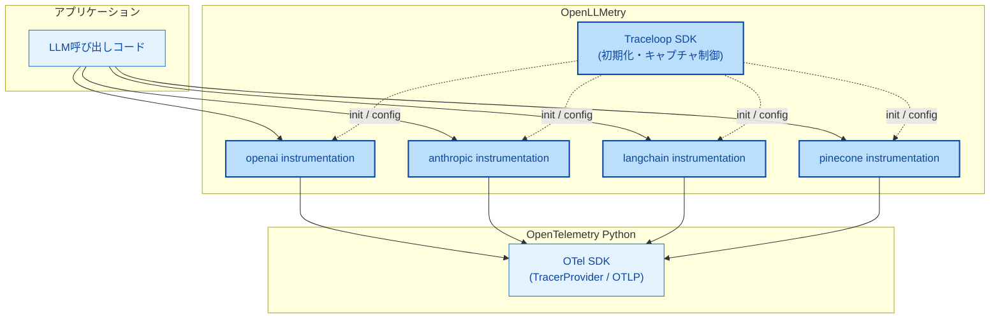
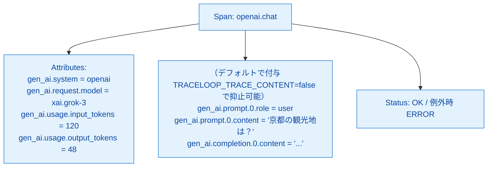
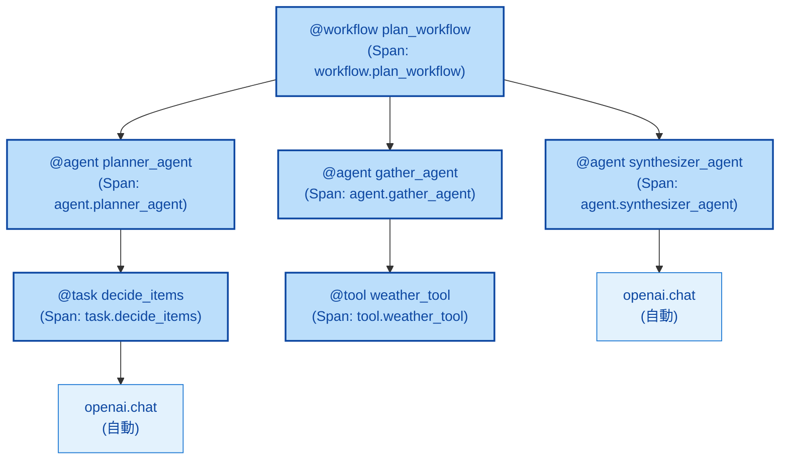

# 第9章 OpenLLMetry ― LLM呼び出しの自動計装

第8章でLLM計装の標準化動向（GenAI Semantic Conventions）を整理した。標準化は進行中だが実装はOpenTelemetry（以下OTel）公式パッケージとして十分には揃っていない。この空白を埋める現実解として広く使われているのがOpenLLMetryである。本章ではOpenLLMetryの位置付け、セットアップ方法、自動記録されるデータと限界、そしてデコレータによるワークフロー定義機能を扱う。実装と実機検証は第14章で行う。本章は概念と疑似コードによる解説にとどめる。

本章の図は第2章の図2.4「データフロー全体図」のうち、計装層内の `OpenLLMetry` ノードに焦点を絞ったものである。

## 9.1 OpenLLMetryとは何か

OpenLLMetryはTraceloop社が開発する、LLM SDK向け自動計装ライブラリ群の総称である[^1]。OTel Pythonの上に構築されており、生成されるSpanは通常のOTel SDKが作るSpanと完全に互換である。Tempo、Grafana、Prometheus、Lokiといった一般的なOTelバックエンドにそのまま流せる（図9.1）。



*図9.1: OpenLLMetryの位置付け。Traceloop SDKが束ね役となり、各LLM/フレームワーク向けinstrumentationがOTel Python SDKの上で動作する*

OpenLLMetryはOSSとしてGitHub上で公開されており、執筆時点で多数のLLMプロバイダ（OpenAI、Anthropic、Bedrock、Cohere、Gemini、Ollama等）、ベクトル検索ライブラリ（Pinecone、Chroma、Qdrant、Weaviate等）、フレームワーク（LangChain、LlamaIndex、CrewAI、Haystack等）に対応している[^1]。第7章で扱った自動計装の典型例の1つで、対象ライブラリ呼び出しをモンキーパッチでラップしてSpanへ変換する。

## 9.2 セットアップと基本的な使い方

OpenLLMetryのセットアップは `Traceloop.init()` を1回呼ぶだけで完結する（リスト9.1）。これにより、インストール済みの全対応SDKに対する自動計装が一括で有効化される。

**リスト9.1: Traceloop初期化（疑似コード、動作検証は第14章）**

```python
# 疑似コード（動作検証対象外）
from traceloop.sdk import Traceloop

Traceloop.init(
    app_name="travel-helper",
    # OTLPエンドポイントは OTEL_EXPORTER_OTLP_ENDPOINT 環境変数で
    # 解決される（指定なければデフォルトの localhost:4318）
)

# 以降は普通のOpenAI SDKを呼ぶだけで自動計装される
from openai import OpenAI
client = OpenAI(base_url=os.environ["OCI_GENAI_ENDPOINT"], api_key=...)
resp = client.chat.completions.create(
    model="xai.grok-3",
    messages=[{"role": "user", "content": "京都の観光地は？"}],
)
```

ポイントは2点ある。第1に、初期化はアプリのエントリポイントで1度だけ行えばよく、ライブラリ呼び出しのコードに変更を加える必要がない。第2に、OTLPエンドポイントは環境変数 `OTEL_EXPORTER_OTLP_ENDPOINT` から自動的に解決される。本書のサンプル構成では、第4・5章で使ったCollectorに同じ環境変数で接続するだけで済む。

OTel SDKを別途初期化していてもOpenLLMetryと共存できる。Traceloopは内部的にOTelの `TracerProvider` を再利用するため、自分で `TracerProvider` を構成済みであっても、その上にinstrumentationを上乗せする形で動作する[^2]。本書のサンプルでは第13章まで自前のOTel初期化を使い、第14章で `Traceloop.init` を追加する流れになる。

## 9.3 自動で記録されるデータ

OpenLLMetryが自動で生成するSpanの典型的な内容を表9.1に示す。

*表9.1: OpenLLMetryが自動記録する代表的な情報。GenAI Semantic Conventionsに準拠*

| 項目 | 例 | 補足 |
|------|-----|------|
| Span名 | `openai.chat`、`openai.completion`、`anthropic.messages` | プロバイダ＋操作種別 |
| `gen_ai.system` | `openai`、`anthropic` | プロバイダ識別子 |
| `gen_ai.request.model` | `gpt-4o-mini`、`xai.grok-3` | 要求モデル名 |
| `gen_ai.response.model` | `gpt-4o-mini-2024-07-18` | 応答モデル名（応答内に含まれる場合） |
| `gen_ai.request.temperature` | `0.7` | サンプリングパラメータ |
| `gen_ai.usage.input_tokens` | `120` | 入力トークン数 |
| `gen_ai.usage.output_tokens` | `48` | 出力トークン数 |
| プロンプト本文 | `gen_ai.prompt.0.role` `gen_ai.prompt.0.content` 等 | **デフォルトON**。`TRACELOOP_TRACE_CONTENT=false` で無効化 |
| レスポンス本文 | `gen_ai.completion.0.role` `gen_ai.completion.0.content` 等 | 同上 |
| 例外情報 | Span Status=ERROR、`record_exception` | LLM呼び出しで例外発生時 |

最後の2項目（プロンプト／レスポンス本文）が重要である。これらは**デフォルトで記録される**設定になっており[^3]、無効化するには明示的に環境変数 `TRACELOOP_TRACE_CONTENT=false` を設定する必要がある。プロンプトとレスポンスは個人情報や機密情報を含みうるため、本番環境では保存先（Tempo等）のアクセス権・保持期間・暗号化を確認した上で、「キャプチャしてLLM品質改善に使う／しない」をリスクアセスメントで判断する必要がある。

なお `gen_ai.prompt.*` `gen_ai.completion.*` の添字付き命名は、執筆時点のOpenLLMetry実装が出力する形式である。OpenTelemetry GenAI Semantic Conventions v1.38 以降ではこれらはdeprecated扱いとなり、構造化メッセージ属性（`gen_ai.input.messages` `gen_ai.output.messages`）やSpan Event方式への移行が進行中である[^6]。本書のTraceQL／PromQLは現行の `gen_ai.prompt.*` 前提で記述するが、SDK更新時にはクエリも追従が必要になる。

GrafanaのTempoでLLM呼び出しSpanを開いた際の典型的な見え方を図9.2に示す（実画面イメージは第14章で示す）。



*図9.2: 自動記録される情報の構造イメージ。基本Attributeは常時、プロンプト／レスポンスはキャプチャ有効時のみ付与される*

OpenLLMetryが生成するAttributeの命名は第8章で扱ったGenAI Semantic Conventionsに揃えられており[^4]、ツール固有の独自命名から段階的に標準命名へ移行が進んでいる。本書サンプルもこの命名前提でTraceQL／PromQLを書く。

## 9.4 OpenLLMetryの限界

便利な自動計装も万能ではない。OpenLLMetryが捕捉できる情報と捕捉できない情報を表9.2にまとめる。

*表9.2: OpenLLMetryが捕捉できる／できない情報*

| 項目 | OpenLLMetry単体 | 補完手段 |
|------|----------------|---------|
| 対応SDKのLLM呼び出し | 捕捉可（自動Span化） | ― |
| 未対応SDKや独自HTTP直叩きでのLLM呼び出し | 捕捉不可 | OTel手動Span＋GenAI Attributeを自分で付与 |
| ツール選択の判断理由 | 捕捉不可 | 手動Spanで `agent.tool_select` 等を作る |
| Few-shot件数や戦略の違い | 捕捉不可 | 手動Span Attribute（`travel_helper.few_shot_count` 等） |
| プロンプト／応答の評価スコア | 捕捉不可 | Langfuse SDK（第11章） |
| 複数エージェント間の協調構造 | 部分的（フレームワーク次第） | デコレータ＋手動Spanで階層を補強 |

3つの注意点がある。第1に、対応SDKがなければ動かない。OCI Generative AI Service（以下OCI GenAI）はOpenAI SDK互換のエンドポイントを提供するため、OpenAI instrumentation経由で自動計装される見込みだが、OCI固有の挙動（モデルID形式、Responses APIの内部呼び出し等）が想定どおりキャプチャされるかは検証が必要である。これが第10章のテーマになる。

第2に、判断ロジックはアプリ固有のためinstrumentationが知る由がない。「3案のうちなぜweather_toolを選んだか」「ループを2回回した根拠」といった情報は手動計装でしか記録できない（第7章で扱った原則と同じ）。

第3に、SDKバージョンアップで計装が壊れる可能性がある。OpenLLMetryは対象SDKの内部APIにフックを当てているため、SDKの内部変更で動作不良になる場合がある。本番運用ではSDKとOpenLLMetryのバージョンを揃えて固定し、アップデート時は計装の再検証を計画的に行うのが安全である。

## 9.5 デコレータによるワークフロー定義

OpenLLMetryは自動計装に加え、`@workflow`、`@task`、`@agent`、`@tool` の4つのデコレータを提供する[^5]。これらは手動Span生成（`with tracer.start_as_current_span(...)`）と同等のことを宣言的に書ける機能である。

デコレータで構築されるSpan階層の典型を図9.3に示す。



*図9.3: デコレータで構築されるSpan階層。`@workflow` を頂点に、`@agent` `@task` `@tool` のSpanがネストし、その内側の対応SDK呼び出しは自動計装が引き受ける*

デコレータの使用イメージをリスト9.2に示す。

**リスト9.2: デコレータ使用例（疑似コード、動作検証は第14章）**

```python
# 疑似コード（動作検証対象外）
from traceloop.sdk.decorators import workflow, agent, task, tool

@tool(name="weather_tool")
def weather_tool(city: str, days: int) -> str:
    # ... HTTP呼び出し（自動計装される）
    return forecast

@task(name="decide_items")
def decide_items(req: PlanRequest) -> list[str]:
    # ... openai.chat 呼び出し（自動計装される）
    return items

@agent(name="planner_agent")
def plan_stage(req: PlanRequest) -> list[str]:
    return decide_items(req)

@agent(name="gather_agent")
def gather_stage(req: PlanRequest) -> str:
    return weather_tool(req.city, req.days)

@workflow(name="plan_workflow")
def handle_plan(req: PlanRequest) -> PlanResponse:
    items = plan_stage(req)
    forecast = gather_stage(req)
    # ... synthesize
```

`with tracer.start_as_current_span(...)` を毎回書くのに比べて、デコレータは関数定義に1行付けるだけで済むため見通しが良い。既存関数に後付けで適用しやすい点も実用上のメリットである。

ただしデコレータと手動 `with` には判断軸がある。デコレータは「関数全体」を1つのSpanで囲む粒度であり、関数内の特定の数行だけをSpan化したい場合や、Spanの開始・終了タイミングを動的に制御したい場合は手動 `with` が必要になる。本書のサンプルでは第13章で手動Spanを完成させ、第14章で外側にデコレータ／自動計装を重ねる構成を採る。

## まとめ

- OpenLLMetryはTraceloop社開発のLLM SDK向け自動計装ライブラリ群で、OTel Pythonの上に構築されている
- `Traceloop.init()` 1行で対応SDKに対する自動計装が一括有効化される
- 自動記録される代表的Attributeは `gen_ai.*` 名前空間（第8章のGenAI Semantic Conventionsに準拠）
- プロンプト／レスポンス本文はデフォルトON。本番ではプライバシー観点から `TRACELOOP_TRACE_CONTENT=false` での無効化も検討する
- 限界として、未対応SDK・判断理由・評価スコアは捕捉できず、手動計装やLangfuseで補完する必要がある
- `@workflow` `@agent` `@task` `@tool` デコレータで関数単位のSpan化を宣言的に書ける

## 理解度チェック

### Q1. 自動記録される代表的Attribute

**種類**: 概念の確認 / **関連する節**: 9.3

OpenLLMetryが自動で記録する代表的なAttributeを2つ挙げよ。

<details>
<summary>解答と解説</summary>

例として `gen_ai.request.model`（要求モデル名、例: `xai.grok-3`）と `gen_ai.usage.input_tokens`（入力トークン数）が挙げられる。他にも `gen_ai.system`、`gen_ai.usage.output_tokens`、`gen_ai.request.temperature` 等が常時自動記録される。これらはGenAI Semantic Conventions（第8章）に準拠した命名である。プロンプト・レスポンス本文（`gen_ai.prompt.*` `gen_ai.completion.*`）はデフォルトで付与されるが、`TRACELOOP_TRACE_CONTENT=false` で抑止できる。

</details>

### Q2. OpenLLMetryが苦手な観測対象

**種類**: 概念の確認 / **関連する節**: 9.4

OpenLLMetryが苦手とする観測対象を2つ挙げよ。

<details>
<summary>解答と解説</summary>

例1: アプリ固有の判断理由。「3案のうちなぜweather_toolを選んだか」のような業務ロジックは汎用instrumentationの対象外で、手動Spanとカスタム属性で補完する必要がある。

例2: LLM応答の評価スコア。出力品質を採点する仕組みはOpenLLMetryのスコープ外で、Langfuse SDK等の専用ツール（第11章）で記録する。

他にも、未対応SDKでの呼び出しや、SDKバージョンアップ直後で計装側の追随が間に合っていないケースも捕捉が難しくなりうる。

</details>

### Q3. プロンプト本文記録の設定と注意点

**種類**: 判断問題 / **関連する節**: 9.3

OpenLLMetryはデフォルトでプロンプト・レスポンス本文を記録する。本番運用でプライバシーや機密情報の観点から記録を抑止したい場合、どう設定すべきか。また判断にあたっての注意点は何か。

<details>
<summary>解答と解説</summary>

設定方法は環境変数 `TRACELOOP_TRACE_CONTENT=false` をアプリのコンテナに付与する。これによりプロンプト・レスポンス本文（`gen_ai.prompt.*` `gen_ai.completion.*`）がSpan Attributeに乗らなくなる。

注意点は3つある。第1に、プロンプト・レスポンスは個人情報や機密情報を含みうるため、保存先（Tempo等）のアクセス権・保持期間・暗号化を確認した上で「記録する／しない」を決める。第2に、長大なプロンプトはSpanのサイズを大きくし、Collector側のバッチサイズや転送性能に影響する場合がある。第3に、本番環境で常時記録するか、開発・検証環境のみで記録するかは、リスクアセスメントとObservability要件のバランスで判断する。本書のサンプル検証ではデフォルト値を活かして記録した状態でTempo上で内容が見えることを確認する（第14章）。

</details>

### Q4. デコレータと手動 `with span` の判断基準

**種類**: 判断問題 / **関連する節**: 9.5

`@workflow` 等のデコレータと、手動 `with tracer.start_as_current_span(...)` のどちらを使うかを判断する基準を1つ述べよ。

<details>
<summary>解答と解説</summary>

判断基準の1つは「Span化したい範囲が関数1つと一致するか」である。関数全体を1つのSpanで包めばよいケース（例: ある `gather_stage` 関数の呼び出し全体をSpan化したい）はデコレータが見通し良く、後付けも容易である。一方、関数内の特定の数行（例: 関数の中で外部API呼び出し前後の数行だけを別Spanとして切り出したい）や、Spanの開始・終了タイミングを動的な条件で決めたい場合は手動 `with` が必要になる。両者は併用可能で、本書サンプルでは外側のstage区切りはデコレータ寄り、内部の判断ポイント切り出しは手動 `with` という使い分けが現れる。

</details>

## 参考文献

- Traceloop. "OpenLLMetry — Introduction." https://www.traceloop.com/docs/openllmetry/introduction （閲覧日: 2026-04-14）
- Traceloop. "OpenLLMetry — Integrations." https://www.traceloop.com/docs/openllmetry/integrations/introduction （閲覧日: 2026-04-14）
- Traceloop. "Manually configure OpenLLMetry." https://www.traceloop.com/docs/openllmetry/getting-started-python （閲覧日: 2026-04-14）
- Traceloop. "Privacy — Disabling content tracing." https://www.traceloop.com/docs/openllmetry/privacy/traces （閲覧日: 2026-04-14）
- Traceloop. "Workflows / Agents / Tasks / Tools decorators." https://www.traceloop.com/docs/openllmetry/tracing/decorators （閲覧日: 2026-04-14）
- traceloop/openllmetry GitHub Issue #3515. "gen_ai.prompt / gen_ai.completion deprecated." https://github.com/traceloop/openllmetry/issues/3515 （閲覧日: 2026-04-14）

[^1]: Traceloop. "OpenLLMetry — Introduction." https://www.traceloop.com/docs/openllmetry/introduction
[^2]: Traceloop. "Manually configure OpenLLMetry." https://www.traceloop.com/docs/openllmetry/getting-started-python
[^3]: Traceloop. "Privacy — Disabling content tracing." https://www.traceloop.com/docs/openllmetry/privacy/traces
[^4]: Traceloop. "OpenLLMetry — GenAI Semantic Conventions." https://www.traceloop.com/docs/openllmetry/contributing/semantic-conventions
[^5]: Traceloop. "Workflows / Agents / Tasks / Tools decorators." https://www.traceloop.com/docs/openllmetry/tracing/decorators
[^6]: traceloop/openllmetry GitHub Issue #3515. "gen_ai.prompt / gen_ai.completion の deprecated 化とOTel GenAI Semantic Conventions への追従." https://github.com/traceloop/openllmetry/issues/3515

## 次章への接続

本章でOpenLLMetryの仕組みと限界を整理した。残る論点は「読者の環境（OCI GenAI＋OpenAI SDK）でこの自動計装が想定どおり動くか」である。第10章ではOCI GenAIをOpenAI SDK経由で呼ぶ際の検証ポイント、Chat Completions APIとResponses APIの違い、OpenLLMetryでキャプチャできる情報の実機確認方針を扱う。
