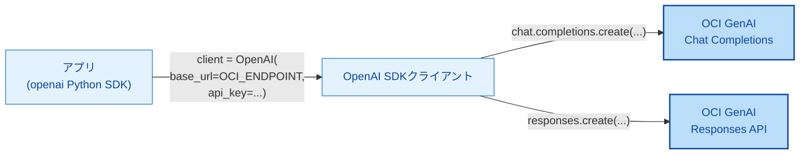
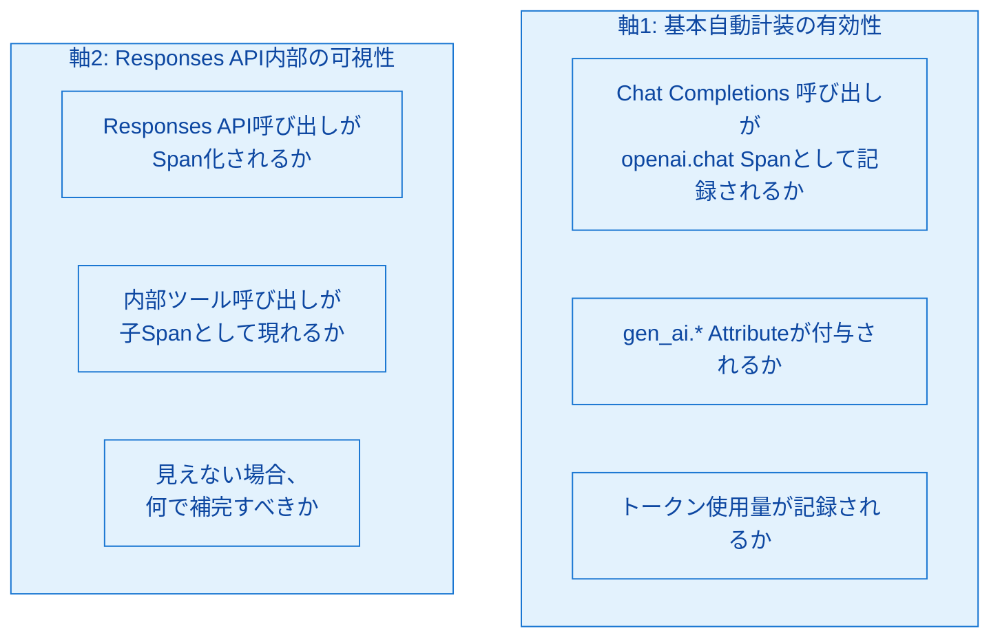
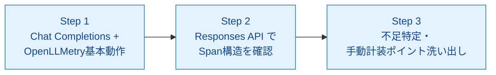

# 第10章 OCI GenAI + OpenAI SDK環境での検証ポイント

第9章でOpenLLMetryの仕組みを見た。残る論点は「読者の環境――本書ではOCI Generative AI Service（以下OCI GenAI）――で自動計装が想定どおり動くか」である。OCI GenAIはOpenAI SDK互換のエンドポイントを提供するため、形式上はOpenLLMetryが動作するはずである。しかしChat Completions APIとResponses APIという2種のインターフェースや、内部でのツール呼び出しオーケストレーションが絡むと、自動計装が何をどこまで捕捉できるかは事前の設計判断だけでは決めきれない。本章では、検証の観点・手順・判断基準を提示する。実際の検証は第14章で `sample-app/ch14/` を用いて行う。

## 10.1 OCI GenAI ServiceのOpenAI SDK互換性

OCI GenAIはOpenAI Chat Completions APIとResponses APIの両方を互換エンドポイントとして提供している[^1]。クライアント側は標準のOpenAI SDK（Python）を使い、`base_url` をOCIのエンドポイントに向け、認証キーを設定するだけで接続できる（図10.1）。

*図10.1: OpenAI SDKの `base_url` をOCIに向けるだけで同じSDKから両APIを呼び出せる。OpenLLMetryは `openai` instrumentationでこれらの呼び出しを自動Span化する*

Chat Completions APIとResponses APIは、提供するインターフェース形式と内部の振る舞いが異なる（表10.1）。

*表10.1: Chat Completions APIとResponses APIの比較*

| 観点 | Chat Completions API | Responses API |
|------|---------------------|---------------|
| 入力形式 | `messages` 配列（role/content） | `input` テキストまたはメッセージ配列 |
| 出力形式 | `choices[0].message.content` | `output` 配列（メッセージ／ツール呼び出し等の構造化） |
| ツール呼び出し | クライアント側でループ制御（モデル→ツール結果を再送信→モデル） | API内部でツール呼び出し／オーケストレーションを行う場合がある |
| ステートフル性 | 原則ステートレス（会話履歴はクライアント持ち） | `previous_response_id` やConversations APIでサーバ側に状態を持てる |
| Observability上の扱い | クライアント呼び出しが1Spanで完結しやすい | API内部の処理がクライアントから不可視になる可能性 |

Observability観点で重要なのは最終行である。Chat Completions APIはクライアントからの1回の呼び出しが1つのSpanに対応しやすく、OpenLLMetryの標準的な自動計装で過不足なく記録できると期待できる。一方Responses APIは、サーバ内部のツール呼び出しや複数ターンのオーケストレーションがクライアントから見えにくく、1Spanに集約されてしまう可能性がある。

## 10.2 検証すべきポイント

OCI GenAI環境でのOpenLLMetry挙動を検証する際、2つの軸に整理できる（図10.2）。

*図10.2: 検証の2軸。軸1は自動計装の「成立」、軸2は自動計装の「深さ」を問う*

軸1は、OpenAI SDKを通常どおり使えば想定の自動計装が成立するかという基本動作の確認である。OCI GenAIはOpenAI SDK互換のはずだが、レスポンスのスキーマ差やヘッダー差でinstrumentation内部の属性抽出が失敗する可能性は残る。

軸2は、Responses API内部の深さを捕捉できるかである。サーバ側で完結するツール呼び出しは、OTelの観測範囲ではクライアントから追えないのが原則で、得られるのは「Responses呼び出しという1Span」と返却された `output` 配列のみになる可能性が高い。その場合、`output` 配列の内容をSpan Attributeに載せて疑似的に可視化するか、アプリ側で同等のロジックをクライアントで展開して手動Span化する必要がある。

## 10.3 検証の手順

検証は3ステップで進めるのが効率的である（図10.3）。

*図10.3: 検証フローの3段階。単純なケースで自動計装が成立するかを先に確認し、次に複雑ケースでの深さを見る*

Step 1では、`sample-app/ch14/` 相当の最小構成で `client.chat.completions.create(...)` を1回呼び、以下を確認する。(1) Tempoで `openai.chat` Spanが検索できる、(2) `gen_ai.system`、`gen_ai.request.model`、`gen_ai.usage.input_tokens`、`gen_ai.usage.output_tokens` がAttributeとして付く、(3) `TRACELOOP_TRACE_CONTENT=false` 設定時にプロンプト／レスポンス本文が記録されない（もしくはtrue/デフォルトで記録される）。これらが揃えば基本動作はOK。

Step 2では、Responses APIを使い内部でツール呼び出しを起こす想定で `client.responses.create(...)` を呼ぶ。TempoでResponses呼び出しのSpanを開き、(1) Span名と階層、(2) `output` 配列が何らかのAttributeに載っているか、(3) 内部で複数ターン走った形跡（`usage` の合計値や `response_id` 等）が見えるかを確認する。

Step 3では、Step 2で見えなかった情報を整理し、手動計装で補うべきポイントを洗い出す。典型的には「内部のツール選択結果」「内部で走ったターン数」「中間的な生成内容」などが手動補完対象になる。アプリ側で同等のロジックを展開するか、`output` 配列をパースして独自AttributeとしてSpanに乗せる。

## 10.4 判断基準

検証結果に応じて採用方針を決める際の判断マトリクスを表10.2にまとめる。

*表10.2: 検証結果に応じた採用方針の判断マトリクス*

| Step 1（基本） | Step 2（深さ） | 採用方針 |
|---|---|---|
| OK | 十分な情報が見える | OpenLLMetryのみで採用。メンテコスト最小 |
| OK | 1Spanで内部不可視 | OpenLLMetryを基盤に採用し、アプリ側で手動計装（`output` パース＋独自Span）を併用 |
| OK | 使用していない | Chat Completionsのみ使用ならOpenLLMetryのみで十分 |
| 一部NG（属性欠落等） | ― | OpenLLMetryを使いつつ、欠落Attributeを手動で補う。ライブラリ更新を追跡 |
| 基本動作NG | ― | OpenAI instrumentationのバージョン・対象APIの相性を確認し、OCI対応版の出現を待つ／独自計装を検討 |

判断軸は「メンテコスト」と「情報の完全性」のバランスである。自動計装で十分な情報が取れているなら、手動計装を追加する動機は薄い（計装コードがビジネスロジックに混ざる負担と、メンテコスト増を招く）。一方、Responses API内部のように自動では見えない情報が運用上重要なら、手動補完は必須となる。

推奨される設計パターンは「OpenLLMetryを基盤に採用」＋「差し替え可能な手動補完レイヤ」である。手動計装をSDK更新で容易に差し替えられる構造にしておけば、将来OpenLLMetryがResponses API内部を見えるようになった際に手動補完を除去できる。

## 10.5 検証結果の記録と本書での前提

本書で検証に用いた環境（執筆時点）における結果を表10.3にまとめる。値は `sample-app/ch14/` での実機検証結果として記録する（第14章で詳細を示す）。読者の環境とは一致しない可能性があるため、必ず再検証の上で自身の前提を確定させるよう推奨する。

*表10.3: 本書検証時の結果（執筆時点、`xai.grok-3` を使用）。値は第14章で実機検証する*

| 検証項目 | 本書での結果（予定） | 備考 |
|---------|-------------------|------|
| Chat Completions で `openai.chat` Span生成 | 成立想定 | OpenAI SDK互換のため標準動作 |
| `gen_ai.request.model` への model 値格納 | 成立想定 | SDK互換ならそのまま流れる |
| `gen_ai.usage.input_tokens` / `output_tokens` | 成立想定 | レスポンスに `usage` が含まれる前提 |
| プロンプト／レスポンス本文キャプチャ | デフォルトON（第9章参照） | 本番環境では false 設定を推奨 |
| Responses API 呼び出しが Span 化 | 成立想定 | OpenLLMetry Issue #2782でResponses API対応のwrapper追加済みのため、基本Span化は期待できる |
| Responses API 内部ツール呼び出しの子Span化 | 成立せず（見込み） | API内部処理のためクライアント不可視 |
| Responses API 内部処理の手動補完 | 必要 | `output` 配列パースと `travel_helper.*` 独自Attributeで補う |

この結果は第14章の実機検証で確定させる。本書の以降の章では「Chat Completions API＋OpenLLMetry」で自動計装された標準的なSpanが得られることを前提とし、Responses API内部の深掘りが必要な箇所は手動計装で補完する方針を採る。

検証結果は時間とともに変わる。OpenLLMetryのバージョンアップ、OCI GenAIの機能追加、OpenAI SDKの互換性調整などのいずれかで、Span構造やAttribute内容が変化する可能性がある。本書は「執筆時点」の結果を記録するにとどめ、運用上は定期的な再検証を推奨する。

## まとめ

- OCI GenAIはOpenAI SDK互換のChat Completions APIとResponses APIを提供する
- Chat Completions APIはクライアント側で1呼び出し1Spanに対応しやすく、OpenLLMetryの標準自動計装で過不足なく記録しやすい
- Responses APIはAPI内部のツール呼び出しがクライアントから不可視になる可能性があり、自動計装の「深さ」は要検証
- 検証は3ステップ（基本動作→Responses API→不足特定）で進める
- 採用方針はメンテコストと情報完全性のバランスで決め、「OpenLLMetryを基盤＋手動補完レイヤ」が汎用的な選択
- 本書は第14章で実機検証し、その結果を以降の章の前提とする

## 理解度チェック

### Q1. 2APIのObservability観点での違い

**種類**: 概念の確認 / **関連する節**: 10.1、10.2

Chat Completions APIとResponses APIの違いを、Observabilityの観点でどう捉えるべきか述べよ。

解答と解説

Chat Completions APIはクライアントからの1呼び出しが1つのLLM推論に対応しやすく、OpenLLMetryの自動計装で得られるSpanとAttribute（`gen_ai.request.model`、`gen_ai.usage.*` 等）で十分に記録できる。ツール呼び出しもクライアント側でループ制御するため、各ステップが独立したSpanとして木に並ぶ。

Responses APIはサーバ側で複数ターンのオーケストレーションやツール呼び出しを行う場合があり、クライアントからは「1回の呼び出し＝1Span」にしか見えない可能性がある。自動計装だけでは内部の判断過程が追えず、応答に含まれる `output` 配列や `usage` 合計値を手動計装でSpan Attributeに展開する補完が必要になることがある。

### Q2. 1Spanに集約された場合の次の一手

**種類**: 判断問題 / **関連する節**: 10.3、10.4

自動計装の結果、Responses API内部が1つのSpanにしか見えなかった場合、次にどうすべきか。

解答と解説

自動計装で得られるSpanを基盤として残した上で、手動計装による補完レイヤを追加する。具体的には次の3つを行う。

1. 応答の `output` 配列をパースし、「どのツールが呼ばれた／どのような順でターンが進んだ」といった情報を独自Attribute（`travel_helper.turns_count`、`travel_helper.tools_used` 等）としてSpanに乗せる。
2. `usage` の合計値から推察されるターン数・トークン消費をMetricとしても記録し、全体傾向の把握に使う。
3. Responses APIに代えて、必要に応じてChat Completions APIとクライアント側ツール呼び出しに切り替える選択肢を検討する（深く可視化したい重要フローのみ）。

手動補完レイヤはSDK更新時に差し替え可能な形で実装する。将来OpenLLMetryがResponses API内部を自動で展開できるようになれば、補完コードを段階的に除去できる。

### Q3. 自動で十分な場合の手動計装のデメリット

**種類**: 判断問題 / **関連する節**: 10.4

自動計装で十分な情報が取れるのに手動計装も書くことのデメリットは何か。

解答と解説

デメリットは3点ある。第1に、計装コードがビジネスロジックに混ざり、コードの見通しとレビュー容易性が下がる。第2に、同じ情報が自動計装と手動計装の両方で記録されると、Span Attributeが重複し、下流の検索や集計で混乱を招く。第3に、ライブラリ更新や標準命名の変更に追随するメンテコストが二重に発生する。

原則として、自動計装で得られる情報を手動で再現するだけの計装は書かず、自動計装が捕捉できない情報（判断理由、業務固有の指標、API内部の不可視部分など）に限定して手動計装を追加する。

## 参考文献

- Oracle. "OCI Generative AI — OpenAI-compatible endpoints." https://docs.oracle.com/en-us/iaas/Content/generative-ai/oci-openai.htm （閲覧日: 2026-04-14）
- Oracle. "Generative AI overview." https://docs.oracle.com/en-us/iaas/Content/generative-ai/overview.htm （閲覧日: 2026-04-14）
- OpenAI. "Chat Completions API reference." https://platform.openai.com/docs/api-reference/chat （閲覧日: 2026-04-14）
- OpenAI. "Responses API reference." https://platform.openai.com/docs/api-reference/responses （閲覧日: 2026-04-14）
- OpenTelemetry Project. "Semantic Conventions for Generative AI." https://opentelemetry.io/docs/specs/semconv/gen-ai/ （閲覧日: 2026-04-14）
- Traceloop. "OpenLLMetry — OpenAI instrumentation." https://www.traceloop.com/docs/openllmetry/integrations/openai （閲覧日: 2026-04-14）

[^1]: Oracle. "OCI Generative AI — OpenAI-compatible endpoints." https://docs.oracle.com/en-us/iaas/Content/generative-ai/oci-openai.htm

## 次章への接続

本章でOCI GenAI環境におけるOpenLLMetryの検証観点を整理した。システム挙動の観測（関心事A）については、ここまでのOTel＋OpenLLMetryで基盤が揃う。残る関心事BであるLLM出力品質の観測は別ツールが担う。第11章ではLangfuseの機能（トレース、評価、プロンプト管理）を扱い、OTelと併存しながらLLM品質改善ループを回す手段を導入する。
