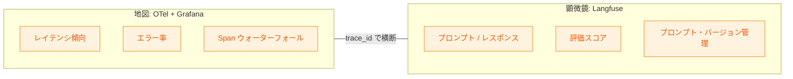
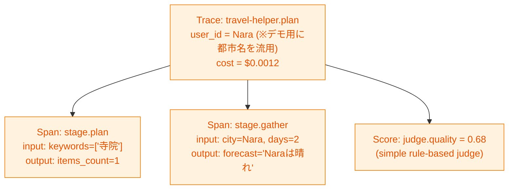
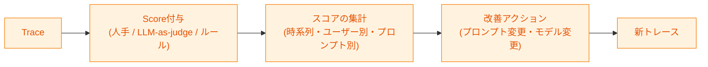
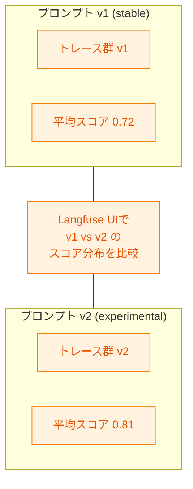
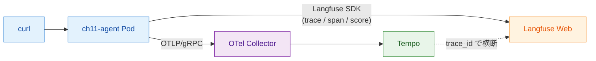

# 第11章 Langfuseの機能と使い方

第10章でOCI GenAI環境でのOpenLLMetry検証観点を整理した。これで関心事A（システムとして何が起きたか）の基盤は揃う。残る関心事Bは「LLMの出力品質はどうだったか」である。本章では、この関心事B専用のツールとしてLangfuseの3つの主要機能――トレーシング／評価／プロンプト管理――を扱い、最後にサンプルアプリにLangfuse SDKを組み込んで実機で確認する。

本章の範囲は第2章の図2.4（データフロー全体図）のうち、右下の「Langfuse」ノードとそこへ至るLangfuse SDK経路である。

## 11.1 Langfuseの位置付け

OpenTelemetry（以下OTel）＋Grafanaが「システム全体の地図」を描くツール群だとすれば、Langfuseは「LLMの判断を顕微鏡で見る」ツールである（図11.1）[^1]。両者は競合せず、関心事Aと関心事Bを分担する。



*図11.1: 地図と顕微鏡の対比。同じ1リクエストに対し、OTel＋Grafanaは「どこで時間を使ったか」を、Langfuseは「なぜそう判断したか」を見る*

Grafana側で「この時刻帯のレイテンシが悪化している」と見えた際、該当Trace IDを辿ってLangfuse上で「そのリクエストのLLM判断はどうだったか（プロンプト／レスポンス／評価スコア）」を確認する、という横断デバッグが本書の基本フローである。trace_id紐付けの具体的な方法は第12章で扱う。

Langfuseは3つの主要機能を提供する。トレーシング（LLM呼び出し単位の入出力記録）、評価（Evaluation、スコア付与と時系列推移）、プロンプト管理（バージョン管理と品質比較）である。以下の節でそれぞれを見ていく。

## 11.2 機能1: トレーシング

Langfuseのトレーシングは、LLM呼び出しの入出力、使用モデル、トークンコスト、所要時間といった情報を、1リクエスト単位で階層構造として記録する仕組みである[^2]。OTelのTraceと似ているが、Langfuse UIは「プロンプト・レスポンス本文を並べて見る」ことに最適化されている点が異なる（図11.2）。



*図11.2: Langfuse UIにおけるトレース詳細のイメージ。1Trace下にSpanとScoreが並び、入出力本文がJSONで直接見える*

実装はシンプルで、Langfuse SDKのTraceオブジェクトとSpanオブジェクトを使う（リスト11.1）。

**リスト11.1: `sample-app/ch11/agent.py`（Langfuseトレース記録部分）**

```python
lf_trace = langfuse.trace(
    name="travel-helper.plan",
    user_id=req.city,
    metadata={"otel_trace_id": trace_id_hex, "keywords_count": len(req.keywords)},
    input={"city": req.city, "days": req.days, "keywords": req.keywords},
    output={"itinerary": itinerary},
)
lf_trace.span(
    name="stage.plan",
    input={"keywords": req.keywords},
    output={"items_count": len(items)},
)
lf_trace.span(
    name="stage.gather",
    input={"city": req.city, "days": req.days},
    output={"forecast": forecast},
)
```

特徴は3点ある。第1に、`input` と `output` が構造化データ（辞書）として記録され、プロンプト本文・応答本文・パラメータをまとめて保持できる。第2に、`metadata` にOTelの `trace_id` を入れることで、第12章で扱う横断デバッグが成立する。第3に、`user_id` などの軸を渡すことでユーザーごとの品質傾向も追える。

料金は、LangfuseがサポートするLLMモデルのレート表に基づき、入出力トークン数から自動で計算される[^3]。本書のサンプルはLLM呼び出しを本格的には含まないが、第14章以降の構成ではOCI GenAIの実モデル名を渡すことでコスト集計が可能になる。

## 11.3 機能2: 評価（Evaluation）

Langfuseの評価機能は、トレースに対してスコアを付与し、スコアの時系列推移やフィルタリングを行う仕組みである[^4]。LLMが「正しく動いたか」を定量化し、改善ループの効果を測定する軸となる（図11.3）。



*図11.3: 評価ワークフロー。スコアを起点に集計・分析し、改善アクションに繋げて再度トレースとして跳ね返す*

スコア付与の方法は3種類ある[^4]。

- **人手レビュー**: Langfuse Web UIでトレースを開き、アノテータがスコアを付ける。最終的な「正解」の基準として使える
- **LLM-as-judge**: 別のLLMに出力を採点させる。大量のトレースを機械的にスコア付けできる
- **ルールベース**: 出力の長さ、特定キーワードの含有、フォーマット合致などをコードで判定

サンプル実装ではルールベースの簡易LLM-as-judge（実体はルール）で採点する（リスト11.2）。

**リスト11.2: `sample-app/ch11/agent.py`（スコア記録部分）**

```python
def simple_llm_judge(itinerary: str, req: PlanRequest) -> float:
    score = min(len(itinerary) / 80.0, 1.0) * 0.5
    if req.keywords:
        hit = sum(1 for kw in req.keywords if kw in itinerary) / len(req.keywords)
        score += hit * 0.5
    return round(score, 2)

score = simple_llm_judge(itinerary, req)
lf_trace.score(name="judge.quality", value=score, comment="simple rule-based judge")
```

スコア名前空間（`judge.quality`）を揃えることで、Langfuse Web UI上で該当スコアの時系列推移を集計できる。「プロンプトを変えたらスコアが上がったか」「モデルを変えたらどうか」といった改善効果の定量測定が、OTelだけでは難しいこの領域を埋める。

評価はOTelの範疇外であり、Langfuseを採用する最大の動機の1つである。OTelにもAttributeとしてスコアを乗せる選択肢はあるが、時系列分析UI・アノテーション機能・LLM-as-judge機能は専用ツールに分がある。

## 11.4 機能3: プロンプト管理

Langfuseのプロンプト管理は、プロンプトテンプレートにバージョンを付け、実行時にそのバージョンを参照し、バージョン間で出力品質を比較する機能である[^5]。Gitでプロンプトを管理するのとの違いは、「実行時のスコアに直接紐付く」点である（図11.4）。



*図11.4: プロンプトのv1とv2を同時に運用し、それぞれに紐付くトレース群のスコアを比較する。定量的な改善判断が可能になる*

Gitでのプロンプト管理は「コードの履歴」までで、実環境での品質は別途計測する必要がある。Langfuseのプロンプト管理は、プロンプトオブジェクトに `version` を付けて参照すると、各トレースに `prompt_version` が自動で紐付く。これにより、バージョン別のスコア分布やレイテンシ分布を1つのUIで比較できる。A/Bテストに近い運用が可能である。

本書のサンプルは簡易のためプロンプト管理機能は使わないが、実運用ではLangfuse Web UI上でプロンプトテンプレートを管理し、コードは `langfuse.get_prompt("travel_planner")` のような呼び出しでバージョン付きプロンプトを取得する形になる。

## 11.5 ハンズオン ― サンプルアプリにLangfuse SDKを組み込む

本章のサンプル（`sample-app/ch11/`）は、第4・5章のOTel版にLangfuse SDKを追加した構成である（図11.5）。



*図11.5: 第11章ハンズオン構成。OTel経路とLangfuse SDK経路が並存し、`trace_id` で横断できる*

本書のサンプルは `langfuse==2.60.2`（v2系SDK）を使用する。Langfuseは2025年5月にPython SDK v3（OpenTelemetryベースに刷新、`start_as_current_span` 等のAPIに変更）をリリースしており、本章のコード例はv2系のtrace／span／score APIを前提とする点に注意する。

Langfuse SDKの初期化はリスト11.3のようになる。credentialsが未設定の場合は `None` を返し、ランタイム側でNoneチェックして処理をスキップする作りにしている（本書サンプルの動作検証時はkeyがなくてもPodが起動する）。

**リスト11.3: `sample-app/ch11/langfuse_setup.py`（初期化部分）**

```python
def init_langfuse():
    host = os.environ.get("LANGFUSE_HOST")
    public_key = os.environ.get("LANGFUSE_PUBLIC_KEY")
    secret_key = os.environ.get("LANGFUSE_SECRET_KEY")
    if not (host and public_key and secret_key):
        log.warning("Langfuse credentials not set; skipping Langfuse recording")
        return None
    from langfuse import Langfuse
    return Langfuse(public_key=public_key, secret_key=secret_key, host=host)
```

認証情報は環境変数 `LANGFUSE_HOST` `LANGFUSE_PUBLIC_KEY` `LANGFUSE_SECRET_KEY` から読み込む。本書の検証環境ではLangfuseが `http://langfuse-web.langfuse:3000` にデプロイ済みで、キーはLangfuse Web UIでプロジェクトを作成して発行する。本書リポジトリは `sample-app/ch11/k8s/secret.example.yaml` をテンプレートとして配布し、読者が実値を埋めた `secret.yaml` を作成して `kubectl apply` する流れを想定する。

デプロイと検証は次のコマンドで行う。

```bash
cd sample-app/ch11
# 1. Secretの準備（実値を埋める）
cp k8s/secret.example.yaml k8s/secret.yaml
$EDITOR k8s/secret.yaml
kubectl apply -f k8s/secret.yaml -n aio11y-book

# 2. デプロイと検証
make deploy
make verify
```

本書の検証では、Langfuse credentialsなしでPodが正常起動し、Tempoに通常のOTel Traceが届くところまでを確認した。Langfuse credentialsを設定した状態での動作確認は読者環境で実施する。実施時には、Langfuse Web UIの `Traces` 画面で `travel-helper.plan` トレースが現れ、`metadata.otel_trace_id` からOTel Tempoの同じTraceに飛べることを確認する。また `Scores` 画面で `judge.quality` スコアの時系列が確認できる。

クリーンアップは次のコマンドで行う。

```bash
make clean
# またはリポジトリルートから
make clean-ch11
```

## まとめ

- Langfuseは「LLMの判断を顕微鏡で見る」専用ツールで、OTel＋Grafanaと役割分担する
- 主要機能はトレーシング（入出力＋コスト集計）、評価（スコア付与と時系列分析）、プロンプト管理（バージョン＋品質比較）の3つ
- 評価（Evaluation）はOTelの範疇外で、Langfuseを採用する最大の動機の1つ
- `metadata` にOTelの `trace_id` を入れることで、Grafana（Tempo）とLangfuseを横断デバッグできる
- サンプル実装は `sample-app/ch11/` に配置。credentials未設定時はLangfuse記録をスキップする作りで動作する
- プロンプト管理はGit管理との違いが「実行時スコアと直結」する点で、A/Bテスト相当の定量比較を実現する

## 理解度チェック

### Q1. Langfuseの3機能

**種類**: 概念の確認 / **関連する節**: 11.2、11.3、11.4

Langfuseの3機能それぞれを1文で説明せよ。

<details>
<summary>解答と解説</summary>

- トレーシング: LLM呼び出しの入出力・使用モデル・トークンコスト・所要時間を1リクエスト単位で階層構造として記録し、Langfuse Web UIで入出力本文を並べて閲覧する機能。
- 評価: トレースに対し人手／LLM-as-judge／ルールの3方式でスコアを付与し、時系列推移・ユーザー別・プロンプト別の分布として分析する機能。
- プロンプト管理: プロンプトテンプレートにバージョンを付けて実行時参照し、バージョン間の出力品質（スコア分布）をUI上で定量比較する機能。

</details>

### Q2. OTelのトレースではなくLangfuseを使う場面

**種類**: 概念の確認 / **関連する節**: 11.1、11.3

OTelのトレース（Tempo）ではなくLangfuseを使うと嬉しいのはどんな場面か。

<details>
<summary>解答と解説</summary>

「LLM判断の良し悪し」を問いたい場面である。例として(1)プロンプトとレスポンスを並べて品質評価する、(2)トレースにスコアを付けて時系列で改善効果を測る、(3)プロンプトのバージョン間で出力品質を比較する、といった作業はLangfuseのUIが最適化されている。OTel TempoはSpanウォーターフォールや分散処理の依存関係表示に強いが、LLM入出力の可読性・スコア分析・プロンプト管理には踏み込んでいない。横断的なデバッグはtrace_idで両UIを行き来するのが基本形となる。

</details>

### Q3. プロンプト変更の影響測定

**種類**: 判断問題 / **関連する節**: 11.3、11.4

プロンプト変更が品質に与える影響を測定したい。Langfuseのどの機能を組み合わせて使うか。

<details>
<summary>解答と解説</summary>

プロンプト管理と評価を組み合わせる。具体的には(1)プロンプト管理機能でv1（既存）とv2（変更後）のバージョンを登録し、コード側で条件分岐または段階的に切り替えて両方のトレースを記録する、(2)評価機能で `judge.quality` 等のスコアをルールベースまたはLLM-as-judgeで両バージョンのトレースに付与する、(3)Langfuse Web UI上で `prompt_version` 別にスコア分布を比較する。これにより「v2の平均スコアが0.72から0.81に上がった」のような定量的な改善判断が可能になる。A/Bテストに近い運用で、レイテンシやコストの分布も同時に比較できる。

</details>

### Q4. LLM-as-judgeによる自動評価設計

**種類**: 設計問題 / **関連する節**: 11.3

「LLM出力が期待と異なるケース」を検知する自動評価の仕組みを、LLM-as-judgeで設計せよ。

<details>
<summary>解答と解説</summary>

設計案: アプリの本処理とは別経路で、Langfuseのトレースを取り出して採点する非同期ジョブを走らせる。

1. 採点用プロンプトの設計: 「以下のユーザー質問と応答を見て、応答が質問の意図に合致するか、事実と矛盾しないか、要求フォーマットを満たすかを0.0〜1.0で採点し、理由を1文で述べよ」を採点LLMに渡すテンプレートとして用意する。
2. 採点対象の抽出: Langfuse APIで直近N件のトレースを取得し、`input`（ユーザー質問）と `output`（応答）をペアで採点LLMに渡す。
3. スコア記録: 得られたスコアを該当トレースに `langfuse.trace.score(name="judge.intent_match", value=score, comment=reason)` で書き戻す。
4. アラート閾値: 一定期間の平均スコアが閾値（例: 0.5）を下回ったら、GrafanaのMetrics（`travel_helper.llm_judge_score` Histogram等）経由でアラートを発火する。

注意点として、採点LLMは本処理のLLMとは分離して呼び出すのが望ましい（同じモデルだと判断のバイアスが混入しやすい）。また、採点プロンプト自体もLangfuseのプロンプト管理でバージョン化し、「採点基準の変更」もスコア変動要因として可視化する。

</details>

## 参考文献

- Langfuse. "LLM Observability & Application Tracing." https://langfuse.com/docs/observability/overview （閲覧日: 2026-04-14）
- Langfuse. "Tracing." https://langfuse.com/docs/tracing （閲覧日: 2026-04-14）
- Langfuse. "Model-based usage & cost tracking." https://langfuse.com/docs/model-usage-and-cost （閲覧日: 2026-04-14）
- Langfuse. "Scores and Evaluations." https://langfuse.com/docs/scores/overview （閲覧日: 2026-04-14）
- Langfuse. "Prompt Management." https://langfuse.com/docs/prompts/get-started （閲覧日: 2026-04-14）

[^1]: Langfuse. "LLM Observability & Application Tracing." https://langfuse.com/docs/observability/overview
[^2]: Langfuse. "Tracing." https://langfuse.com/docs/tracing
[^3]: Langfuse. "Model-based usage & cost tracking." https://langfuse.com/docs/model-usage-and-cost
[^4]: Langfuse. "Scores and Evaluations." https://langfuse.com/docs/scores/overview
[^5]: Langfuse. "Prompt Management." https://langfuse.com/docs/prompts/get-started

## 次章への接続

本章でLangfuseの機能を概観し、実際にSDKをサンプルアプリに組み込んだ。OTelとLangfuseの両ツールが揃ったので、次に必要なのは両者をどう使い分け・どう連携させるかの設計判断である。第12章ではOTelとLangfuseの役割分担、データ送信経路の3パターン（アプリ直接／Collector経由／両用）、そして `trace_id` による横断デバッグの具体的手順を扱う。
