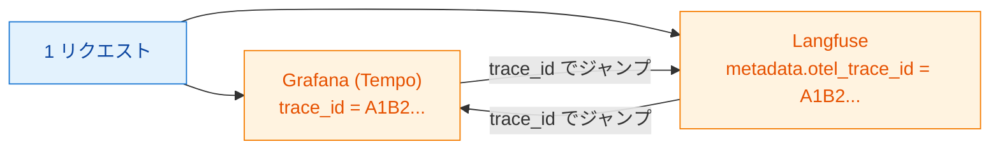
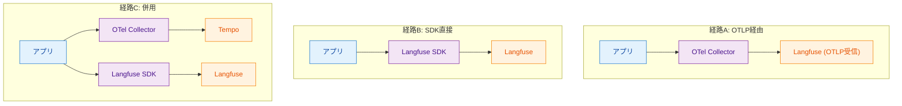
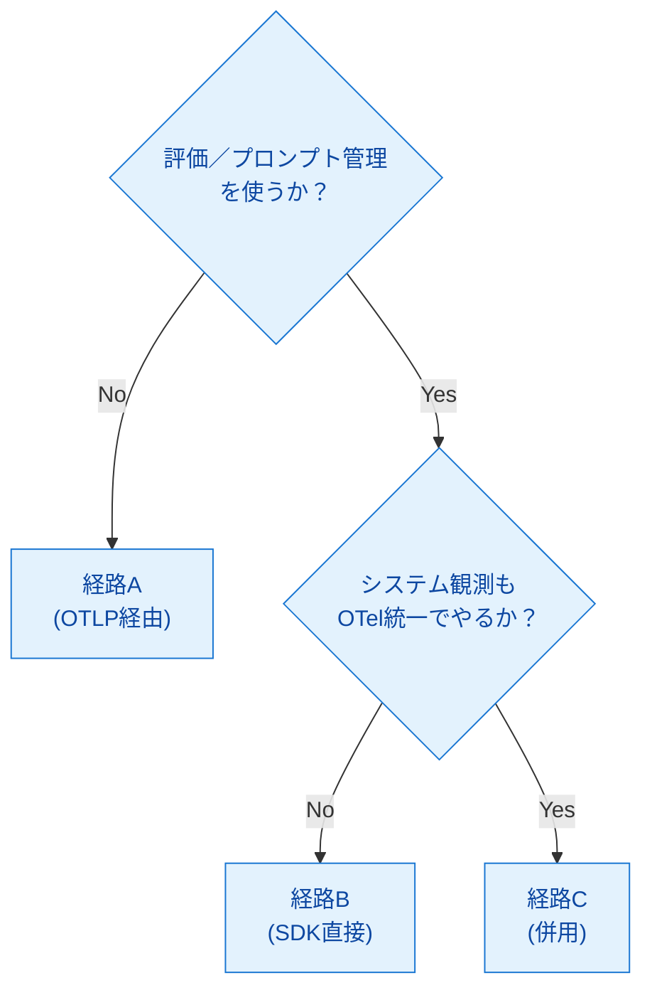
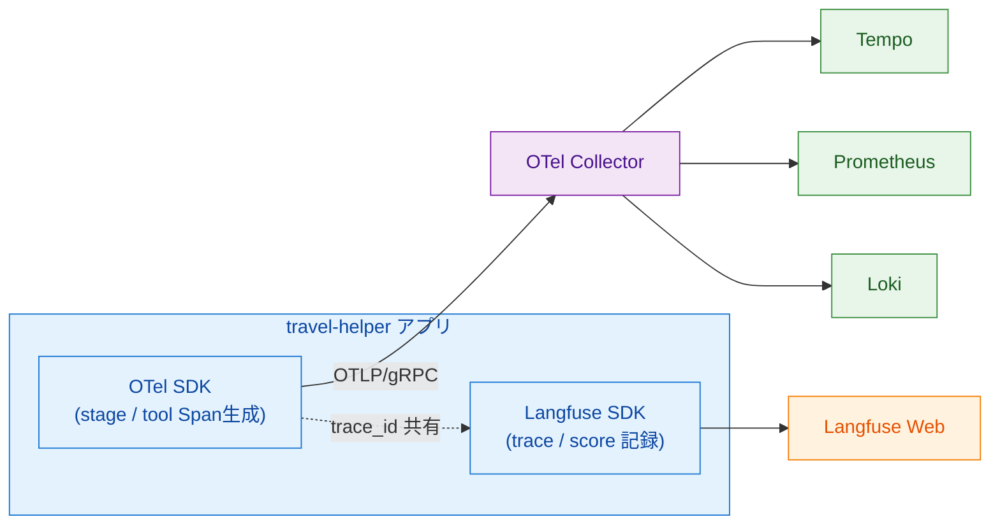

# 第12章 OTelとLangfuseの役割分担とデータ送信経路

第11章までにOpenTelemetry（以下OTel）とLangfuseの両方の機能を個別に見てきた。本章ではこの2つをどう役割分担させ、Langfuseへのデータ送信経路（OTLP／SDK／併用）をどう選ぶかという設計判断を整理する。第1章で導入した「2つの関心事」に立ち戻り、各ツールが担う領域を明確にした上で、サンプルアプリ `travel-helper` の実装に即した併用パターンを提示する。

本章は設計判断を扱う章であり、新規サンプル実装は行わない。第11章で作成した `sample-app/ch11/` のコードを引用して設計意図を示す。

## 12.1 役割分担の整理

OTel＋GrafanaとLangfuseは、第1章で導入した2つの関心事と対応する（表12.1）。

*表12.1: OTel+GrafanaとLangfuseの役割分担。対応する関心事、扱うデータ、代表的な問いの3つで整理する*

| 観点 | OTel + Grafana | Langfuse |
|------|---------------|---------|
| 対応する関心事 | A: システムとして何が起きたか | B: LLMの出力品質はどうだったか |
| 扱うデータ | Traces（Span階層）、Metrics、Logs | LLM Trace、プロンプト／レスポンス、評価スコア、プロンプトバージョン |
| 代表的な問い | どこが遅い／失敗したか、どのサービスが律速か | LLMの応答は適切か、プロンプト変更で品質が上がったか |
| 扱うデータの解像度 | 1リクエスト〜時系列集計まで幅広い | 1リクエスト単位のLLM判断の詳細 |
| 得意な分析 | ウォーターフォール、集計ダッシュボード | 入出力比較、スコア推移、バージョン比較 |
| Spec／OSS | OpenTelemetry標準、CNCF | Langfuse独自スキーマ＋OTel連携 |

両者は補完関係にある。どちらか片方だけでは、第1章で述べた「検知→深掘り→仮説→修正→効果確認」の改善ループが閉じない。「遅い」をGrafanaだけで見るとLLMの判断ロジック変化を見逃し、「おかしい応答」をLangfuseだけで見るとリトライやタイムアウトといった裏側のシステム事象を見落とす。本書では両者を併用する構成を標準とする。

## 12.2 trace_idによる紐付け

併用時の最大の利点は、同じリクエストをGrafana（Tempo）とLangfuseの両方で追跡できることである。接続の鍵となるのはOTelのTrace ID（以降、コード上の変数・メタデータキーとしては `trace_id` と表記）である（図12.1）。



*図12.1: trace_id紐付けによる横断デバッグ。OTel側で採番されたTrace IDをLangfuseの`metadata`に渡すことで、両UIが1リクエストを共通IDで指す*

双方向のデバッグフローが成立する。Grafanaで「あるエンドポイントのp95レイテンシが悪化」を検知したら、Tempoで該当時間帯のトレースをサンプルし、そのTraceIDをLangfuseで検索する。Langfuseで該当リクエストのLLM判断内容・プロンプト・スコアを確認し、原因が「LLMの長い応答」か「裏のネットワーク遅延」かを切り分ける。

逆方向のフローも同様である。Langfuseで「評価スコアが下がっているトレース」を発見したら、その `metadata.otel_trace_id` を使ってGrafanaのTempoに飛び、Spanウォーターフォールでシステム側の異常（外部API呼び出しの失敗、リトライ発生等）を確認する。

実装は単純で、Langfuse SDKの `trace(..., metadata={"otel_trace_id": trace_id_hex})` で紐付け情報を渡すだけである。第11章のサンプル（`sample-app/ch11/agent.py`）は既にこの形を採っている。

## 12.3 データ送信経路の選択

Langfuseにデータを送る経路は3つある（図12.2）。



*図12.2: 3つのデータ送信経路。アプリ→Collector→Langfuse（A）、アプリ→Langfuse SDK→Langfuse（B）、両者併用（C）*

3経路のメリット・デメリットを表12.2に整理する。

*表12.2: 3経路の比較。計装の一元化／Langfuse機能活用／実装コストの3軸でトレードオフが現れる*

| 経路 | 計装の一元化 | Langfuse機能活用 | 実装コスト | 典型的な採用ケース |
|------|-------------|------------------|----------|----------------|
| A: OTLP経由 | ◎（OTel SDKのみ） | △（trace／span記録は可。評価・プロンプト管理は不可） | 低 | システム観測を最優先し、Langfuseはトレース閲覧のみで足りる場合 |
| B: SDK直接 | △（アプリにLangfuse依存） | ◎（3機能フル活用） | 中 | LLM品質評価・プロンプト管理が主目的で、OTelは最小限で足りる場合 |
| C: 併用 | ○（OTelで一元化しつつLangfuseは別経路） | ◎ | 中〜高 | 本書の推奨構成。両方の強みを活かす |

経路選択のフローチャートを図12.3に示す。



*図12.3: 経路選択フローチャート。「評価／プロンプト管理を使うか」が最初の分岐、「OTel統一かSDK専用か」が次の分岐となる*

Langfuse Python SDK v3はOpenTelemetryベースに刷新されており、OTLP/HTTP経由でLangfuseの専用エンドポイント（`/api/public/otel`）にデータを送る経路が整備されている[^1]。v3ベータのリリースは2025年5月である[^2]。これにより経路Aと経路Bの境界は以前より曖昧になっている。評価・プロンプト管理のAPIはv3でも引き続き提供されるが、Span生成の基本部分はOTelに吸収されつつある。本書の第11章サンプルはv2系APIを採るが、将来プロジェクトでは経路A（OTLP）ベースの構成から始め、評価機能が必要な箇所だけSDKを呼ぶ、という形が主流になると見込まれる。

## 12.4 併用時の設計パターン

`travel-helper` の場合、併用構成の設計は図12.4のようになる。



*図12.4: 併用構成の典型。OTel側はシステム観測、Langfuse側はLLM品質観測、両者は `trace_id` を共有して繋がる*

trace_id紐付けの実装コードは第11章の `sample-app/ch11/agent.py` に既にある（リスト12.1）。

**リスト12.1: `sample-app/ch11/agent.py`（trace_id紐付け部分、第11章からの引用）**

```python
with tracer.start_as_current_span("handle_plan") as root:
    trace_id_hex = format(root.get_span_context().trace_id, "032x")

    # ... OTel側の stage.plan / stage.gather Span ...

if langfuse is not None:
    lf_trace = langfuse.trace(
        name="travel-helper.plan",
        user_id=req.city,
        metadata={
            "otel_trace_id": trace_id_hex,
            "keywords_count": len(req.keywords),
        },
        input={"city": req.city, "days": req.days, "keywords": req.keywords},
        output={"itinerary": itinerary},
    )
```

設計上のポイントは3つある。第1に、計装を担う関数を1箇所にまとめる。本書のサンプルは `handle_plan` ハンドラ内でOTel SpanとLangfuse Traceを両方生成しており、両者が同じリクエスト処理に属することをコード上も明示している。第2に、Langfuse SDKへの依存を薄いラッパー越しにする（`langfuse_setup.py` でインスタンス取得を隠蔽、呼び出し側はNoneチェックで済む）。これによりLangfuse SDKのバージョン変更や経路変更（例: v3移行）の影響を局所化できる。第3に、`trace_id_hex` は必ず `metadata` に入れる。この一本の紐があれば、後からどちらの方向からでも追えるようになる。

## 12.5 判断基準のまとめ

要件シナリオ別の経路選択ガイドを表12.3に示す。

*表12.3: 要件シナリオ別の経路選択ガイド。典型的な開発・運用要件ごとに推奨経路と理由を対応付ける*

| 要件シナリオ | 推奨経路 | 理由 |
|------------|---------|------|
| LLM品質の人手評価・スコア記録 | B または C | 評価機能はLangfuse SDK（v2）またはv3の評価APIが必要 |
| プロンプトのバージョン管理とA/B比較 | B または C | プロンプト管理機能はLangfuse SDKが必要 |
| システム全体の観測を優先、LLM品質は後回し | A | OTel統一でメンテコスト最小。後でLangfuseを追加可能 |
| 既存がOTel観測のみ、LLM品質観測を段階的に追加 | A→C | まずA（OTLP）でSpanだけ流し、後で必要な箇所にSDK呼び出しを追加 |
| LLMアプリがメイン、システム観測は最小限 | B | SDK直接で簡潔に始める |
| 複数エージェント・複雑なワークフロー・品質改善ループ必須 | C | 本書推奨。両方の強みを活かす標準構成 |

判断の核は「評価・プロンプト管理が必要か」「既存のOTel観測基盤があるか」の2つである。前者が必要なら経路Bまたは経路Cが必須、前者が不要でシステム観測優先なら経路Aが最小構成となる。

本書のサンプルは経路Cを採用する。第11章ですでにOTel＋Langfuse SDKの併用構成を実機で動かしており、以降の第IV部（手動計装の完成版、OpenLLMetry追加、Collector設定、Grafana活用、E2Eフロー）でも同じ構成を延伸する。

## まとめ

- OTel+GrafanaとLangfuseは第1章の「2つの関心事」に対応し、補完関係にある
- どちらか片方では改善ループが閉じない。両方を並行して観測する必要がある
- Trace IDをLangfuseの `metadata` に渡すことで、GrafanaとLangfuseを横断デバッグできる
- Langfuseへの送信経路は3つ（A: OTLP経由、B: SDK直接、C: 併用）。本書はCを推奨
- 経路選択は「評価・プロンプト管理の必要性」と「OTel統一の優先度」の2軸で決まる
- 併用の設計原則は(1)計装を1箇所に集約、(2)SDK依存を薄いラッパーで局所化、(3)`trace_id` を必ずmetadataに入れる

## 理解度チェック

### Q1. OTelとLangfuseの役割分担

**種類**: 概念の確認 / **関連する節**: 12.1

OTel（＋Grafana）とLangfuseの役割分担を、それぞれ1行ずつで述べよ。

<details>
<summary>解答と解説</summary>

- OTel+Grafana: システム全体の挙動（レイテンシ、エラー率、Spanウォーターフォール、3シグナル）を観測し、「どこで何が壊れたか／遅いか」を特定する。
- Langfuse: LLMの判断と出力品質（プロンプト、レスポンス、評価スコア、プロンプトバージョン）を観測し、「LLMは賢く動いたか、なぜその応答になったか」を分析する。

両者はそれぞれ第1章の関心事A・関心事Bに対応し、`trace_id` で紐付く形で横断デバッグできる。

</details>

### Q2. trace_id紐付けの効果

**種類**: 概念の確認 / **関連する節**: 12.2

trace_id紐付けがあることで可能になるデバッグ例を1つ挙げよ。

<details>
<summary>解答と解説</summary>

例: Grafanaで「特定エンドポイントのp95レイテンシが15時台に悪化」を検知したとき、Tempoで該当時間帯のTraceをサンプルし、そのTrace IDでLangfuseを検索する。Langfuse上で該当リクエストのLLM判断を開けば、プロンプト・レスポンス・スコアが並んで見える。レスポンスが異常に長かったり、ツール選択が期待と違っていたりすれば、LLM側の原因が見える。逆にLangfuse側では通常どおりで、Tempoのウォーターフォールだけが伸びていれば、外部API呼び出しやネットワークの遅延など「LLM外」の原因が疑える。

</details>

### Q3. 評価必須＋Collector経由の場合の経路選択

**種類**: 判断問題 / **関連する節**: 12.3

「Langfuseで評価が必要、かつOTelのCollector経由でもシステム観測したい」場合、どの経路を選ぶか。

<details>
<summary>解答と解説</summary>

経路C（併用）を選ぶ。評価機能はLangfuse SDKを使わないと利用できないため、経路B相当のSDK呼び出しが必須となる。一方、システム観測をOTel Collector経由で一元管理したいなら、アプリはOTel SDKでOTLPデータを生成しCollectorに送る構成（経路A相当）も同時に必要になる。両者を同居させたものが経路Cであり、実装は本書の第11章サンプルがそのまま範となる。設計上は(1)OTel側で `trace_id` を採番、(2)Langfuse側の `metadata.otel_trace_id` にその値を渡す、の2点を守れば横断デバッグも成立する。

</details>

### Q4. travel-helperへのLangfuse追加の設計

**種類**: 設計問題 / **関連する節**: 12.4

`travel-helper` にLangfuseを追加する設計を、OTelコードへの影響を最小化しつつ行うにはどう組むか。

<details>
<summary>解答と解説</summary>

設計案: Langfuse側の初期化とSDK呼び出しを `langfuse_setup.py` のような独立モジュールに集約し、ハンドラからは薄いラッパー関数経由で呼ぶ形にする。

1. `langfuse_setup.py` で初期化: credentialsの有無をチェックし、`Langfuse` インスタンスまたはNoneを返す。
2. ハンドラ側: `langfuse = init_langfuse()` で取得し、Noneチェックした上で `langfuse.trace(..., metadata={"otel_trace_id": trace_id_hex})` を呼ぶ。
3. OTel側のコードは一切変更しない。`with tracer.start_as_current_span(...)` はそのまま残し、そのブロック内でLangfuse呼び出しを追加する形にする。

これにより、(1)Langfuse credentialsがない環境でもアプリは正常起動する、(2)Langfuse SDKのバージョン変更（v2→v3等）は `langfuse_setup.py` 内の差し替えで済む、(3)OTel側コードは純粋なまま保たれる、という3点が同時に満たされる。本書の第11章実装がこのパターンを採っている。

</details>

## 参考文献

- Langfuse. "OpenTelemetry Integration." https://langfuse.com/integrations/native/opentelemetry （閲覧日: 2026-04-14）
- Langfuse. "Changelog — OTEL-based Python SDK (2025-05-23)." https://langfuse.com/changelog/2025-05-23-otel-based-python-sdk （閲覧日: 2026-04-14）
- Langfuse. "LLM Observability & Application Tracing." https://langfuse.com/docs/observability/overview （閲覧日: 2026-04-14）
- Langfuse. "Tracing." https://langfuse.com/docs/tracing （閲覧日: 2026-04-14）

[^1]: Langfuse. "OpenTelemetry Integration." https://langfuse.com/integrations/native/opentelemetry
[^2]: Langfuse. "Changelog — OTEL-based Python SDK (2025-05-23)." https://langfuse.com/changelog/2025-05-23-otel-based-python-sdk

## 次章への接続

本章でOTelとLangfuseの役割分担と経路選択が整理された。ここまでで第I〜III部の概念と設計判断は揃った。第IV部からは実装に入る。第13章ではPython OTel SDKで `travel-helper` の手動計装を完成形まで組み上げ、Span／Metric／Log／Exception／Statusの扱い方を一通り実機で固める。
