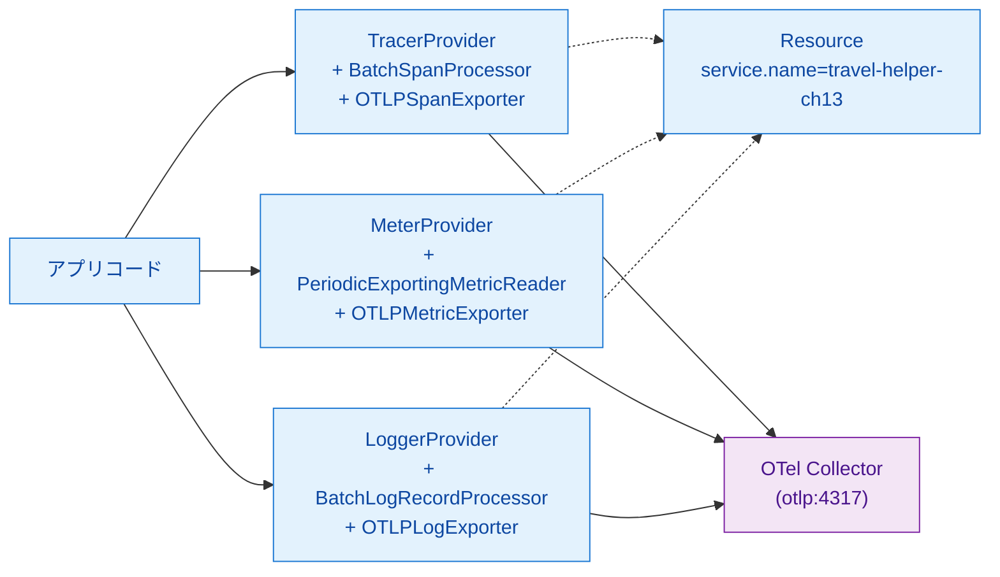
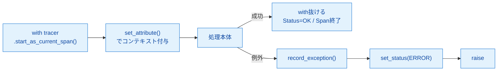
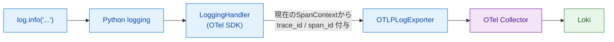
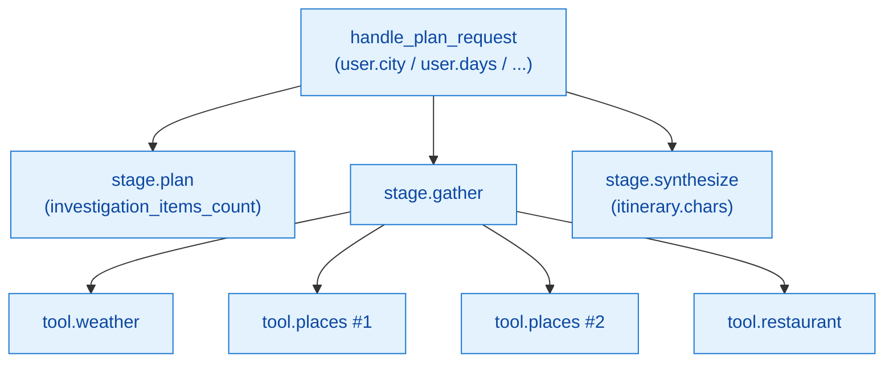
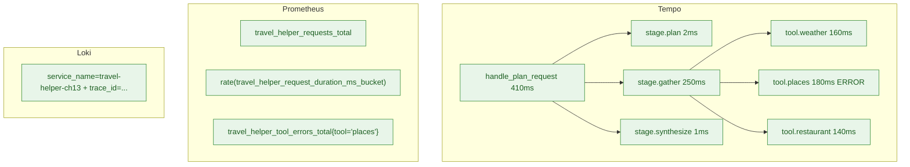

# 第13章 Python OTel SDKでの手動計装

ここから第IV部の実装編に入る。第I〜III部で扱った概念と設計判断を受け、本章ではPython OpenTelemetry（以下OTel）SDKによる手動計装を完成形まで組み上げる。`travel-helper` のサンプルを plan／gather／synthesize の3stage構成にし、Span階層・Attribute・カスタムMetric・例外記録・trace_id付きログを一通り実機で動かすところまで到達する。

本章の範囲は第2章図2.4（データフロー全体図）の「計装層（手動）」部分である。第14章でOpenLLMetryによる自動計装を追加し、第15章で本書専用のCollectorを並走させる。

## 13.1 SDK初期化の基本パターン

3シグナル（Traces／Metrics／Logs）をOTel SDKで初期化し、OTLP/gRPCで共有Collectorに送る構成を作る。初期化後のコンポーネント関係は図13.1のようになる。



*図13.1: SDK初期化後のコンポーネント関係。3つのProviderが共通の `Resource` を共有し、OTLPで単一のCollectorエンドポイントに送る*

実装はリスト13.1のとおりで、本書の全実装章（ch13以降）で使う雛形となる。

**リスト13.1: `sample-app/ch13/otel_setup.py`**

```python
def init_otel(service_name: str):
    resource = Resource.create({
        "service.name": service_name,
        "service.namespace": "aio11y-book",
    })

    tp = TracerProvider(resource=resource)
    tp.add_span_processor(
        BatchSpanProcessor(OTLPSpanExporter(endpoint=_endpoint(), insecure=True)))
    trace.set_tracer_provider(tp)

    reader = PeriodicExportingMetricReader(
        OTLPMetricExporter(endpoint=_endpoint(), insecure=True),
        export_interval_millis=10_000)
    mp = MeterProvider(resource=resource, metric_readers=[reader])
    metrics.set_meter_provider(mp)

    lp = LoggerProvider(resource=resource)
    lp.add_log_record_processor(
        BatchLogRecordProcessor(OTLPLogExporter(endpoint=_endpoint(), insecure=True)))
    set_logger_provider(lp)
    handler = LoggingHandler(level=logging.NOTSET, logger_provider=lp)
    logging.getLogger().addHandler(handler)

    return trace.get_tracer(service_name), metrics.get_meter(service_name)
```

3つのProviderが共通の `Resource` を共有する点が重要である。`service.name` などのResource属性はあらゆるSpan／Metric／Logに刻印され、下流のTempo・Prometheus・Lokiでこれらを横断検索する軸になる。

送信には `BatchSpanProcessor`（トレース）と `PeriodicExportingMetricReader`（メトリクス）と `BatchLogRecordProcessor`（ログ）を使う。前2者は第4章・第5章で扱ったとおり、バッファリングと定期送信を担う。`LoggingHandler` はPython標準 `logging` モジュールにフックを仕込み、`logging.info(...)` の呼び出しを自動的にOTLP Logsに流す。

## 13.2 Spanの作成と操作

Span操作の定型パターンは図13.2のとおりである。



*図13.2: Span操作のフロー。成功経路と例外経路で分岐し、例外時は record_exception と set_status(ERROR) を必ず実行する*

本書のdevelopment-guidelines準拠のパターンは次のとおり（リスト13.2）。

**リスト13.2: `sample-app/ch13/tools.py`（Spanと例外処理）**

```python
def weather_tool(city: str, days: int) -> str:
    with tracer.start_as_current_span("tool.weather") as span:
        span.set_attribute("tool.name", "weather")
        span.set_attribute("tool.city", city)
        span.set_attribute("tool.days", days)
        try:
            time.sleep(random.uniform(0.1, 0.2))
            _maybe_raise("weather")
            return f"{city}は晴れ予報"
        except Exception as exc:
            span.record_exception(exc)
            span.set_status(trace.Status(trace.StatusCode.ERROR, str(exc)))
            raise
```

ルールは3つある。第1に、Span名は `tool.weather` のようにドット階層で業務文脈を表現する。変数を名前に含めない（`tool.weather_kyoto` はNGで、`tool.weather` + `tool.city=kyoto` Attributeで表現する）。第2に、`try/except` で例外を捕まえたら、必ず `record_exception` と `set_status(Status(StatusCode.ERROR, ...))` を両方呼ぶ。どちらか片方だけでは、Tempo上で例外スタックが見えなかったり、Span Statusが `OK` のままで検索に漏れたりする。第3に、呼び出し元にも例外を伝えたい場合は `raise` で再送出する。本書のサンプルはツールエラーをリクエスト失敗にしない設計（第13.5節参照）のため、ハンドラ側でツール例外をcatchしている。

## 13.3 Metricの記録

本書サンプルで使う全Metricを表13.1にまとめる。命名規則は `travel_helper.*` プレフィックスで、単位を明示する（`ms` など）。

*表13.1: 本書サンプルのMetric一覧。業務特性（要求数・継続時間・エラー数）をカバーする*

| 名前 | 型 | 単位 | 用途 | 属性例 |
|------|----|------|------|--------|
| `travel_helper.requests` | Counter | 件 | `/plan` リクエスト数 | `endpoint` |
| `travel_helper.request.duration` | Histogram | ms | エンドツーエンドのレイテンシ分布 | `endpoint` |
| `travel_helper.errors` | Counter | 件 | ハンドラで例外発生時 | `endpoint` |
| `travel_helper.tool.errors` | Counter | 件 | ツール呼び出しで例外発生時（リクエストは成功扱い） | `tool` |

Metricの記録コードはリスト13.3のとおり。

**リスト13.3: `sample-app/ch13/agent.py`（Metric作成と記録）**

```python
requests_counter = meter.create_counter(
    "travel_helper.requests",
    description="Total /plan requests")
duration_hist = meter.create_histogram(
    "travel_helper.request.duration",
    unit="ms",
    description="End-to-end /plan request duration")
errors_counter = meter.create_counter(
    "travel_helper.errors",
    description="Requests that raised an exception")

# 利用側
requests_counter.add(1, {"endpoint": "/plan"})
duration_hist.record(elapsed_ms, {"endpoint": "/plan"})
errors_counter.add(1, {"endpoint": "/plan"})   # 例外時のみ
```

「レイテンシは Histogram、累積は Counter」という選び分けが基本である。分布が知りたい値（レイテンシ、トークン数、レスポンスサイズ）はHistogram、件数が知りたい値（リクエスト数、エラー数）はCounter。Gaugeはキュー長・接続数などの瞬間値に使うが、本書サンプルでは登場しない。

Counterは `.add(delta, attributes)` で差分を加算する。OTelはこの累積をCumulative形式で保持し、Prometheus Remote Write側で `travel_helper_requests_total` として格納される。

## 13.4 Logの記録

ログはPython標準 `logging` モジュールのまま使う。13.1節の `LoggingHandler` 登録により、`logging.info(...)` が自動でOTLP Logsに変換され、現在のSpanContextから `trace_id` と `span_id` が自動付与される（図13.3）。



*図13.3: ログの流れ。アプリは通常のlogging呼び出しだけ、trace_id付与はOTelが自動で行う*

実装側は追加コードなしで、通常のlog呼び出しを書くだけで良い（リスト13.4）。

**リスト13.4: `sample-app/ch13/agent.py`（ログ出力）**

```python
# 13.1のinit_otelでLoggingHandlerが登録されているため、以下は自動でOTLPに流れる
log = logging.getLogger("travel-helper-ch13")

# Span内で呼ぶと、そのSpanのtrace_id/span_idが自動付与される
with tracer.start_as_current_span("stage.plan") as span:
    # ...
    log.info("plan_stage decided items=%d", len(items))
```

Loki側では `service_name=travel-helper-ch13` ラベルで絞り、LogQLで検索すると `trace_id` と `span_id` が構造化属性として並ぶ。第5章で見たとおり、Tempoで開いているTraceの同一 `trace_id` でLokiログを抽出することで、リクエストの文脈まで掘り下げられる。

## 13.5 エージェントの計装パターン

`travel-helper` の完全版ハンドラは、Root Spanの下に3つのstage Span（`stage.plan` `stage.gather` `stage.synthesize`）を並べ、`stage.gather` の下にツール呼び出しSpan（`tool.weather` `tool.places` `tool.restaurant`）をネストする構造である（図13.4）。



*図13.4: 完全版Span木。Root Spanを頂点に、3stageとその下のツール呼び出しが整理された階層を作る*

ハンドラのコードはリスト13.5のとおり。エラーハンドリングを含む完全版である。

**リスト13.5: `sample-app/ch13/agent.py`（ハンドラ完全版）**

```python
@app.post("/plan", response_model=PlanResponse)
def plan(req: PlanRequest) -> PlanResponse:
    start = time.perf_counter()
    with tracer.start_as_current_span("handle_plan_request") as root:
        root.set_attribute("user.city", req.city)
        root.set_attribute("user.days", req.days)
        root.set_attribute("user.keywords_count", len(req.keywords))
        trace_id_hex = format(root.get_span_context().trace_id, "032x")
        try:
            items = _plan_stage(req)
            gathered = _gather_stage(req, items)       # ツール例外はstage内でcatch
            itinerary = _synthesize_stage(req, items, gathered)
        except Exception as exc:
            root.record_exception(exc)
            root.set_status(trace.Status(trace.StatusCode.ERROR, str(exc)))
            errors_counter.add(1, {"endpoint": "/plan"})
            raise

    elapsed_ms = (time.perf_counter() - start) * 1000
    requests_counter.add(1, {"endpoint": "/plan"})
    duration_hist.record(elapsed_ms, {"endpoint": "/plan"})
    log.info("request done trace_id=%s elapsed_ms=%.1f itinerary_chars=%d",
             trace_id_hex, elapsed_ms, len(itinerary))
    return PlanResponse(itinerary=itinerary, trace_id=trace_id_hex)
```

設計ポイントは3つある。第1に、ツール例外は `_gather_stage` の内部でcatchし、`tool_errors_counter` に記録して処理を継続する。これは「ツール1つが失敗してもプラン生成は続ける」という業務方針を表す。第2に、`handle_plan_request` Root Spanの `try/except` はstage呼び出し全体を包み、想定外の例外が外に漏れる場合のみ `errors_counter` をインクリメントする。第3に、命名規則を揃える（stageは `stage.*`、ツールは `tool.*`、Attributeは `user.*` `travel_helper.*`）。これにより後のTraceQL／PromQL／LogQLが書きやすくなる。

## 13.6 ハンズオン ― 完全版をデプロイ

サンプルは `sample-app/ch13/` に配置済みである。デプロイと検証の流れは次のとおり。

```bash
cd sample-app/ch13
make deploy
make verify
```

`make verify` は `/plan` に5回リクエストを投げ、(1) Tempoで `service.name=travel-helper-ch13` のTraceが階層Spanとして検索可能なこと、(2) Prometheusで `travel_helper_requests_total` のCounterが増えること、を自動確認する。

GrafanaのExplore上では、Tempoで `handle_plan_request` Spanを開くとウォーターフォールに `stage.plan / stage.gather / stage.synthesize` が並び、`stage.gather` の下に `tool.weather / tool.places / tool.restaurant` が並ぶ木が見える（図13.5の通り）。ツールエラー時は `tool.*` Span のStatusがERROR、`record_exception` の情報が添付されている。



*図13.5: Grafana上の確認画面イメージ。Tempoでウォーターフォール、Prometheusでメトリクス、LokiでTraceIdリンク付きログが揃って見える*

実機検証時は、Tempoで `service.name=travel-helper-ch13` のトレース群、Prometheusで `travel_helper_requests_total` のCounterが観測できることを確認した。5%確率で挿入されるツールエラーは `tool.places` などのSpan Statusが `ERROR` で現れ、`travel_helper.tool.errors` CounterとTraceのSpanイベントの両方で追跡できる。

クリーンアップは次のコマンド。

```bash
make clean
# またはリポジトリルートから
make clean-ch13
```

## まとめ

- Python OTel SDKの初期化は、3Providerに共通のResource（`service.name`等）を渡すのが基本パターン
- Span生成は `with tracer.start_as_current_span(...)`、例外時は `record_exception` と `set_status(ERROR)` の両方を必ず呼ぶ
- Metricは Counter（件数） / Histogram（分布） / Gauge（瞬間値）で使い分け、`travel_helper.*` プレフィックスで命名
- ログはPython標準 `logging` のまま使い、OTel `LoggingHandler` が `trace_id` / `span_id` を自動付与する
- エージェントの計装パターンは「Root Span＋stage Span＋tool Span」の3階層、命名規則 `stage.*` `tool.*` を徹底
- ツールエラーはリクエスト失敗にしない設計を採り、Counterと `record_exception` で観測対象に残す

## 理解度チェック

### Q1. TracerProviderにResourceを設定する目的

**種類**: 概念の確認 / **関連する節**: 13.1

TracerProvider（およびMeterProvider／LoggerProvider）にResourceを設定する目的は何か。

<details>
<summary>解答と解説</summary>

Resourceは「どのプロセス／サービスから発信されたデータか」を識別するための共通ラベル集合である。`service.name` `service.namespace` 等を設定すると、同じプロセスから生成されたSpan／Metric／Logすべてに自動で刻印される。これにより下流のTempo・Prometheus・Lokiで「特定サービスの3シグナルを横断的に検索・集計する」ことが可能になる。Resourceが欠けていると、サービス識別が個別Attributeに散らばって集計精度が落ちたり、サービス軸のダッシュボードが作れなくなる。3Providerで共通化することで、3シグナル間の整合性も保たれる。

</details>

### Q2. 例外発生時のSpan定型処理

**種類**: 判断問題 / **関連する節**: 13.2

例外発生時にSpanに対して行うべき定型処理を述べよ。

<details>
<summary>解答と解説</summary>

3点を必ず実行する。(1) `span.record_exception(exc)` でスタックトレース・例外型・メッセージをSpanのイベントとして記録する。(2) `span.set_status(Status(StatusCode.ERROR, str(exc)))` でSpan全体のステータスをERRORにする。これによりTempo／TraceQLでエラートレースを検索できる。(3) 呼び出し元にも例外を伝えたい場合は `raise` で再送出する。

第(1)と第(2)は両方必須。片方だけでは、Tempoで例外詳細が見えなかったり、StatusがOKのまま検索に漏れたりする。ガイドラインの `development-guidelines.md` にも明示されている定型パターンである。

</details>

### Q3. 新関数のSpan名設計

**種類**: 設計問題 / **関連する節**: 13.2、13.5

新しい関数を計装するとき、どのような観点でSpan名を決めるか。

<details>
<summary>解答と解説</summary>

次の3観点で命名する。

1. 業務文脈のドット階層で表現する。汎用動詞ではなく「エージェントのどの処理か」を示す（例: `stage.plan` `tool.weather` `agent.tool_select`）。ライブラリ呼び出し自体は自動計装（第7章）が `openai.chat` `requests.GET` 等を生成するため、手動Spanは「その外側の業務単位」に集中する。
2. 変数を含めない。`tool.weather_kyoto` のように値をSpan名に含めると、Tempoでの集計が困難になる。動的要素はAttributeで表現する（`tool.weather` + `tool.city=kyoto`）。
3. 他の章・他のサービスとの命名整合を取る。本書サンプルなら `stage.*` `tool.*` で統一し、LLM関連は `gen_ai.*` のSemantic Conventionsに揃える。既存の命名ルールに無ければ、プロジェクト共通の prefix（例: `travel_helper.*`）を用いる。

</details>

### Q4. レイテンシ記録のCounter／Histogram選択

**種類**: 設計問題 / **関連する節**: 13.3

レイテンシを分布で記録したい。Counter／Histogramのどちらを使うか、理由とともにコード断片を示せ。

<details>
<summary>解答と解説</summary>

Histogramを使う。Counterは累積値で「何回起きたか」しか表現できず、レイテンシのように「値の分布」を問うメトリクスには適さない。Histogramは自動的に複数バケットへの度数分配を持つため、p50/p95/p99のパーセンタイルを後から計算できる。

コード断片:

```python
duration_hist = meter.create_histogram(
    "travel_helper.request.duration",
    unit="ms",
    description="End-to-end /plan request duration")

start = time.perf_counter()
# ... 処理 ...
elapsed_ms = (time.perf_counter() - start) * 1000
duration_hist.record(elapsed_ms, {"endpoint": "/plan"})
```

`unit="ms"` で単位を明示するとPrometheus側でも `_ms` サフィックスなど（Collector設定次第）でクエリ軸が整う。属性（`endpoint`）を付けることで、後でエンドポイント別のp95分析ができる。

</details>

## 参考文献

- OpenTelemetry Python. "Tracing API / SDK." https://opentelemetry-python.readthedocs.io/en/latest/api/trace.html （閲覧日: 2026-04-14）
- OpenTelemetry Python. "Metrics API / SDK." https://opentelemetry-python.readthedocs.io/en/latest/api/metrics.html （閲覧日: 2026-04-14）
- OpenTelemetry Python. "Logs API." https://opentelemetry-python.readthedocs.io/en/latest/api/_logs.html （閲覧日: 2026-04-14）
- OpenTelemetry Project. "Semantic Conventions — Resource." https://opentelemetry.io/docs/specs/semconv/resource/ （閲覧日: 2026-04-14）

## 次章への接続

本章で手動計装の完成版が揃った。Root Span→stage Span→tool Spanの3階層、カスタムMetric、trace_id付きログが実機で動くところまで到達した。次は、これまで手動で書いてこなかった領域――特にLLM呼び出し――を自動計装で埋める。第14章ではOpenLLMetryをサンプルアプリに追加し、LLM SDKの呼び出しを自動Span化した状態でOCI GenAIと組み合わせて動作検証する。
