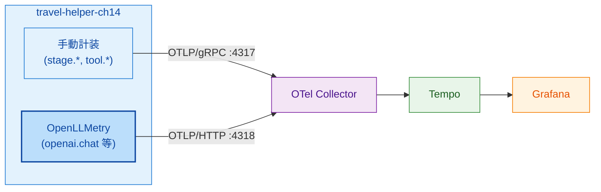
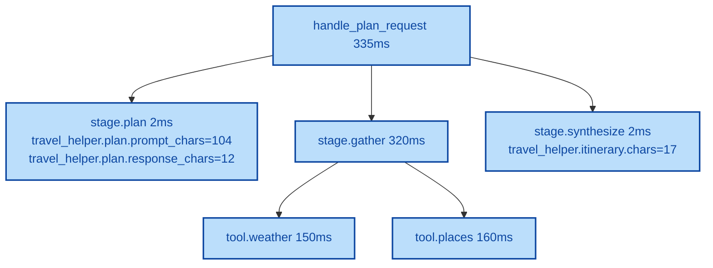
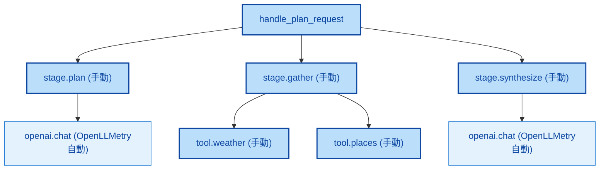

# 第14章 OpenLLMetryのセットアップと検証

第13章で手動計装の完成版を組み上げた。LLM呼び出しは第13章では未計装のまま残っている。本章ではOpenLLMetry（Traceloop SDK）を追加し、LLM SDK呼び出しの自動Span生成と手動計装との共存を、OCI Generative AI Service（以下OCI GenAI）互換環境で検証する。

本章では `sample-app/ch14/` を用意する。第13章のコードに `Traceloop.init()` を1行加え、`LLM_MODE=mock`（本書検証）と `LLM_MODE=oci`（読者の実環境）の両モードで動作させる構成である。

## 14.1 セットアップ手順

OpenLLMetryの導入は2ステップである。第1に依存パッケージを追加する（リスト14.1）。第2にOTel SDK初期化の直後に `Traceloop.init()` を呼ぶ（リスト14.2）。

**リスト14.1: `sample-app/ch14/requirements.txt`（第13章からの差分）**

```text
fastapi==0.115.6
uvicorn[standard]==0.32.1
pydantic==2.10.3
opentelemetry-api==1.29.0
opentelemetry-sdk==1.29.0
opentelemetry-exporter-otlp-proto-grpc==1.29.0
+ openai==1.58.1
+ traceloop-sdk==0.40.7
```

`traceloop-sdk` がOpenLLMetryの本体パッケージで、`openai`・`anthropic`等の各instrumentationを裏で読み込む。`openai` クライアントSDKも追加し、OCI GenAIのOpenAI互換エンドポイントを叩けるようにする。

**リスト14.2: `sample-app/ch14/otel_setup.py`（Traceloop初期化部）**

```python
def init_traceloop(service_name: str) -> None:
    try:
        from traceloop.sdk import Traceloop

        # Traceloopはデフォルトで Traceloop Cloud に送ろうとするため、
        # api_endpoint を Collector のOTLP/HTTP エンドポイントに明示する。
        api_endpoint = os.environ.get(
            "TRACELOOP_BASE_URL",
            "http://otel-gateway-opentelemetry-collector.observability:4318",
        )
        Traceloop.init(
            app_name=service_name,
            api_endpoint=api_endpoint,
            disable_batch=False,
        )
    except Exception as exc:
        logging.getLogger(__name__).error("Traceloop.init failed: %s", exc)
```

ポイントは3つある。第1に、初期化の順序は「OTel SDK（TracerProvider等）を先、`Traceloop.init` を後」とする。Traceloopは内部で既存のTracerProviderを検出して再利用するため、第13章の初期化コードはそのまま活かせる。第2に、デフォルトでTraceloopはTraceloop Cloud（`api.traceloop.com`）にデータを送ろうとするため、`api_endpoint` を明示してCollectorのOTLP/HTTPエンドポイント（ポート 4318）に向ける。これにより自動計装のSpanもCollector経由でTempoに合流する。第3に、プロンプト／レスポンスのキャプチャはデフォルトONで、無効化したい場合は環境変数 `TRACELOOP_TRACE_CONTENT=false` を設定する（第9章参照）。本書検証では `TRACELOOP_TRACE_CONTENT=true` を明示し、Tempoで内容が見えることを確認する。

アプリ側のエントリは次の順序で呼ぶ。

```python
tracer, meter = init_otel(service_name)    # TracerProvider/MeterProvider/LoggerProvider
init_traceloop(service_name)               # OpenLLMetry instrumentationをフック
llm = LLMClient()                           # OpenAI SDKクライアント生成（instrument済み）
```

## 14.2 OCI GenAI環境での動作検証

検証時の構成は図14.1のとおりである。`travel-helper-ch14` アプリが2種類のデータ経路でCollectorに送る。手動Spanは従来通りOTLP/gRPC（4317）経由、OpenLLMetryの自動SpanはTraceloopがOTLP/HTTP（4318）経由でCollectorに送る。



*図14.1: ch14検証時の構成。手動Spanは OTLP/gRPC、自動Span（OpenLLMetry）は OTLP/HTTP でそれぞれCollectorへ送られるが、同じTraceContextを共有するためTempo上で同じTrace木にまとまる*

LLMモードは `LLM_MODE` 環境変数で切り替える。`mock`（本書検証時のデフォルト）では固定応答を返し、OpenAI SDK自体を呼ばないためOpenLLMetryの自動Spanは生成されないが、手動計装と初期化経路の健全性は確認できる。`oci` では読者がOCI GenAIのendpoint／APIキーをSecretで設定し、実際にOpenAI SDK経由でOCI GenAIを呼ぶ。

本書検証時（mockモード）のTempo上の表示イメージを図14.2に示す。



*図14.2: mockモードでのTempo表示。stage.* / tool.* の手動Spanは正常に記録される。LLM呼び出しを伴う本番実行では `openai.chat` 自動Spanが stage.* の子として加わる*

OCI GenAIモード（`LLM_MODE=oci`）で実機動作させた場合、本来であれば `stage.plan` と `stage.synthesize` の下に `openai.chat` Spanが自動生成され、以下のAttributeが付く。

- `gen_ai.system` = `openai`（OCI互換エンドポイントを `openai` SDKで叩いているため）
- `gen_ai.request.model` = `xai.grok-3`（環境変数 `OCI_GENAI_MODEL`）
- `gen_ai.usage.input_tokens` / `gen_ai.usage.output_tokens`
- `gen_ai.prompt.*` / `gen_ai.completion.*`（`TRACELOOP_TRACE_CONTENT=true` 時）

Responses API の場合は API 内部処理がクライアント不可視なため、`responses.create` 呼び出しが1Spanで記録され、内部ツール呼び出しまでは展開されない可能性が高い（第10章参照）。読者環境での実検証時に Tempo 上で実際のSpan構造を観察し、必要に応じて14.5節のパターンで手動補完する。

## 14.3 手動計装との共存を確認する

手動計装と自動計装は同じ `TracerProvider` を共有するため、自動的に親子関係が成立する。`stage.plan` Span内で `client.chat.completions.create(...)` を呼ぶと、その自動Spanは `stage.plan` の子として木に加わる（図14.3）。



*図14.3: 手動Span（濃青）と自動Span（薄青）の混成木。LLM呼び出しを包む手動stage Spanの中で自動Spanが発生し、そのままその子として記録される*

この挙動は第7章で扱った原則の実機確認である。両者が共通の `contextvars` ベースのSpanContextを使うため、開発者が親子関係を明示的に書く必要はない。計装コードを書く側は「どこに手動Spanを置くか」だけを設計し、その内側のライブラリ呼び出しは自動計装に任せられる。

## 14.4 プロンプト・レスポンスのキャプチャと注意点

キャプチャON/OFFで記録される情報は表14.1のとおりである。

*表14.1: `TRACELOOP_TRACE_CONTENT` ON/OFFで記録される情報の違い*

| 項目 | ON（デフォルト） | OFF（`=false`） |
|------|----------------|----------------|
| Span名（`openai.chat` 等） | 記録 | 記録 |
| `gen_ai.system` / `gen_ai.request.model` | 記録 | 記録 |
| `gen_ai.usage.input_tokens` / `output_tokens` | 記録 | 記録 |
| `gen_ai.request.temperature` / `top_p` | 記録 | 記録 |
| プロンプト本文（`gen_ai.prompt.*.content`） | 記録 | **記録されない** |
| レスポンス本文（`gen_ai.completion.*.content`） | 記録 | **記録されない** |
| レスポンス `finish_reasons` | 記録 | 記録 |

記録される情報のうち、プロンプト本文とレスポンス本文はPII（個人情報）や機密情報を含みうる。本番環境では次のいずれかの戦略を採る。

- **全面OFF**: `TRACELOOP_TRACE_CONTENT=false` でプロンプト／レスポンス本文を一切記録しない。最も安全だが、プロンプト改善の深掘りにはLangfuseなど別経路で評価データを持つ必要がある。
- **Collectorでマスク**: `TRACELOOP_TRACE_CONTENT=true` のままCollectorの `attributes` または `transform` Processorで `gen_ai.prompt.*.content` / `gen_ai.completion.*.content` を削除する。第15章の応用として実装可能。
- **特定環境のみON**: 開発・ステージング環境だけONにして、本番はOFFにする運用。ConfigMapの環境変数を分けるだけで切り替えられる。

本書の検証環境では `TRACELOOP_TRACE_CONTENT=true` として中身の可視化を優先するが、読者自身のプロジェクトではObservability要件とプライバシー要件のバランスで判断する。

## 14.5 不足がある場合の手動補完

自動計装で捕捉できない情報は手動で補う。特にResponses API内部のツール呼び出しのように、サーバサイドで完結してクライアントから見えない処理は、クライアント側で「同等のロジックを展開する」か「応答の構造をパースしてSpan Attributeに載せる」かのいずれかが必要になる。

リスト14.3は後者のパターンである。Responses APIの応答 `output` 配列から、内部で呼ばれたツール名とターン数を抽出して独自Attributeに載せる。

**リスト14.3: `sample-app/ch14/` に追加できる手動補完の疑似例**

```python
# 疑似コード（動作検証対象外、読者のResponses API利用時の実装イメージ）
with tracer.start_as_current_span("stage.plan") as span:
    resp = client.responses.create(
        model="xai.grok-3",
        input=prompt,
    )
    # openai.response Span は OpenLLMetry が自動生成している前提で、
    # 見えない内部情報をアプリ側で独自Attributeとして補完する
    # Responses APIの output 配列では、関数ツール呼び出しは type="function_call"、
    # ビルトインツール（Web検索等）は type="tool_search_call" 等の別種になる。
    tools_called = [
        item.get("name") for item in resp.output
        if item.get("type") == "function_call"
    ]
    span.set_attribute("travel_helper.responses.tools_called", tools_called)
    span.set_attribute("travel_helper.responses.turns_count", len(resp.output))
    span.set_attribute("travel_helper.responses.usage.total_tokens",
                       resp.usage.total_tokens)
```

設計原則は「将来差し替え可能にしておく」である。OpenLLMetryがResponses API内部を自動展開できるようになったら、上の手動補完コードは不要になる。そのため、手動補完のロジックは `otel_setup.py` とは別モジュール（例: `responses_spans.py`）に分離し、一括除去や差し替えが容易な構造にしておく。

実機検証上の注意: `sample-app/ch14/` は `LLM_MODE=mock` で動作確認しており、OpenAI SDKを実際に呼ばないためOpenLLMetryの自動Spanは現時点では生成されない。読者がOCI GenAIキーを設定して `LLM_MODE=oci` に切り替えることで、Tempo上で `openai.chat` / `openai.response` 等の自動Spanが実体を伴って見える。

## まとめ

- OpenLLMetryの導入は `traceloop-sdk` 追加と `Traceloop.init()` 1行で完了する
- 既存の手動計装と完全に共存し、同じTraceContextで親子関係が自動的に成立する
- `Traceloop.init(api_endpoint=...)` でCollectorのOTLP/HTTPエンドポイントを明示し、Traceloop Cloudへのデフォルト送信を回避する
- `TRACELOOP_TRACE_CONTENT` のデフォルトはON。プライバシー要件に応じてOFFまたはCollectorでのマスクを検討
- Responses API内部のように自動で見えない情報は、応答の構造をパースして独自Attributeに載せる手動補完で補う
- 手動補完は将来の自動計装対応で除去できる構造にしておく

## 理解度チェック

### Q1. 初期化順序が重要な理由

**種類**: 概念の確認 / **関連する節**: 14.1

OTel SDK初期化（`init_otel`）と `Traceloop.init()` の順序が重要な理由を述べよ。

<details>
<summary>解答と解説</summary>

Traceloop SDKは内部で「現在のグローバル`TracerProvider`を検出して再利用する」設計になっている。OTel SDK初期化を先に行うと、`trace.set_tracer_provider(tp)` でグローバルProviderがセットされ、その後 `Traceloop.init()` がそれを検出してinstrumentationを上乗せする形になる。

順序が逆だと、Traceloopが自前のデフォルトTracerProviderを作ってしまい、その後 `init_otel` が上書きするため、instrumentationが無効なProviderに紐付いた状態で残り、自動Spanが期待通りに流れない。`override_tracer_provider` 引数で明示的に制御する方法もあるが、「OTel→Traceloop」の順序を守るのが最も安全で可読性が高い。

</details>

### Q2. 本番環境でのキャプチャ有無

**種類**: 判断問題 / **関連する節**: 14.4

本番環境でプロンプト／レスポンスキャプチャ（`TRACELOOP_TRACE_CONTENT=true`）をONにするべきか、どう判断するか。

<details>
<summary>解答と解説</summary>

単純にON/OFFで決めるのではなく、3つの観点で判断する。

1. 記録されるデータの機密度: プロンプト・レスポンスにPII（氏名、住所、医療情報等）や企業機密が含まれ得る場合はOFFか、Collectorでのマスク必須。個人識別情報を含まない業務ドメインなら低リスク。
2. 保存先のセキュリティ: Tempo/Langfuseへのアクセス権限、保持期間、暗号化、監査ログ等が要件を満たしているか。満たさないならONにできない。
3. Observability要件との比較: プロンプト改善やLLM品質分析が必須で、実際にキャプチャデータを使う運用体制があるなら記録する価値がある。使わないならONは不要。

現実的には「開発・検証環境はON」「本番はOFFまたはマスク」が標準解で、開発時の深掘りと本番の安全性を両立させる。Collector側のマスク処理で部分的にON/OFFを切り替える設計も第15章で扱う範囲の応用として可能。

</details>

### Q3. Responses API内部の判断理由を補完する設計

**種類**: 設計問題 / **関連する節**: 14.5

自動計装で捕捉できないResponses API内部の判断理由を補完するため、どのような手動Attributeを設計するか。

<details>
<summary>解答と解説</summary>

Responses APIの応答 `output` 配列・`usage` オブジェクトから抽出できる情報を、以下のAttributeとして追加する。

- `travel_helper.responses.tools_called`（配列）: サーバ内部で呼ばれたツール名の一覧
- `travel_helper.responses.turns_count`（整数）: API内部で走ったターン数（`len(resp.output)`）
- `travel_helper.responses.usage.input_tokens` / `output_tokens` / `total_tokens`（整数）: ターン合計のトークン消費
- `travel_helper.responses.response_id`（文字列）: 後でAPI側の詳細を取得する際のキー
- `travel_helper.responses.finish_reason`（文字列）: `stop` `length` `tool_calls` など

命名規則は `travel_helper.responses.*` プレフィックスを付け、OpenLLMetryの `gen_ai.*` 標準Attributeと名前空間を分ける。将来GenAI Semantic ConventionsがResponses API固有の内部情報を標準化した場合は、そちらに移行しやすい設計である。

実装は `responses_spans.py` のような独立モジュールに分離し、OpenLLMetryの進化で自動展開が可能になった際に一括で除去できる構造にしておく。

</details>

### Q4. OpenLLMetry版のバージョン依存への備え

**種類**: 判断問題 / **関連する節**: 14.1、14.2

OpenLLMetry（traceloop-sdk）やその配下のinstrumentationパッケージが更新されると、生成されるSpan名（例: `openai.chat` → `chat gpt-4o`）や `gen_ai.*` Attribute構造が変わる可能性がある。こうしたバージョン依存の変化にどう備えるか。

<details>
<summary>解答と解説</summary>

3つの備えを組み合わせる。

1. バージョンピン: `requirements.txt` で `traceloop-sdk==x.y.z` のように固定し、予期せぬ自動アップデートを防ぐ。本書サンプルも `traceloop-sdk==0.40.7` で固定している。
2. 下流クエリの抽象化: TraceQL／PromQL／LogQLを書く際、Span名・Attribute名を直接リテラルで参照する箇所はGrafanaダッシュボードのテンプレート変数にまとめ、SDK更新時の差し替えを1箇所で済ませられるようにする。
3. Collectorでのマッピング: Collectorの `transform` または `attributes` Processor（第15章）で、旧Attribute名を新名にコピー／リネームする層を用意する。これによりSDK更新と下流クエリ更新のタイミングを切り離せる。

加えて、Span名が `openai.chat` から標準形式に変わる可能性（GenAI Semantic Conventionsの進行）は、OpenLLMetry公式の変更履歴やTraceloopのリリースノートをSDK更新時に確認する運用を組み込む。新旧のSpan名が一定期間共存する場合に備え、ダッシュボードは「どちらの名前でも拾える」クエリ（例: `name="openai.chat" OR name=~"chat .*"`）で書くのも有効である。

</details>

## 参考文献

- Traceloop. "OpenLLMetry — Getting Started (Python)." https://www.traceloop.com/docs/openllmetry/getting-started-python （閲覧日: 2026-04-14）
- Traceloop. "OpenLLMetry — Configuration." https://www.traceloop.com/docs/openllmetry/configuration （閲覧日: 2026-04-14）
- Traceloop. "OpenLLMetry — Privacy." https://www.traceloop.com/docs/openllmetry/privacy/traces （閲覧日: 2026-04-14）
- Traceloop. "OpenLLMetry SDK リポジトリ." https://github.com/traceloop/openllmetry （閲覧日: 2026-04-14）
- OpenTelemetry Project. "Semantic Conventions for Generative AI." https://opentelemetry.io/docs/specs/semconv/gen-ai/ （閲覧日: 2026-04-14）
- OpenAI. "Python SDK." https://github.com/openai/openai-python （閲覧日: 2026-04-14）
- OpenAI. "Responses API reference." https://platform.openai.com/docs/api-reference/responses （閲覧日: 2026-04-14）

## 次章への接続

本章でアプリ側の計装が手動・自動ともに揃った。残る要素は中継点であるCollectorのカスタマイズである。第15章では本書専用のCollectorを `aio11y-book` namespaceにデプロイし、LangfuseへのExporter追加・属性マスキング等を通じて「Collector設定の変更でアプリ側を変えずに観測経路を拡張する」経験を積む。
