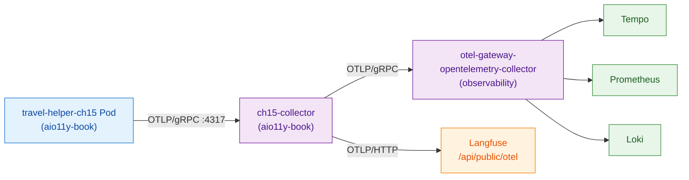
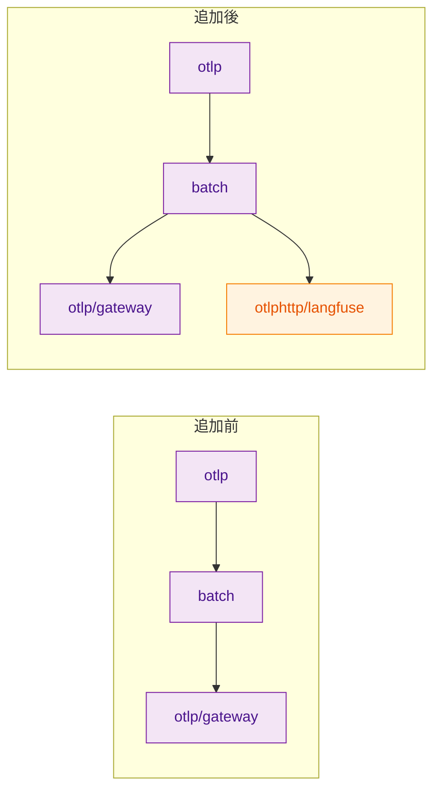
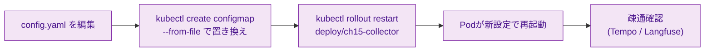

# 第15章 OTel Collectorの設定

第14章までで、アプリ側の計装（手動＋自動）が完成した。本章では中継点であるOpenTelemetry（以下OTel）Collectorの設定ファイルを読み書きし、本書専用のCollectorを `aio11y-book` namespaceにデプロイして、共有CollectorとLangfuseへの経路を追加する。「アプリ側コードを変えずに観測経路を増やせる」というCollectorの設計判断の恩恵を、設定変更と再起動だけで実機確認する。

本章の範囲は第2章図2.4（データフロー全体図）のうち中央の「OTel Collector」部分である。第6章で概念として扱った内容を、ここで実運用できるレベルまで手を動かして固める。

## 15.1 設定ファイルの全体構造（再訪）

Collector設定は `receivers` / `processors` / `exporters` / `service` の4セクション構成である（第6章）。本書用Collectorの設定は `collector-config/ch15-add-langfuse/config.yaml` にある（リスト15.1）。

**リスト15.1: `collector-config/ch15-add-langfuse/config.yaml`**

```yaml
receivers:
  otlp:
    protocols:
      grpc:
        endpoint: 0.0.0.0:4317
      http:
        endpoint: 0.0.0.0:4318

processors:
  memory_limiter:
    check_interval: 1s
    limit_mib: 256
    spike_limit_mib: 64
  batch:
    send_batch_size: 512
    timeout: 5s
  resource:
    attributes:
      - key: collector.instance
        value: ch15-book-collector
        action: insert
  attributes/gen_ai_rename:
    actions:
      - key: gen_ai.input.messages
        from_attribute: gen_ai.prompt
        action: insert

exporters:
  otlp/gateway:
    endpoint: otel-gateway-opentelemetry-collector.observability:4317
    tls:
      insecure: true
  otlphttp/langfuse:
    endpoint: http://langfuse-web.langfuse:3000/api/public/otel
    headers:
      Authorization: "Basic ${env:LANGFUSE_BASIC_AUTH}"

service:
  pipelines:
    traces:
      receivers: [otlp]
      processors: [memory_limiter, resource, batch]
      exporters: [otlp/gateway, otlphttp/langfuse]
    metrics:
      receivers: [otlp]
      processors: [memory_limiter, resource, batch]
      exporters: [otlp/gateway]
    logs:
      receivers: [otlp]
      processors: [memory_limiter, resource, batch]
      exporters: [otlp/gateway]
```

第6章のベースラインとの主な違いは3点である。(1) `otlp/gateway` Exporterを追加し、本書用Collectorから既存の共有Gateway Collector（observability namespace）に中継する（アプリ→本書Collector→Gateway Collector→Tempo等）。(2) `otlphttp/langfuse` Exporterを `traces` パイプラインに追加し、LangfuseのOTLPエンドポイントにも同じトレースを送る。(3) `attributes/gen_ai_rename` Processorを示し、第8章で扱った旧→新Attribute名（`gen_ai.prompt` → `gen_ai.input.messages`）のマッピングパターンを提示する。ただしこの `attributes/gen_ai_rename` は**定義例として示すのみ**で、`service.pipelines.traces.processors` には組み込んでいない（本書のサンプル実装ではまだ必要がないため）。移行期に実際に使う際は `service.pipelines` のリストにも追加する必要がある。

## 15.2 よく使うReceiver・Processor・Exporter

本書で使う主要コンポーネントの設定パターンを表15.1にまとめる。

*表15.1: 本書で使う主要コンポーネントの設定パターン*

| 種類 | コンポーネント | 典型的な用途 | 主なパラメータ |
|------|--------------|-----------|--------------|
| Receiver | `otlp` | アプリからのOTLP受信（gRPC 4317／HTTP 4318） | `protocols.grpc.endpoint` / `protocols.http.endpoint` |
| Processor | `memory_limiter` | メモリ圧時のドロップ／バックプレッシャ | `limit_mib` / `spike_limit_mib` / `check_interval` |
| Processor | `batch` | 一定件数または一定時間でまとめて送信 | `send_batch_size` / `timeout` |
| Processor | `resource` | Resource属性の付与 | `attributes[].action=insert/update/upsert` |
| Processor | `attributes` | Attributeのinsert/update/delete/マッピング | `actions[].action / key / from_attribute` |
| Exporter | `otlp` | OTel準拠バックエンド（Tempo、別Collector等） | `endpoint` / `tls` |
| Exporter | `otlphttp` | HTTP経由のOTLP（Langfuse、Loki（OTLPサポート時）等） | `endpoint` / `headers` |
| Exporter | `prometheusremotewrite` | Prometheusへの書き込み | `endpoint` |
| Exporter | `loki` | LokiのPush API | `endpoint` |

ポイント3つ。第1に、`memory_limiter` と `batch` はほぼ必須である。パイプラインの先頭に `memory_limiter`、Exporterの直前に `batch` を置くのが推奨順序（第6章参照）。第2に、Processorの `attributes` と `transform` はどちらもAttributeを操作できるが、`attributes` は典型的な操作（insert/update/delete/upsert）に特化し、`transform` はOTTL（OpenTelemetry Transformation Language）でより複雑な条件分岐・計算が書ける。旧→新名のマッピング程度なら `attributes` で十分。第3に、Exporterはシグナル固有性があり、`prometheusremotewrite` はMetrics専用、`loki` はLogs専用である（`otlp` / `otlphttp` は3シグナル対応）。

## 15.3 本書用Collectorのデプロイ

本書用Collectorは `aio11y-book` namespaceに配置し、共有Collectorには一切手を加えない。構成は図15.1のとおり。



*図15.1: 本書用Collectorをデプロイした構成。アプリはまず本書用Collectorに送信し、そこから既存Gateway（システム観測）とLangfuse（LLM品質観測）に分岐する*

Collector本体の配布はKubernetes標準のDeploymentとConfigMapで行う。マニフェストをリスト15.2に抜粋する。

**リスト15.2: `collector-config/deploy/collector-deployment.yaml`（Deployment部分・抜粋）**

（紙面の都合で `app.kubernetes.io/part-of` `book.aio11y/owned-by` 等のラベルおよびテンプレートラベル群は省略。実ファイルは development-guidelines.md の共通ラベル4種を全付与している。）

```yaml
apiVersion: apps/v1
kind: Deployment
metadata:
  name: ch15-collector
  namespace: aio11y-book
  labels:
    app.kubernetes.io/name: ch15-collector
    book.aio11y/chapter: "15"
spec:
  replicas: 1
  selector:
    matchLabels:
      app.kubernetes.io/name: ch15-collector
  template:
    spec:
      containers:
        - name: collector
          image: docker.io/otel/opentelemetry-collector-contrib:0.147.0
          args: ["--config=/etc/otel/config.yaml"]
          ports:
            - { name: otlp-grpc, containerPort: 4317 }
            - { name: otlp-http, containerPort: 4318 }
          envFrom:
            - secretRef:
                name: ch15-collector-secret
                optional: true
          volumeMounts:
            - { name: config, mountPath: /etc/otel }
      volumes:
        - name: config
          configMap:
            name: ch15-collector-config
```

注意点2つ。第1に、`image` は完全修飾名（`docker.io/otel/...`）で指定する。OKE等の環境では短縮名が解釈されずPull失敗する場合がある。第2に、ConfigMapは `kubectl create configmap --from-file=config.yaml=collector-config/ch15-add-langfuse/config.yaml` で実ファイルから注入するのが最も管理が楽である（Makefileにこの処理を含める）。

Collectorのバージョンは `0.147.0` を使う。共有Gatewayと同じバージョンに揃えると、機能差の混在を避けられる。

デプロイは次のコマンド。

```bash
cd sample-app/ch15
make deploy
```

Makefileは次の順序で処理する。(1) Deployment/Serviceを `collector-config/deploy/collector-deployment.yaml` から適用、(2) 実のconfig.yamlを `kubectl create configmap --from-file` でConfigMapに差し替え、(3) Collector Podをrolling restart、(4) アプリ（`travel-helper-ch15`）をデプロイし、接続先を `ch15-collector.aio11y-book:4317` に向ける。

## 15.4 実践: Langfuse Exporterの追加

既存の `traces` パイプラインを壊さずにLangfuse向けExporterを追加するパターンを見る（図15.2）。



*図15.2: 追加前後のパイプライン変化。既存Exporterはそのまま残し、新Exporterを `service.pipelines.traces.exporters` に追加する*

差分は設定ファイルの2箇所に入る（リスト15.3）。

**リスト15.3: `collector-config/ch15-add-langfuse/config.yaml`（差分）**

```yaml
 exporters:
   otlp/gateway:
     endpoint: otel-gateway-opentelemetry-collector.observability:4317
     tls:
       insecure: true
+  otlphttp/langfuse:
+    endpoint: http://langfuse-web.langfuse:3000/api/public/otel
+    headers:
+      Authorization: "Basic ${env:LANGFUSE_BASIC_AUTH}"

 service:
   pipelines:
     traces:
       receivers: [otlp]
       processors: [memory_limiter, resource, batch]
-      exporters: [otlp/gateway]
+      exporters: [otlp/gateway, otlphttp/langfuse]
```

ポイント3つ。第1に、新Exporterの定義（`otlphttp/langfuse`）は既存セクションに並列で追加する。インスタンス名（`otlp/gateway` と `otlphttp/langfuse`）で区別する。第2に、`service.pipelines.traces.exporters` のリストに追加する。定義だけでは有効化されず、このリストへの追加で初めてデータが流れる。第3に、認証情報は環境変数 `${env:LANGFUSE_BASIC_AUTH}` で解決する。実値はSecret経由で注入し、ConfigMapには入れない。

Langfuse Basic Authの値は `base64(public_key:secret_key)` で作る。KubernetesのSecretマニフェストで `ch15-collector-secret` の `LANGFUSE_BASIC_AUTH` キーに設定する。本書の検証ではこの値を設定しないままにしており、CollectorはLangfuse経路でリトライエラーを出すが、もう1つの `otlp/gateway` 経路は正常に動作する。

## 15.5 変更の反映と動作確認

設定変更後の反映はConfigMap更新＋Rolling Restartで行う（図15.3）。



*図15.3: 変更反映フロー。ConfigMap更新後のrolling restartでゼロダウンタイムに近い反映ができる*

疎通確認の具体的な手順は次のとおり。

```bash
# 1. Collector Podのログで設定の読み込み成功を確認
kubectl -n aio11y-book logs deploy/ch15-collector --tail=20

# 2. サンプルアプリから /plan を叩く
kubectl -n aio11y-book exec deploy/ch15-agent -- python -c '...'

# 3. Tempoで travel-helper-ch15 のトレース到達を確認
kubectl -n observability exec tempo-0 -- \
    wget -qO- "http://localhost:3200/api/search?tags=service.name%3Dtravel-helper-ch15&limit=3"

# 4. Langfuseのトレース到達は Langfuse Web UI で確認
```

本書検証では、ch15-collector経由で `travel-helper-ch15` の `handle_plan_request` Rootを持つトレースがTempoに届くことを確認した（`durationMs=216〜289`）。ConfigMap更新→Rolling Restartが5秒程度で完了し、Collectorの再起動中もサンプルアプリ側はバッファリングによって送信失敗を抑える（OTel SDKの `BatchSpanProcessor` がキューにバッファし、OTLP Exporter の `retry_on_failure` 機構が数秒分の送信失敗を吸収する）。

Langfuse経路（`otlphttp/langfuse`）は `LANGFUSE_BASIC_AUTH` の実値が未設定のため本書検証では送信エラーとなるが、他の経路（`otlp/gateway`）には影響しない。読者環境でLangfuseのpublic_key/secret_keyを取得し、`kubectl create secret generic ch15-collector-secret --from-literal=LANGFUSE_BASIC_AUTH=$(echo -n 'pk:sk' | base64)` でSecret設定すれば、Langfuse Web UIでもトレースが見える状態になる。

クリーンアップは次のコマンド。

```bash
cd sample-app/ch15
make clean
# または
make clean-ch15
```

これにより `book.aio11y/chapter=15` ラベルを持つDeployment/Service/ConfigMap/Secretが一括削除され、共有Gateway側には影響しない。

## まとめ

- Collector設定は4セクション（receivers / processors / exporters / service）で構成
- 本書用Collectorを `aio11y-book` namespaceに配置し、共有Collectorには一切触らない
- Langfuse向けExporterは `exporters` に定義を追加し、`service.pipelines.traces.exporters` リストに追加するだけで有効化
- 認証情報はSecretから `${env:KEY}` で注入し、ConfigMapには実値を入れない
- 反映は `kubectl create configmap --from-file` + `rollout restart` で数秒
- Langfuse経路が失敗しても他の経路は独立に動くため、段階的な導入が安全

## 理解度チェック

### Q1. 4セクションの役割

**種類**: 概念の確認 / **関連する節**: 15.1

Collector設定の4セクション（receivers / processors / exporters / service）それぞれの役割を述べよ。

<details>
<summary>解答と解説</summary>

- receivers: 受信経路の定義。どのプロトコル（OTLP/gRPC、OTLP/HTTP、Prometheus scrape等）で、どのアドレスで待ち受けるかを指定する。
- processors: 中間加工の定義。batch、memory_limiter、attributes、resource、tail_samplingなどを宣言する。
- exporters: 送信先の定義。OTLP、otlphttp、prometheusremotewrite、loki等で、各バックエンドへの接続情報を持つ。
- service: 上記3セクションで定義したコンポーネントを組み合わせて「パイプライン」として宣言する箇所。`service.pipelines.traces/metrics/logs` に `receivers / processors / exporters` のリストを書くことで初めてデータが流れる。定義しただけでserviceに書かれていないコンポーネントは実質無効である。

</details>

### Q2. 共有Collectorを直接変更しない理由

**種類**: 判断問題 / **関連する節**: 15.3

既存の共有Collector（observability namespace）を直接変更せず、本書用Collectorを別途立てた理由は何か。

<details>
<summary>解答と解説</summary>

3つの理由がある。第1に、共有Collectorは複数チーム・複数アプリから利用される共通資産であり、本書の都合で設定変更すると他の利用者に影響が及ぶ可能性がある。第2に、本書用の設定（Langfuse Exporter、gen_ai属性マッピング等）は本書に閉じた関心事で、共有資産に入れるのは責務の混在を招く。第3に、本書用Collectorを独立に持つことで、読者がnamespace単位でまるごとクリーンアップできるという運用上の利点がある。

構成上は「本書用Collector → 共有Gateway → Tempo/Prometheus/Loki」の2段構成となり、共有資産の設定変更をゼロに抑えつつ本書専用のパイプラインを追加できる。

</details>

### Q3. 特定Attributeの削除設計

**種類**: 設計問題 / **関連する節**: 15.2

特定のAttributeをログから削除したい場合、どのProcessorをどう設定するか。

<details>
<summary>解答と解説</summary>

`attributes` Processorの `delete` アクションを使う。例として `user.email` をlogsから除去する場合:

```yaml
processors:
  attributes/logs_redact:
    actions:
      - key: user.email
        action: delete

service:
  pipelines:
    logs:
      receivers: [otlp]
      processors: [memory_limiter, attributes/logs_redact, batch]
      exporters: [loki]
```

ポイントは2つ。(1) Processor名を `attributes/logs_redact` のように別インスタンス名で区別し、他シグナルには適用しないように `logs` パイプラインにのみ組み込む。(2) 削除ではなくマスクしたい場合は `action: update` に `value: "[REDACTED]"` を組み合わせる、またはより複雑な条件が必要なら `transform` ProcessorのOTTL（例: `redact_pattern(...)`）を使う。

プロンプト／レスポンス本文（`gen_ai.prompt.*.content` 等）をマスクする場合も同じパターンで `traces` パイプラインに入れる。

</details>

### Q4. Secretの注入方法

**種類**: 設計問題 / **関連する節**: 15.4

LangfuseへのOTLP送信に認証（Basic Auth）が必要な場合、SecretをCollectorにどう注入するか。

<details>
<summary>解答と解説</summary>

3ステップで行う。

1. Kubernetes Secret作成:
   ```bash
   kubectl create secret generic ch15-collector-secret \
     --from-literal=LANGFUSE_BASIC_AUTH=$(echo -n 'pk-lf-xxx:sk-lf-yyy' | base64) \
     -n aio11y-book
   ```

2. Deployment側の `envFrom` でSecretを環境変数として注入:
   ```yaml
   spec:
     containers:
       - name: collector
         envFrom:
           - secretRef:
               name: ch15-collector-secret
               optional: true
   ```

3. Collector設定で `${env:LANGFUSE_BASIC_AUTH}` を参照:
   ```yaml
   exporters:
     otlphttp/langfuse:
       headers:
         Authorization: "Basic ${env:LANGFUSE_BASIC_AUTH}"
   ```

ポイントは(1) ConfigMapには実値を置かず環境変数参照のみを書く、(2) Secretは別途 `kubectl apply` で（本書リポジトリは `.gitignore` で実Secretを除外している）、(3) `optional: true` を付けて「Secret未設定でもPodが起動する」設計にしておくと、読者が段階的に試せる。

</details>

## 参考文献

- OpenTelemetry Project. "Collector — Configuration." https://opentelemetry.io/docs/collector/configuration/ （閲覧日: 2026-04-14）
- OpenTelemetry Collector Contrib. "otlphttp exporter." https://github.com/open-telemetry/opentelemetry-collector/tree/main/exporter/otlphttpexporter （閲覧日: 2026-04-14）
- OpenTelemetry Collector Contrib. "attributes processor." https://github.com/open-telemetry/opentelemetry-collector-contrib/tree/main/processor/attributesprocessor （閲覧日: 2026-04-14）
- Langfuse. "OpenTelemetry Integration." https://langfuse.com/integrations/native/opentelemetry （閲覧日: 2026-04-14）

## 次章への接続

本章でアプリ側と中継側の計装経路が整い、Tempo・Prometheus・Loki・Langfuseのすべてに本書のデータが流れる状態になった。残るは「データを活かす」側――Grafanaである。第16章ではGrafanaの基本概念（データソース、ダッシュボード、Explore、パネル）を押さえ、PromQL／TraceQL／LogQLの基本パターンとコーディングエージェントへの指示テンプレートを整理する。
