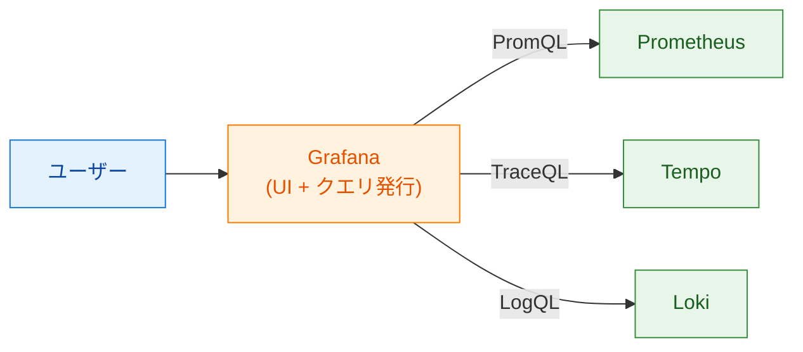
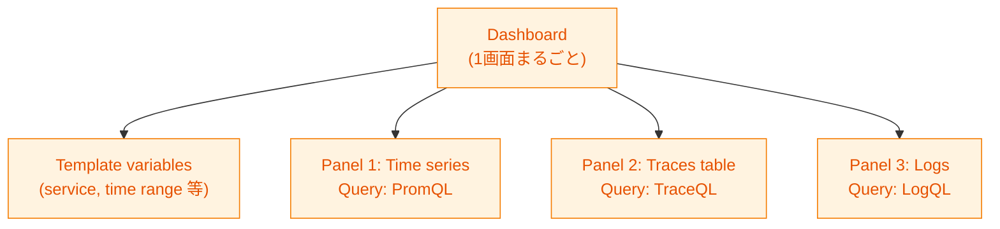
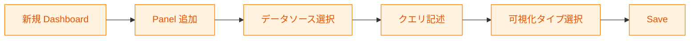
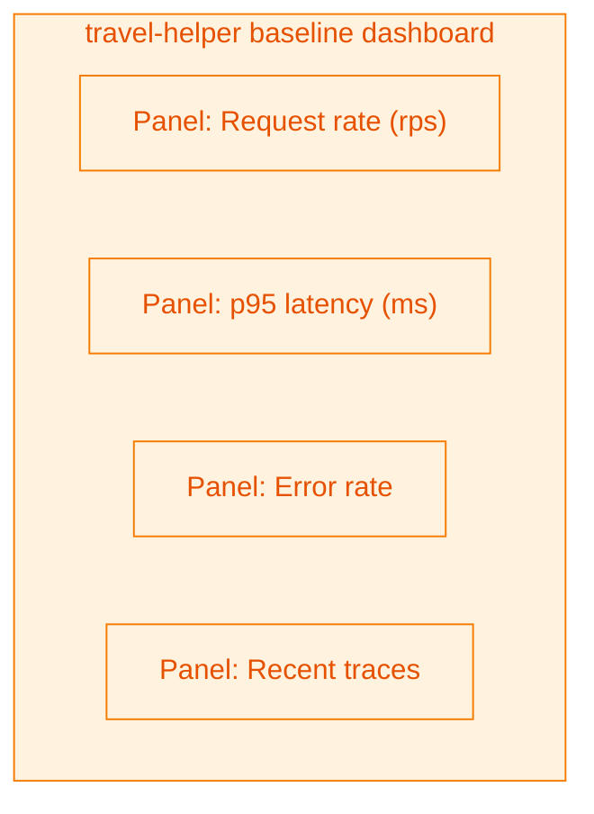

# 第16章 Grafanaでのデータ活用

第15章までで、計装から収集・転送までの全経路が完成した。データはTempo・Prometheus・Loki・Langfuseの4ストアに蓄積されている。本章ではそのデータを「活用する側」に回る。Grafanaで何ができるかを押さえ、PromQL／TraceQL／LogQLの代表的な逆引きパターンと、コーディングエージェントへの指示テンプレートを整理する。本書のスタンスは「クエリ言語の文法を網羅的に覚える」ではなく「やりたいことを言葉で伝えられれば、クエリはエージェントに書かせる」である。

本章の範囲は第2章図2.4の右端「Grafana」であり、ここまで積み上げたデータの出口にあたる。

## 16.1 データソースの概念

第2章で既に触れたとおり、Grafanaはデータを保持しない。データソースとしてPrometheus・Tempo・Loki・Langfuse（プラグイン経由）等を登録し、クエリを発行して結果を描画するだけである（図16.1）。



*図16.1: Grafanaとデータソースの関係。Grafana自体はデータを持たず、バックエンドにクエリを投げて結果を表示する*

本書の検証環境ではPrometheus・Tempo・Lokiのデータソース登録は既に完了している前提で進める。読者環境でGrafanaを新規構築する場合は、Helmチャート（`kube-prometheus-stack` や `grafana` 単体）のvaluesにデータソースを書けば自動で登録される。

## 16.2 Prometheusデータソースで何ができるか

PrometheusはMetricsの保存と問い合わせを担う。Grafanaから利用する用途は大きく3つに分類できる（表16.1）。

*表16.1: Prometheusデータソースで主にできること*

| 用途 | 具体例 |
|------|--------|
| 時系列可視化 | リクエスト数の時系列、トークン消費の推移、エラー率の時系列 |
| 集計・パーセンタイル | p50/p95/p99レイテンシ、エンドポイント別トークン消費合計、サービス別エラー合計 |
| アラート | エラー率が5分間X%を超えたら通知、レイテンシp95がY ms以上で通知 |

PromQLは書けなくてもコーディングエージェントに頼めばよい。ただし代表的なパターンは覚えておくとやり取りが早い（リスト16.1）。

**リスト16.1: 本書サンプルで使うPromQLパターン5選（`sample-app/ch16/dashboards/baseline.json` 抜粋）**

```promql
# 1. リクエストレート（秒あたり）
sum(rate(travel_helper_requests_total[5m]))

# 2. エンドポイント別のp95レイテンシ（ms）
histogram_quantile(0.95,
  sum by (le, endpoint) (rate(travel_helper_request_duration_milliseconds_bucket[5m])))

# 3. エラー率（errors / requests）
sum(rate(travel_helper_errors_total[5m]))
  / clamp_min(sum(rate(travel_helper_requests_total[5m])), 1)

# 4. ツール別エラー合計
sum by (tool) (rate(travel_helper_tool_errors_total[5m]))

# 5. トークン消費合計（第17章以降のメトリクス追加で使う）
sum(rate(travel_helper_llm_tokens_total[5m]))
```

エージェントへの指示パターン例:

> 「`travel-helper-ch13` の `/plan` エンドポイントのp95レイテンシを、過去1時間、5分のローリング窓で描画するPromQLを書いて」

必要な情報は「サービス／メトリクス名」「時間範囲」「集計単位（1分／5分）」「可視化形式（時系列／ヒートマップ）」の4点。この4点さえ言葉で伝えられれば、具体的なクエリは生成させられる。

## 16.3 Tempoデータソースで何ができるか

Tempoは個別トレースの詳細追跡に特化する（表16.2）。

*表16.2: Tempoデータソースで主にできること*

| 用途 | 具体例 |
|------|--------|
| Trace検索 | service.name・span.name・attributeでの絞り込み |
| ウォーターフォール表示 | Root Spanから子Spanまでの階層と所要時間 |
| Span属性の詳細確認 | gen_ai.*・http.*・travel_helper.* 等の値 |
| エラートレース抽出 | `status=error` のトレース一覧 |
| trace_idでの直接ジャンプ | ログ／Langfuseからのtrace_id指定検索 |

TraceQLは属性ベースで書きやすく、クエリの学習コストは比較的低い（リスト16.2）。

**リスト16.2: 本書でよく使うTraceQLパターン3選**

```traceql
# 1. 特定サービスの直近トレース
{ service.name="travel-helper-ch13" }

# 2. レイテンシ500ms以上のトレース
{ service.name="travel-helper-ch13" && duration > 500ms }

# 3. エラーステータスのトレースをstage別に絞る
{ service.name="travel-helper-ch13" && status=error && name =~ "stage.*" }
```

エージェントへの指示パターン例:

> 「直近30分、`travel-helper-ch13` でエラーステータスかつ所要時間1秒以上のトレースを一覧してほしい。TraceQLで書いて」

Tempoの強みは、検索結果からワンクリックで該当Traceのウォーターフォールに飛べる点である。Span属性もUI上に階層で並ぶため、`gen_ai.request.model` ごとのレイテンシ傾向などを手早く調べられる。

## 16.4 Lokiデータソースで何ができるか

Lokiはログの保存と問い合わせを担う（表16.3）。

*表16.3: Lokiデータソースで主にできること*

| 用途 | 具体例 |
|------|--------|
| ラベル絞り込み | `{service_name="travel-helper-ch13"}` |
| 正規表現検索 | `|~ "plan_stage decided items=\\d+"` |
| trace_idフィルタ | `{service_name="travel-helper-ch13"} | json | trace_id="A1B2..."` |
| 時系列集計 | `count_over_time / rate` でログ発生頻度を見る |

LogQLは「ラベル絞り込み」と「パターンマッチ」の2段階構造が基本である（リスト16.3）。

**リスト16.3: 本書でよく使うLogQLパターン4選**

```logql
# 1. サービス別の直近ログ
{service_name="travel-helper-ch13"}

# 2. ERRORログだけ抽出
{service_name="travel-helper-ch13"} |= "ERROR"

# 3. 特定trace_idに紐付くログだけ見る（トレースとの横断）
{service_name="travel-helper-ch13"} | json | trace_id="abc123..."

# 4. ログ発生頻度の時系列
sum by (service_name) (rate({service_name="travel-helper-ch13"}[5m]))
```

エージェントへの指示パターン例:

> 「`trace_id=abc123` に紐付くログをすべて表示して、時刻でソート」

第5章で触れたとおり、OTel LogsはLogレコードの構造化属性として `trace_id` / `span_id` を自動付与する。LokiでJSONパイプ（`| json`）を通せば、これらを絞り込み条件に使える。トレースとログの横断デバッグの具体的なフローが、このLogQL1行で実現できる。

## 16.5 ダッシュボードの基本

Grafanaのダッシュボードは「パネル」の集合である。構造を図16.2に示す。



*図16.2: ダッシュボード構造。1ダッシュボード＝複数パネル、各パネル＝1クエリ、全体をテンプレート変数で動的に絞り込む*

パネルは「1クエリ＋1可視化タイプ」の単位で、時系列（Time series）・表（Table）・ゲージ（Gauge）・統計値（Stat）・ヒートマップ（Heatmap）・トレース（Traces）・ログ（Logs）等の可視化タイプから選ぶ。テンプレート変数（Template variables）は `$service` `$time_range` などとして定義しておくと、ダッシュボード上でドロップダウン切替が可能になる。

作成の流れは図16.3のとおり。



*図16.3: ダッシュボード作成フロー。Grafana UIでの基本操作は「パネル追加→クエリ書く→表示形式選ぶ」の繰り返し*

Grafanaで作ったダッシュボードはJSONとしてエクスポートできる。リポジトリにJSONを置いておけば、別環境に同じダッシュボードを再現するのがImport一発で済む。本書では次節で示す通り、ベースラインダッシュボードをJSON化してリポジトリに配置する。

## 16.6 ベースラインダッシュボードの例

`travel-helper` 向けの最小ダッシュボードとして4パネル構成を用意した（図16.4）。



*図16.4: ベースラインダッシュボードの4パネル構成。rps／p95レイテンシ／エラー率／最新トレース一覧をセットで俯瞰する*

JSON定義の抜粋をリスト16.4に示す（全体は `sample-app/ch16/dashboards/baseline.json`）。

**リスト16.4: `sample-app/ch16/dashboards/baseline.json`（抜粋）**

```json
{
  "title": "travel-helper baseline",
  "refresh": "30s",
  "time": {"from": "now-1h", "to": "now"},
  "templating": {
    "list": [
      {"name": "service", "type": "textbox", "label": "service.name",
       "query": "travel-helper-ch13"}
    ]
  },
  "panels": [
    {
      "type": "timeseries", "title": "Request rate (rps)",
      "datasource": {"type": "prometheus", "uid": "prometheus"},
      "targets": [
        {"expr": "sum(rate(travel_helper_requests_total{job=~\"$service\"}[5m]))",
         "legendFormat": "rps"}
      ]
    },
    {
      "type": "timeseries", "title": "Request duration p95 (ms)",
      "datasource": {"type": "prometheus", "uid": "prometheus"},
      "targets": [
        {"expr": "histogram_quantile(0.95, sum by (le) (rate(travel_helper_request_duration_milliseconds_bucket{job=~\"$service\"}[5m])))",
         "legendFormat": "p95"}
      ]
    }
  ]
}
```

リスト16.4は紙面の都合でRequest rate／p95 latencyの2パネルのみを示す。Error rateとRecent tracesを含む4パネル全体は `sample-app/ch16/dashboards/baseline.json` を参照してほしい。Grafana UI上で「Import」からこのJSONを読み込めば、同じダッシュボードが再現される。`$service` テンプレート変数を変更することで `travel-helper-ch13` だけでなく他の章のサービスにも対応する。

パネル4つの選定理由は「過不足ない初期観測」である。rpsで負荷、p95で遅延、エラー率で品質、Tracesテーブルで個別深掘り入口――これで関心事A（システム挙動）の初期ダッシュボードとしては必要十分で、後から必要に応じてパネルを追加すればよい（第17章で実際に追加する）。

関心事B（LLM品質）はLangfuse Web UIで見る前提なので、このダッシュボードには含めない。必要ならLangfuseのAPIからトークン合計やスコア平均をPrometheus Remote Writeで取り込むパネルを加える選択肢もあるが、本書のスコープ外とする。

## 16.7 コーディングエージェントへの指示パターン

本書が読者に身につけてほしい最大のスキルは「PromQLを書ける」ことではなく「やりたいことを自然言語で伝えてクエリを生成できる」ことである。指示パターンを表16.4にまとめる。

*表16.4: コーディングエージェントへの典型的な指示テンプレート*

| やりたいこと | 指示テンプレート |
|------------|----------------|
| 時系列の描画 | 「`<サービス>` の `<メトリクス>` を過去 `<時間範囲>`、`<集計単位>` の窓で時系列グラフにするPromQLを書いて」 |
| パーセンタイル | 「`<サービス>` の `<Histogram>` のp`<値>`を `<時間範囲>` で描画するPromQLを書いて」 |
| エラー率 | 「`<サービス>` のエラー率（errors / requests）を過去 `<時間範囲>` で描画して」 |
| Trace検索 | 「直近 `<時間範囲>`、`<サービス>` でステータス `<条件>`、所要時間 `<閾値>` のトレースを TraceQL で絞り込んで」 |
| ログ横断 | 「`trace_id=<hex>` に紐付くログを時刻順に表示するLogQLを書いて」 |
| ダッシュボード生成 | 「`<サービス>` の `<メトリクス>` について、rps・p95・エラー率・Traces の4パネルを持つGrafanaダッシュボードJSONを生成して」 |

伝えるべき情報の最小セットは4点である。時間範囲（`now-1h` to `now`）、対象ラベル（`service.name`、`endpoint` など）、集計単位（1分／5分の窓）、可視化形式（時系列／表／ゲージ等）。この4点さえ添えられれば、エージェント側が適切なクエリを組み立てられる。

指示を繰り返すうちに、読者側も「どのデータがどの軸で見られるか」の感覚が育つ。これが本書の最終ゴール――「エージェントに指示できる運用者になる」――に直結する。

## まとめ

- Grafanaはデータを持たず、Prometheus／Tempo／Lokiにクエリを投げて結果を表示するUI
- Prometheusは時系列・集計・アラート、Tempoは個別Trace追跡、Lokiはログ検索とtrace_id横断
- クエリ言語は網羅的に覚えるのではなく、代表パターンだけ押さえてエージェントに頼むのが現実解
- ダッシュボード＝パネル集合、パネル＝1クエリ＋1可視化タイプ、テンプレート変数で動的切替
- ベースラインは4パネル（rps／p95／エラー率／Traces）、JSONでバージョン管理可能
- 指示テンプレートの4要素（時間範囲／対象ラベル／集計単位／可視化形式）を揃えればクエリは生成できる

## 理解度チェック

### Q1. Grafanaとデータストアの関係

**種類**: 概念の確認 / **関連する節**: 16.1

Grafanaとデータストア（Prometheus／Tempo／Loki）の関係を1文で述べよ。

<details>
<summary>解答と解説</summary>

Grafanaは「データを保持せず、各ストアに対してクエリ言語（PromQL／TraceQL／LogQL）で問い合わせ、得られた結果をパネルとして可視化するUI層」である。データ本体はストア側に残り、Grafanaは「可視化とダッシュボード編集の拠点」として機能する。このためGrafanaを入れ替えてもデータは失われず、逆にストアだけ差し替える運用もできる。

</details>

### Q2. 過去1時間のエラー率を見るデータソース

**種類**: 判断問題 / **関連する節**: 16.2

「過去1時間のエラー率」を見たい。どのデータソースを使うか。

<details>
<summary>解答と解説</summary>

Prometheusを使う。エラー率は集計メトリクスの時系列（errors / requests の比率）として計算するのが最も軽量かつ素早く、Counterを持つPrometheusが本命。PromQLで `sum(rate(travel_helper_errors_total[5m])) / clamp_min(sum(rate(travel_helper_requests_total[5m])), 1)` のように書ける。

TempoやLokiでもエラートレース／エラーログの件数を出せるが、集計値の時系列性能ではPrometheusが最適。個別のエラー事例を深掘りするときはTempoで該当トレースを開き、Lokiで詳細ログを確認する流れになる。

</details>

### Q3. LLMレイテンシのパーセンタイルパネル設計

**種類**: 設計問題 / **関連する節**: 16.2、16.5

`travel-helper` のLLM呼び出しレイテンシをp50／p95／p99で見るパネルを設計せよ（データソース／クエリ要件／可視化タイプ）。

<details>
<summary>解答と解説</summary>

**データソース**: Prometheus。LLM呼び出しレイテンシはHistogramとして記録する必要があり、OpenLLMetryの `gen_ai.client.operation.duration` ヒストグラム（もしくは本書の `travel_helper.llm.duration` を第17章で追加）を使う。

**クエリ要件**:
- 3つのパーセンタイル（p50／p95／p99）を同じ時間窓で算出
- サービス名と操作種別（`gen_ai.operation.name`）で絞り込み可能にする

PromQL例:
```promql
histogram_quantile(0.50, sum by (le) (rate(gen_ai_client_operation_duration_seconds_bucket{service_name=~"$service"}[5m])))
histogram_quantile(0.95, sum by (le) (rate(gen_ai_client_operation_duration_seconds_bucket{service_name=~"$service"}[5m])))
histogram_quantile(0.99, sum by (le) (rate(gen_ai_client_operation_duration_seconds_bucket{service_name=~"$service"}[5m])))
```

各クエリは同じパネル内の別ターゲットとして登録し、Legendで「p50」「p95」「p99」とラベル付けする。

**可視化タイプ**: Time series（折れ線）。3本の線が同じ軸に乗ると外れ値（p99の跳ね）が見やすい。単位は `ms` または `s`（HistogramのバケットUnitに合わせる）。

補強として、Tracesパネルを同じダッシュボードに置き、p99に寄与する個別トレースをTraceQLで一覧する構成が望ましい（`{ service.name="$service" && name="openai.chat" && duration > 2s }` 等）。

</details>

### Q4. エラーステータスのトレース一覧の指示文

**種類**: 設計問題 / **関連する節**: 16.3、16.7

「直近30分、`service.name=travel-helper-ch13` でエラーステータスのトレースを一覧表示」をコーディングエージェントに依頼する指示文を書け。

<details>
<summary>解答と解説</summary>

指示文例:

> 「Grafana Exploreで使う前提で、TraceQLクエリを1つ書いてください。条件は(1) 過去30分、(2) `service.name=travel-helper-ch13`、(3) Status が error、(4) 結果は所要時間降順で最大20件。可視化はTracesテーブルでTrace ID・Root Span名・所要時間・時刻を列に表示したい」

この指示に含まれる4要素は次のとおり。

- 時間範囲: 過去30分
- 対象ラベル: `service.name=travel-helper-ch13`、`status=error`
- 集計単位: 不要（個別トレースを出すため）／ソート: duration降順
- 可視化形式: Tracesテーブル、列構成を指定

エージェントが返すTraceQL例:
```traceql
{ service.name="travel-helper-ch13" && status=error } | limit(20)
```

TraceQL単独には汎用的な「duration降順ソート」構文がないため、所要時間順に並べ替えたい場合はGrafana UIのTracesテーブル列ヘッダ（Duration）でクリックしてソートする。閾値で絞りたい場合は `{ ... && trace:duration > 1s }` のように条件を追加する。

補足として「得られたトレースから一番遅いものを開いて、そのウォーターフォールでどのSpanが律速か教えて」と2ターン目で深掘りもできる。本書が目指す「エージェントに指示できる運用者」の姿である。

</details>

## 参考文献

- Grafana Labs. "Grafana documentation." https://grafana.com/docs/grafana/latest/ （閲覧日: 2026-04-14）
- Prometheus. "PromQL — Querying basics." https://prometheus.io/docs/prometheus/latest/querying/basics/ （閲覧日: 2026-04-14）
- Grafana Labs. "TraceQL." https://grafana.com/docs/tempo/latest/traceql/ （閲覧日: 2026-04-14）
- Grafana Labs. "LogQL — Query language for Loki." https://grafana.com/docs/loki/latest/query/ （閲覧日: 2026-04-14）
- Grafana Labs. "Dashboard JSON model." https://grafana.com/docs/grafana/latest/dashboards/build-dashboards/view-dashboard-json-model/ （閲覧日: 2026-04-14）

## 次章への接続

本章で計装から可視化までの全経路が揃い、読者は既存データの活用方法を手に入れた。最後の章では、新しいメトリクス（例: トークン使用量）を追加したい要件が発生した際の「アプリ計装→Collector→Prometheus→Grafanaダッシュボード」までのEnd-to-Endフローを通して体験する。自力で観測項目を増やせる状態が最終ゴールである。
