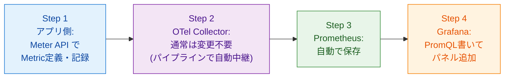
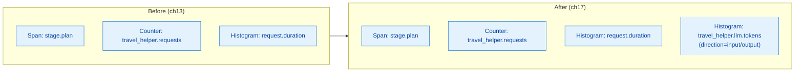
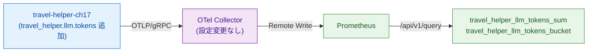
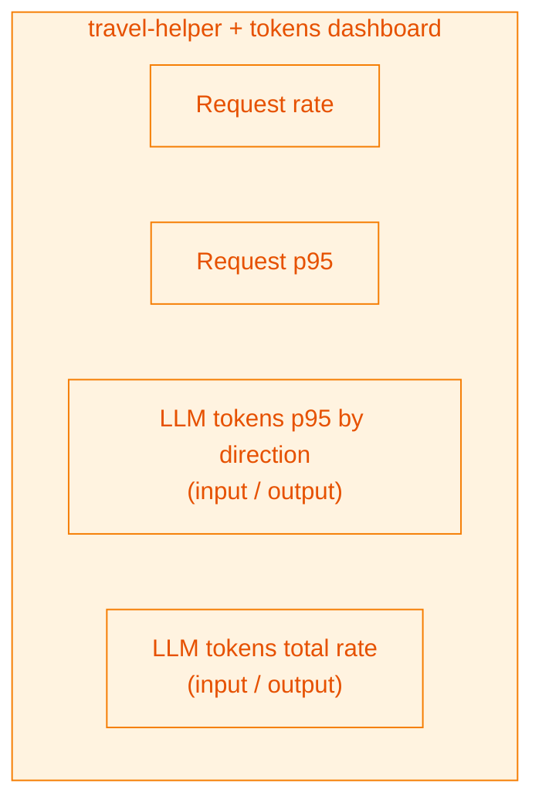
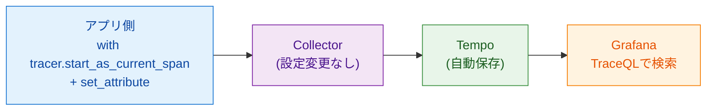
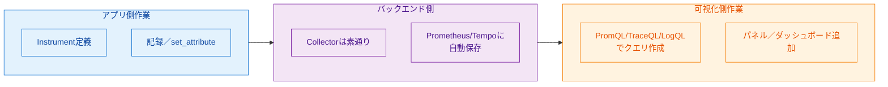
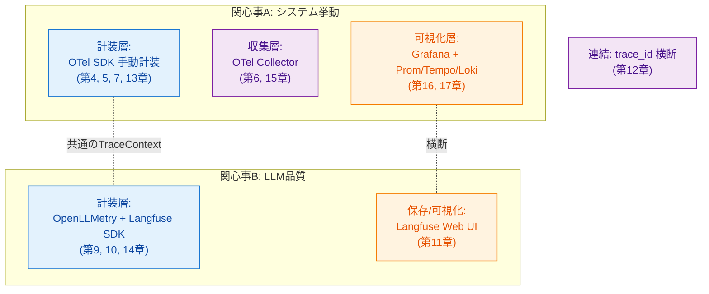

# 第17章 End-to-Endフロー ― メトリクス追加からダッシュボード表示まで

ここまでで計装→収集→保存→可視化の全要素を揃えた。本章ではこの総仕上げとして、「新しいメトリクスが欲しい」という典型的な要件に対し、アプリ側の計装追加からダッシュボード反映までを1つのサンプル（`sample-app/ch17/`）で通しで体験する。最後に本書全体を3層モデルに沿って振り返り、クリーンアップで締めくくる。

第1章の図1.3で示した「検知→深掘り→仮説→修正→効果確認」の改善ループが、この章で通しで実践可能な状態になる。読者がこのフローを自力で回せるようになることが本書の最終ゴールである。

## 17.1 追加の流れ（全体像）

メトリクスを追加するE2Eフローは4ステップに分解できる（図17.1）。



*図17.1: E2Eフロー全体図。アプリ側の1箇所の変更がCollectorとPrometheusを素通りし、最終的にGrafanaでの可視化として現れる*

ポイントは「Step 2が通常変更不要」である点である。第6章・第15章で設計したとおり、Collectorはパイプラインでシグナルを素通りさせる。新規Metricも既存の`metrics`パイプラインを通り、Prometheusにそのまま書き込まれる。読者が新規Metricを追加する作業は、実質Step 1とStep 4の2箇所だけである。

## 17.2 実践 ― トークン使用量メトリクスを追加する

第13章の手動計装版（`sample-app/ch13/`）をベースに、`travel_helper.llm.tokens` Histogramを追加したものが `sample-app/ch17/agent.py` である。差分はリスト17.1のとおり。

**リスト17.1: `sample-app/ch17/agent.py`（差分）**

```python
# 追加: LLMトークン消費のHistogram（direction=input/output のラベル付き）
llm_tokens_hist = meter.create_histogram(
    "travel_helper.llm.tokens",
    unit="tokens",
    description="LLM token usage per call (direction=input/output)",
)

def _record_llm_tokens(input_tokens: int, output_tokens: int, model: str) -> None:
    llm_tokens_hist.record(input_tokens,
                           {"direction": "input", "model": model})
    llm_tokens_hist.record(output_tokens,
                           {"direction": "output", "model": model})

def _plan_stage(req: PlanRequest) -> List[str]:
    with tracer.start_as_current_span("stage.plan") as span:
        span.set_attribute("travel_helper.stage", "plan")
        items = [f"{kw}関連スポット" for kw in req.keywords] or ["市内中心部の主要観光"]
        span.set_attribute("travel_helper.investigation_items_count", len(items))
        # 追加: LLM呼び出しの代わりに擬似的なトークン数を記録
        prompt_chars = sum(len(kw) for kw in req.keywords) + 20
        response_chars = len(items) * 20
        _record_llm_tokens(prompt_chars // 3, response_chars // 3, "mock-model")
        log.info("plan_stage decided items=%d", len(items))
        return items
```

追加した要素は3つ。(1) `meter.create_histogram` でHistogramインスタンスを作る。単位は `unit="tokens"` と明示。(2) 記録用ヘルパー `_record_llm_tokens` を用意し、`direction=input/output` と `model` をラベルとして付ける。(3) LLM呼び出し直後のタイミングで `_record_llm_tokens` を呼ぶ。本書サンプルではLLM呼び出しがmockのため、文字数から擬似的にトークン数を算出している（実環境ではOpenLLMetryや直接のAPI応答から `usage.input_tokens` 等を取得して渡す）。

追加前後のSpanとMetric構造の違いを図17.2に示す。



*図17.2: 追加前後の構造。既存のSpan／Counter／Histogramはそのまま残し、1つのHistogramが加わるだけ*

## 17.3 Collectorの確認

新規MetricがCollectorを素通りしてPrometheusに届くかを確認する。本書の共有Collectorは `otlp/gateway` Receiver→`batch/memory_limiter` Processor→`prometheusremotewrite` Exporterの構成で、フィルタや明示的な許可リストを持たない。追加したMetric名も自動で受け入れられる（図17.3）。



*図17.3: Collectorからの出力確認。設定変更なしで新Metricが Prometheus に到達する*

本書検証では、デプロイ直後にPrometheusへ `travel_helper_llm_tokens_bucket` / `travel_helper_llm_tokens_sum` / `travel_helper_llm_tokens_count` が自動登録された。Collector設定のフィルタ（例: `filter` Processorで特定Metricのみ通す構成）がある場合のみ、許可対象に追加する作業が発生する。

なお注意点として、OTel→Prometheusの命名変換ルールにより、実際のPrometheus側メトリクス名は `travel_helper_llm_tokens_bucket`（ドット→アンダースコア、Histogramの型サフィックス `_bucket` 付き）となる。`unit="tokens"` を指定しているが、`tokens` はPrometheus互換規約で標準単位ではないため、ここでは単位サフィックスが付かないケースも多い。本書検証環境ではサフィックスなしで記録された。実環境で確認してクエリを合わせるとよい。

## 17.4 Grafanaパネルの追加

Prometheusに到達したメトリクスをGrafanaで可視化する。追加するPromQLはリスト17.2のとおり。

**リスト17.2: 追加するPromQLクエリ**

```promql
# 1. direction別のp95トークン数（Histogram分布）
histogram_quantile(0.95,
  sum by (le, direction) (
    rate(travel_helper_llm_tokens_bucket{job=~"$service"}[5m])))

# 2. direction別のトークン流量（累計の変化率）
sum by (direction) (
  rate(travel_helper_llm_tokens_sum{job=~"$service"}[5m]))
```

1本目は「1回のLLM呼び出しで消費される入出力トークン数の分布」を、2本目は「単位時間あたりに消費されているトークン総量」を見る。前者は個別呼び出しの規模感、後者はコスト推定に使える。

新規2パネルを加えた `sample-app/ch17/dashboards/baseline.json` の差分抜粋をリスト17.3に示す。

**リスト17.3: `sample-app/ch17/dashboards/baseline.json`（追加パネル差分）**

```json
{
  "type": "timeseries",
  "title": "LLM tokens p95 by direction",
  "datasource": {"type": "prometheus", "uid": "prometheus"},
  "targets": [{
    "expr": "histogram_quantile(0.95, sum by (le, direction) (rate(travel_helper_llm_tokens_bucket{job=~\"$service\"}[5m])))",
    "legendFormat": "{{direction}}"
  }]
},
{
  "type": "timeseries",
  "title": "LLM tokens total rate",
  "datasource": {"type": "prometheus", "uid": "prometheus"},
  "targets": [{
    "expr": "sum by (direction) (rate(travel_helper_llm_tokens_sum{job=~\"$service\"}[5m]))",
    "legendFormat": "{{direction}} tokens/sec"
  }]
}
```

GrafanaでImportすると、既存の4パネル（rps／p95／error rate／traces）に加えて2パネルが表示される（図17.4）。



*図17.4: ch17ダッシュボードのパネル構成。入出力トークンのp95と流量を並べて可視化*

## 17.5 トレースの追加も同様

Metricではなく「新規カスタムSpan」を追加したい場合も、流れは対称的である（図17.5）。



*図17.5: Span追加のE2E。Metricと同じく「アプリ側変更→バックエンド自動到達→可視化追加」の3点構造*

例として「エージェントのツール選択判断」を独立したSpanにしたい場合、アプリ側で `with tracer.start_as_current_span("agent.tool_select") as span: span.set_attribute("travel_helper.tool.candidates", candidates)` と書くだけでよい。Collectorは素通り、Tempoは自動保存、GrafanaのTempoデータソースで `{ name="agent.tool_select" }` で検索できる。

## 17.6 拡張パターンの一般化

MetricとSpanに共通する拡張パターンを図17.6に示す。



*図17.6: 拡張パターンの一般図。変更はアプリ側と可視化側の2箇所に閉じ、中間のCollector／ストアは通常手を入れない*

この構造の恩恵は、拡張作業の変更範囲が限定されている点にある。新規観測項目を追加するたびにCollector設定やPrometheus／Tempoの構成を触る必要があれば、観測の追加は重い作業になる。OTel Collectorのパイプライン設計と、PrometheusのRemote Write方式が「新規メトリクス名を自動で受け入れる」設計により、アプリ側と可視化側の2箇所を触るだけで済む。

本書の要点はここに集約される。「知識地図（3層モデル）を持ち、各層の責務と拡張パターンを理解していれば、新要件に対して1パスでループを回せる」。

## 17.7 本書のまとめとクリーンアップ

本書で読者が獲得した能力を、第1章の「2つの関心事」×3層モデルで振り返る（図17.7）。



*図17.7: 本書を通じて読者が獲得した能力のマップ。2つの関心事×3層モデルで各章の到達点が配置される*

本書の最終ゴールに達した読者は、次の状態にあるはずである。

- 3層モデル（計装／収集・転送／保存・可視化）でObservabilityツール群を整理して語れる
- OTelのデータモデル（Span／Trace／Attribute／Context／3シグナル）を自分の言葉で説明できる
- Python OTel SDKで手動計装のコードを書け、OpenLLMetryの仕組みと限界も理解している
- GrafanaとLangfuseの機能を把握し、ダッシュボード作成や評価フローをコーディングエージェントに指示できる
- 新規観測項目の追加を、アプリ計装→Collector（素通り）→Grafana／Langfuseパネル追加で1パスで回せる

### クリーンアップ

本書で作成した全てのサンプルリソースは `aio11y-book` namespaceに閉じ込めている。最終クリーンアップは次のコマンドで行う。

```bash
# リポジトリルートから
make clean            # または
kubectl delete namespace aio11y-book
```

`kubectl delete namespace` 1つでDeployment・Service・ConfigMap・Secretを含む全リソースが削除される。共有資産（observability namespaceのCollector／Prometheus／Tempo／Loki／Grafana、langfuse namespaceのLangfuse等）には一切触らず、本書実行前の状態に戻る。章単位の掃除は各章のMakefileに `make clean` / `make clean-chNN` を用意している。

## まとめ

- E2E拡張は4ステップ（アプリ計装→Collector素通り→Prometheus／Tempo自動保存→Grafanaパネル追加）
- 変更範囲が「アプリ側」と「可視化側」に限定され、中間のCollector／ストアは通常触らない
- MetricとSpanで拡張フローは対称的
- 本書の3層モデルを持つことで、新要件に対して1パスで改善ループを回せる
- 本書終了後のクリーンアップは `kubectl delete namespace aio11y-book` 一発で完了

## 理解度チェック

### Q1. E2E拡張フローの4ステップ

**種類**: 概念の確認 / **関連する節**: 17.1

新規メトリクスを追加してGrafanaで可視化するまでのE2E拡張フローの4ステップを挙げよ。

<details>
<summary>解答と解説</summary>

1. アプリ側: `meter.create_histogram / create_counter` でインスタンス定義、適切なタイミングで `record / add` を呼ぶ。必要なラベル（`direction` `endpoint` 等）を渡す。
2. OTel Collector: 通常は設定変更不要。既存の `metrics` パイプラインが素通りでPrometheusへ転送する（フィルタ設定がある場合のみ許可リストに追加）。
3. Prometheus: 自動で新規メトリクスを受け入れて保存。OTel→Prometheus命名変換（ドット→アンダースコア、型サフィックス `_total` `_bucket` 等）が適用される。
4. Grafana: PromQLを書いてパネルを追加、既存または新規ダッシュボードに配置、ImportでJSON化してリポジトリ管理。

作業の重心はStep 1とStep 4の2箇所で、Step 2・3は自動で素通りするのが本書構成の恩恵である。

</details>

### Q2. ツール失敗率メトリクスの追加設計

**種類**: 設計問題 / **関連する節**: 17.2、17.4

新しいメトリクス「ツール呼び出しの失敗率」を追加する。計装からダッシュボードまでの設計を述べよ。

<details>
<summary>解答と解説</summary>

**Step 1（アプリ側）**: 本書サンプルは既に `travel_helper.tool.errors` Counter（ツール別）と、各ツール呼び出しを `tool.weather` 等のSpanで記録している。失敗率を出すにはもう1つ「呼び出し総数」を `travel_helper.tool.calls` Counter（`tool` ラベル）として追加する。記録は各ツール関数の冒頭で `tool_calls_counter.add(1, {"tool": "weather"})`。

**Step 2（Collector）**: 変更不要。

**Step 3（Prometheus）**: 自動保存。Prometheus側名は `travel_helper_tool_calls_total` と `travel_helper_tool_errors_total`。

**Step 4（Grafana）**: PromQLは `sum by (tool) (rate(travel_helper_tool_errors_total[5m])) / clamp_min(sum by (tool) (rate(travel_helper_tool_calls_total[5m])), 1)`。可視化は時系列（Time series）で `tool` 別に線を分ける。アラートを掛けるなら「失敗率 > 0.1 が 5分続いたら通知」のルールを別途設定。

補足: Langfuse SDKでスコアとして記録する案もあり得るが、本問はシステム挙動の指標なのでPrometheus一択。

</details>

### Q3. カスタムSpan「判断理由」の追加

**種類**: 設計問題 / **関連する節**: 17.5

新しいカスタムSpan「エージェントの判断理由」を追加する場合、アプリ側とGrafana側で何を行うか。

<details>
<summary>解答と解説</summary>

**アプリ側**:
- 判断ロジックの周りに `with tracer.start_as_current_span("agent.decision") as span:` を置く
- Attributeとして `travel_helper.decision.reason`（文字列）、`travel_helper.decision.candidates`（配列、検討したツール候補）、`travel_helper.decision.chosen`（選ばれた値）を `span.set_attribute` で付与
- 命名は既存の `stage.*` `tool.*` パターンに合わせ、名前空間を揃える

**Grafana側**:
- TempoデータソースのTraceQLで検索: `{ name="agent.decision" }` または `{ name="agent.decision" && travel_helper.decision.reason =~ "budget.*" }` のように属性で絞り込み
- Traces パネルに常時表示するのは情報過多なため、必要時にExploreで検索する運用でよい
- 頻度の時系列を見たい場合はTempo Metrics Generator（または `count_over_time` 集計）と組み合わせる

Collector側は変更不要、Tempoへの保存は自動。

</details>

### Q4. 最初に追加すべき観測項目3つ

**種類**: 設計問題 / **関連する節**: 17.6、17.7

本書の範囲で獲得した知識を活かし、読者自身のエージェントに最初に追加すべき観測項目を3つ挙げよ。

<details>
<summary>解答と解説</summary>

以下の3つを推奨する。他のエージェントでも応用しやすい汎用性を持つ。

1. **リクエストレート／レイテンシ／エラー率のRED三点セット**（関心事A）
   - `<app>.requests` Counter、`<app>.request.duration` Histogram、`<app>.errors` Counter
   - Prometheus+Grafanaで時系列ダッシュボード化
   - 本書の第13章パターンをそのまま流用可能

2. **LLM呼び出しのトークン消費と所要時間**（関心事A寄り、コスト管理用）
   - `gen_ai.usage.input_tokens` / `output_tokens`（OpenLLMetry自動）または `<app>.llm.tokens` Histogram（本章パターン）
   - `gen_ai.client.operation.duration` Histogram（OpenLLMetry自動）
   - コスト傾向とレイテンシ分布の両方を見る

3. **LLM応答品質スコアとプロンプトバージョン**（関心事B）
   - Langfuse Scoreで `quality` や `judge.intent_match` を付与
   - Langfuse Prompt Managementでバージョン別分析
   - OTel trace_idを `metadata.otel_trace_id` で紐付けし、Grafanaとの横断を可能にする

この3つを押さえておけば、「システム挙動」と「LLM品質」の両輪で改善ループが回る最小セットが揃う。その後は業務ドメイン固有のKPI（本書の `travel_helper.investigation_items_count` のような指標）を追加していくのが自然である。

</details>

## 参考文献

- OpenTelemetry Project. "Specification — Metrics Data Model." https://opentelemetry.io/docs/specs/otel/metrics/data-model/ （閲覧日: 2026-04-14）
- OpenTelemetry Project. "Prometheus Compatibility Specification." https://opentelemetry.io/docs/specs/otel/compatibility/prometheus_and_openmetrics/ （閲覧日: 2026-04-14）
- Grafana Labs. "Grafana Dashboard JSON model." https://grafana.com/docs/grafana/latest/dashboards/build-dashboards/view-dashboard-json-model/ （閲覧日: 2026-04-14）

## 次章への接続

本書の本編はここまでである。以降の付録A〜Cは実務中に引ける早見表として配置している。付録AはPromQL／TraceQL／LogQLの逆引きチートシートとコーディングエージェント指示テンプレート、付録BはPython OTel SDK APIリファレンス、付録Cは用語集である。必要なときに開いて参照してほしい。
